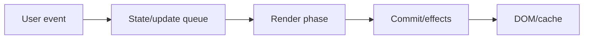
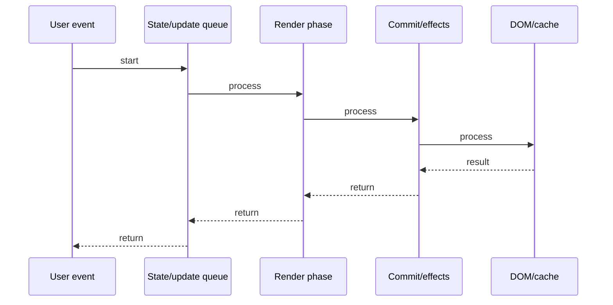

# Context vs Redux

## Quick Facts
- Area: React
- Tag: State
- Source: `src/modules/topics/react/react-context-redux.js`
- Tags: `react`, `context`, `redux`, `state-management`, `zustand`, `prop-drilling`
- Visual coverage: live visual

## Concept
Context API: built-in React. Provider -> Consumer. Any ancestor can pass data to any descendant.
Problem: every consumer re-renders when ANY part of the context value changes. Not selective.
Redux: external state container. Single store. State changed only via dispatched actions through a reducer.
Selectors: components subscribe to slices - only re-render when their slice changes.
Redux Toolkit (RTK) modernizes Redux: createSlice, createAsyncThunk, Immer for mutations.
Zustand: minimal store with hooks - simpler than Redux, more selective than Context.

## Why It Matters
Context is best for: theme, locale, auth user - low-frequency, global-ish data.
Redux/Zustand for: complex state with many actions, cross-feature data, optimistic updates, devtools.
Choosing wrong: Context for high-frequency state = re-render cascade; Redux for simple state = overengineering.

## Architecture / Mental Model


## Runtime / Sequence


## Animation Plan
- Flow lab can use generated mental model steps above.
- UML sequence can use generated sequence diagram above.
- Architecture map can use generated area mental model above.
- Live visual exists in app: topic-specific canvas/ReactViz animation.

Flow steps:

1. User event
2. State/update queue
3. Render phase
4. Commit/effects
5. DOM/cache

## Example
```javascript
// Context (simple, but all consumers re-render)
const UserContext = createContext(null);

function App() {
  const [user, setUser] = useState(null);
  return (
    <UserContext.Provider value={{ user, setUser }}>
      <Router />
    </UserContext.Provider>
  );
}

// Redux Toolkit (selective, scalable)
const counterSlice = createSlice({
  name: 'counter',
  initialState: { value: 0, status: 'idle' },
  reducers: {
    increment: state => { state.value += 1; }, // Immer!
    decrement: state => { state.value -= 1; },
    reset:     state => { state.value = 0; },
  },
});

export const { increment, decrement, reset } = counterSlice.actions;

// Selector: only re-renders when value changes
const count = useSelector(state => state.counter.value);
const dispatch = useDispatch();

// Zustand (simplest)
const useStore = create((set) => ({
  count: 0,
  inc: () => set(state => ({ count: state.count + 1 })),
  dec: () => set(state => ({ count: state.count - 1 })),
}));
const { count, inc } = useStore(state => ({ count: state.count, inc: state.inc }));
```

## Complexity And Performance
- Time/space complexity depends on deployment, data size, and chosen implementation.
- Track p50/p95/p99 latency, throughput, memory, saturation, and error rate for production topics.

## Interview Drills
1. Why does Context cause unnecessary re-renders?

2. What problem does Redux solve that Context does not?

3. Explain the Redux data flow: action -> reducer -> store -> component.

4. What is Immer and how does Redux Toolkit use it?

5. When would you choose Zustand over Redux?

6. How do you optimize Context to prevent re-renders?

## Trade-offs
_No trade-offs configured._

## Gotchas
- Context: passing object as value = new ref every render = all consumers re-render. Memoize value.
- Redux: never mutate state directly - use RTK (Immer) or spread operator.
- useSelector re-runs on every dispatch - selector must return same ref if nothing changed.
- Redux middleware (thunk) runs between dispatch and reducer - async goes here.
- Split contexts by update frequency: AuthContext changes rarely, CartContext changes often.

