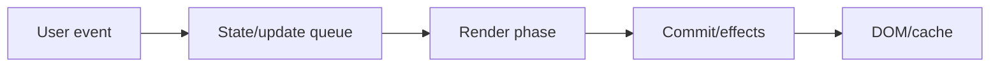
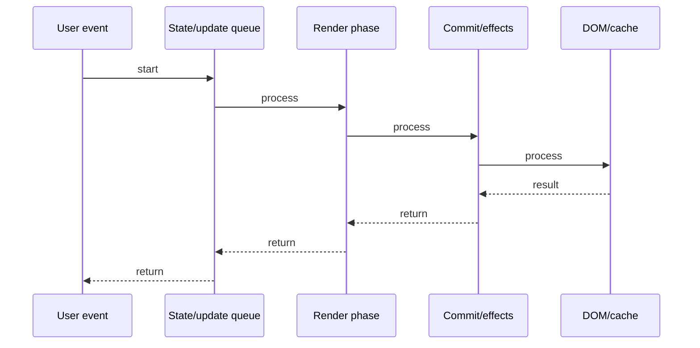

# Custom Hooks

## Quick Facts
- Area: React
- Tag: Patterns
- Source: `src/modules/topics/react/react-custom-hooks.js`
- Tags: `react`, `custom-hooks`, `composition`, `reuse`, `abstraction`
- Visual coverage: live visual

## Concept
Custom hooks are plain JavaScript functions that start with "use" and call other hooks.
They let you extract stateful logic from components into reusable functions.
A custom hook can call useState, useEffect, useContext - anything a component can call.
Each call to a custom hook gets its own isolated state - hooks are not shared between components.
Custom hooks follow all hook rules: no conditionals, no loops, called at top level.

## Why It Matters
Without custom hooks, stateful logic is duplicated across components or forced into HOCs/render props (messy).
Custom hooks make logic portable, testable, and composable - the same pattern as Angular services or mixins.
React Query, SWR, Zustand - all expose their API as custom hooks.

## Architecture / Mental Model


## Runtime / Sequence


## Animation Plan
- Flow lab can use generated mental model steps above.
- UML sequence can use generated sequence diagram above.
- Architecture map can use generated area mental model above.
- Live visual exists in app: topic-specific canvas/ReactViz animation.

Flow steps:

1. User event
2. State/update queue
3. Render phase
4. Commit/effects
5. DOM/cache

## Example
```javascript
// Extract fetch logic into useFetch
function useFetch(url) {
  const [data, setData]     = useState(null);
  const [loading, setLoading] = useState(true);
  const [error, setError]   = useState(null);

  useEffect(() => {
    let cancelled = false;
    setLoading(true);
    fetch(url)
      .then(r => r.json())
      .then(d => { if (!cancelled) { setData(d); setLoading(false); }})
      .catch(e => { if (!cancelled) { setError(e); setLoading(false); }});
    return () => { cancelled = true; };
  }, [url]);

  return { data, loading, error };
}

// Usage: any component, own isolated state
function UserList() {
  const { data, loading } = useFetch('/api/users');
  if (loading) return <Spinner />;
  return <ul>{data.map(u => <li>{u.name}</li>)}</ul>;
}

// Compose hooks - hooks calling hooks
function useUserSearch(query) {
  const debouncedQuery = useDebounce(query, 300);
  const { data, loading } = useFetch(`/api/users?q=${debouncedQuery}`);
  const filtered = useMemo(() =>
    data?.filter(u => u.active), [data]);
  return { users: filtered, loading };
}
```

## Complexity And Performance
- Time/space complexity depends on input size, data volume, and implementation choices.
- Track latency, throughput, memory, saturation, error rate, and correctness invariants.

## Interview Drills
1. What makes a function a "custom hook"?

2. Do two components sharing a custom hook share state?

3. How do you test a custom hook?

4. Custom hook vs HOC vs render props - when to use each?

5. How do you make a custom hook that returns a ref?

6. Can a custom hook return JSX?

## Trade-offs
Pros:
- Logic reuse without component nesting
- Testable in isolation
- Composable (hooks call hooks)
- Clear contract: inputs -> outputs

Cons:
- Debugging chain of hooks can be hard
- Overextraction: too many hooks = fragmented logic
- Rules of hooks apply inside custom hooks

## Gotchas
- Custom hook must start with "use" - React lint rules enforce this.
- Each component call gets ISOLATED state - not shared between components.
- To share state between components, lift to Context or external store.
- A custom hook returning JSX is legal but confusing - prefer components.
- Infinite loop: custom hook that takes object/array as param - new ref every render -> effect re-runs.

