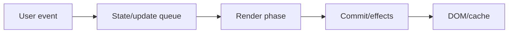
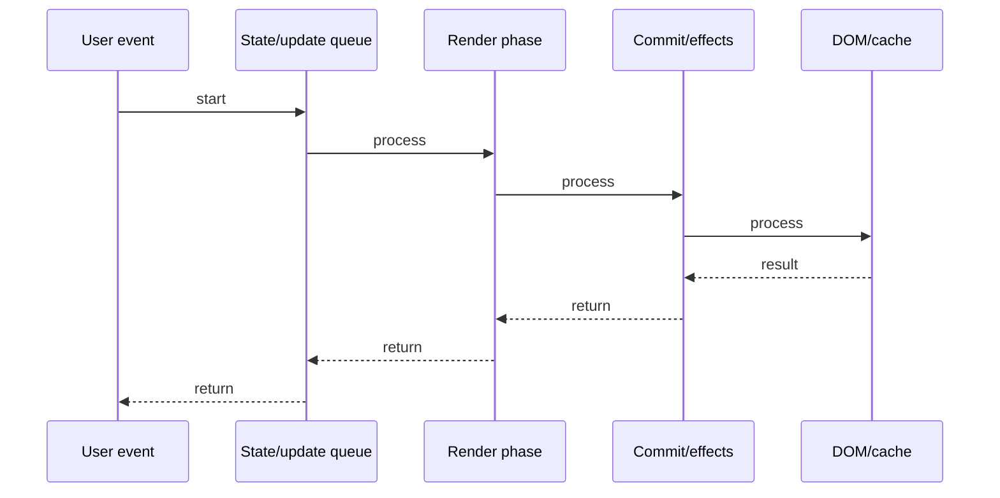

# Error Boundaries

## Quick Facts
- Area: React
- Tag: Reliability
- Source: `src/modules/topics/react/react-error-boundaries.js`
- Tags: `react`, `error-boundary`, `error-handling`, `fallback`
- Visual coverage: live visual

## Concept
Error Boundaries are class components that implement componentDidCatch() and/or getDerivedStateFromError(). They catch JavaScript errors thrown anywhere in their child component tree during render, lifecycle methods, and constructors - then render a fallback UI instead of crashing the whole app. Errors in event handlers, async code, and SSR are NOT caught.

## Why It Matters
Production React apps need graceful error recovery. Without error boundaries, a single thrown error unmounts the entire React tree. Boundaries scope the blast radius: a broken widget crashes its boundary, not the whole page.

## Architecture / Mental Model


## Runtime / Sequence


## Animation Plan
- Flow lab can use generated mental model steps above.
- UML sequence can use generated sequence diagram above.
- Architecture map can use generated area mental model above.
- Live visual exists in app: topic-specific canvas/ReactViz animation.

Flow steps:

1. User event
2. State/update queue
3. Render phase
4. Commit/effects
5. DOM/cache

## Example
```javascript
class ErrorBoundary extends React.Component {
  state = { hasError: false, error: null };

  static getDerivedStateFromError(error) {
    return { hasError: true, error };
  }

  componentDidCatch(error, info) {
    logErrorToService(error, info.componentStack);
  }

  render() {
    if (this.state.hasError) {
      return this.props.fallback || <h2>Something went wrong.</h2>;
    }
    return this.props.children;
  }
}

// Usage:
<ErrorBoundary fallback={<ErrorPage />}>
  <UserDashboard />
</ErrorBoundary>
```

## Complexity And Performance
- Time/space complexity depends on input size, data volume, and implementation choices.
- Track latency, throughput, memory, saturation, error rate, and correctness invariants.

## Interview Drills
1. What do error boundaries catch? What do they NOT catch?

2. Why must error boundaries be class components?

3. How do you scope error boundaries for granular recovery?

4. Difference between getDerivedStateFromError and componentDidCatch?

5. How does React 18 handle errors in concurrent mode?

## Trade-offs
Pros:
- Scopes crash blast radius - broken subtree, not whole app
- Enables custom fallback UI per feature area
- componentDidCatch gives full error + component stack for logging

Cons:
- Must be class components - no hooks equivalent (use react-error-boundary library)
- Does NOT catch: event handlers, async code (setTimeout/fetch), SSR errors
- Error in error boundary itself crashes to nearest parent boundary

## Gotchas
- Event handler errors need try/catch - boundary will NOT catch them
- Async errors (setTimeout, promises) not caught - need .catch() or window.onerror
- In development, React re-throws errors after boundary catches - for stack traces
- react-error-boundary library adds useErrorBoundary hook for throwing from async

