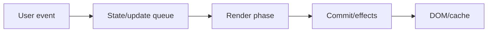
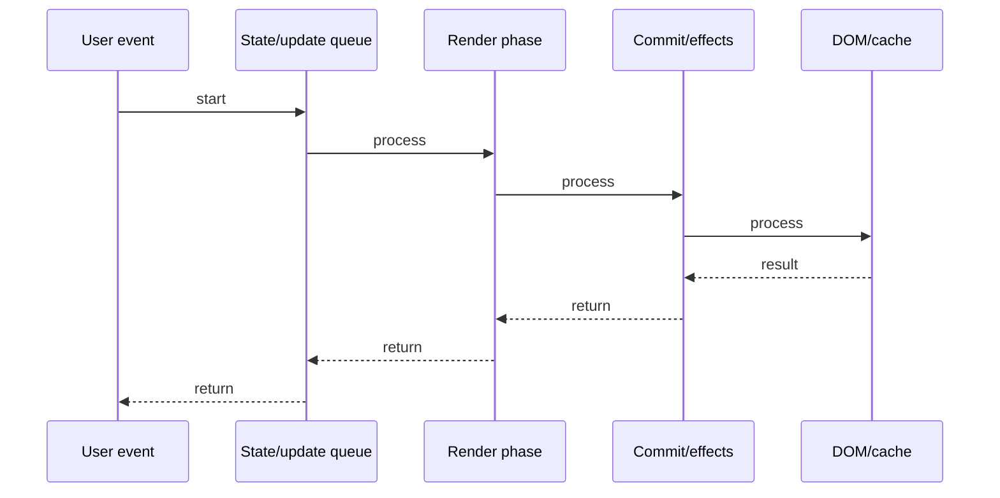

# Fiber & Reconciler

## Quick Facts
- Area: React
- Tag: Internals
- Source: `src/modules/topics/react/react-fiber-reconciler.js`
- Tags: `react`, `fiber`, `reconciler`, `virtual-dom`, `diffing`, `work-loop`, `commit`
- Visual coverage: live visual

## Concept
React Fiber is the reconciliation algorithm rewritten in React 16.
Each component is a "fiber" - a JS object with: type, props, state, effectTag, child, sibling, return (parent).
Work loop: React traverses fibers in two phases:
  1. Render phase (beginWork -> completeWork): builds new fiber tree, computes what changed. INTERRUPTIBLE.
  2. Commit phase: applies changes to real DOM. NOT interruptible (must be atomic).
Diffing: same type at same position -> update (reuse DOM). Different type -> unmount old, mount new.
Keys help React identify list items across re-renders without full unmount/remount.

## Why It Matters
Before Fiber, React used recursive rendering - could not be interrupted.
Long renders blocked the main thread, causing jank. Fiber makes rendering interruptible/pausable.
Understanding Fiber explains: why concurrent mode exists, how Suspense works, why keys matter in lists.

## Architecture / Mental Model


## Runtime / Sequence


## Animation Plan
- Flow lab can use generated mental model steps above.
- UML sequence can use generated sequence diagram above.
- Architecture map can use generated area mental model above.
- Live visual exists in app: topic-specific canvas/ReactViz animation.

Flow steps:

1. User event
2. State/update queue
3. Render phase
4. Commit/effects
5. DOM/cache

## Example
```javascript
// JSX compiles to React.createElement
const element = (
  <div className="app">
    <h1>Hello</h1>
    <Child name="world" />
  </div>
);
// becomes:
React.createElement('div', { className: 'app' },
  React.createElement('h1', null, 'Hello'),
  React.createElement(Child, { name: 'world' })
);

// Fiber object (simplified):
{
  type: 'div',
  props: { className: 'app' },
  stateNode: <actual DOM div>,
  child: h1Fiber,        // first child
  sibling: null,
  return: parentFiber,   // parent
  effectTag: 'UPDATE',   // what to do in commit
  alternate: oldFiber,   // previous version
}

// Key algorithm: same type -> reuse DOM
// <div> -> <div>: UPDATE (change props only)
// <div> -> <span>: UNMOUNT div, MOUNT span (expensive!)
```

## Complexity And Performance
- Time/space complexity depends on deployment, data size, and chosen implementation.
- Track p50/p95/p99 latency, throughput, memory, saturation, and error rate for production topics.

## Interview Drills
1. What is a fiber and what does it store?

2. What is the difference between render phase and commit phase?

3. Why is the commit phase not interruptible?

4. How does React diffing work - same type vs different type?

5. Why are keys important in lists?

6. What is the alternate fiber?

## Trade-offs
Pros:
- Interruptible rendering enables concurrent features
- Keys make list reconciliation O(n)
- Fiber enables Suspense and transitions

Cons:
- Two-fiber system doubles memory
- Commit phase blocks main thread
- Diffing is heuristic - can miss optimal solution

## Gotchas
- Never use array index as key for dynamic lists - causes state/DOM mismatches.
- Different component type at same position = full unmount/remount (state lost!)
- Render phase can run multiple times - keep it pure, no side effects.
- useLayoutEffect runs synchronously in commit phase - avoid heavy work.
- Strict Mode renders components twice (development) to catch impure renders.

