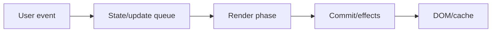
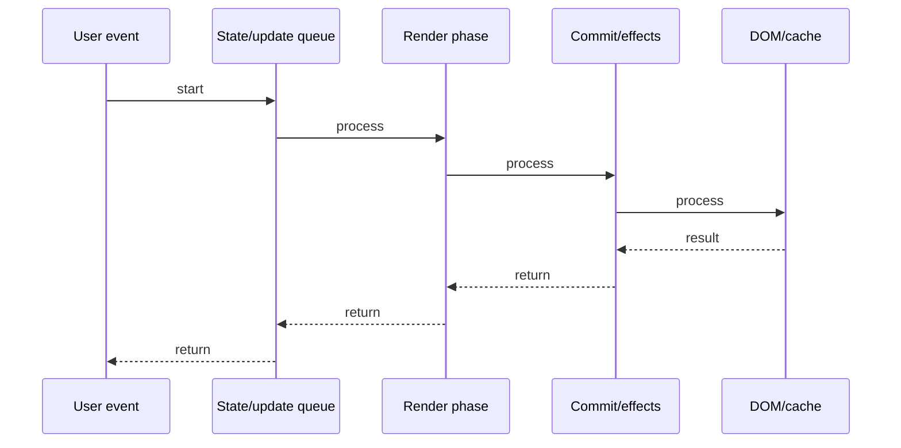

# React Forms

## Quick Facts
- Area: React
- Tag: Patterns
- Source: `src/modules/topics/react/react-forms.js`
- Tags: `react`, `forms`, `controlled`, `uncontrolled`, `validation`, `react-hook-form`
- Visual coverage: live visual

## Concept
Controlled: React owns the form state. Every keystroke -> setState -> re-render -> input reflects state.
Uncontrolled: DOM owns the state. Access value via ref.current.value on submit only.
Controlled = single source of truth; validation on every keystroke; easy to derive UI from state.
Uncontrolled = less re-renders; simple forms; integrating with non-React libs.
react-hook-form: uses uncontrolled inputs internally but gives controlled-like API. Minimal re-renders.

## Why It Matters
Controlled forms re-render on every keystroke - for 20-field forms with validation this can be slow.
react-hook-form re-renders only on submit/error - same API, 10x fewer renders.
Understanding when to use each prevents both over-engineering and performance problems.

## Architecture / Mental Model


## Runtime / Sequence


## Animation Plan
- Flow lab can use generated mental model steps above.
- UML sequence can use generated sequence diagram above.
- Architecture map can use generated area mental model above.
- Live visual exists in app: topic-specific canvas/ReactViz animation.

Flow steps:

1. User event
2. State/update queue
3. Render phase
4. Commit/effects
5. DOM/cache

## Example
```javascript
// CONTROLLED: React owns state
function LoginForm() {
  const [email, setEmail] = useState('');
  const [password, setPassword] = useState('');
  const [error, setError] = useState('');

  function validate(email, password) {
    if (!email.includes('@')) return 'Invalid email';
    if (password.length < 8) return 'Min 8 chars';
    return '';
  }

  function handleSubmit(e) {
    e.preventDefault();
    const err = validate(email, password);
    if (err) { setError(err); return; }
    login(email, password);
  }

  return (
    <form onSubmit={handleSubmit}>
      <input value={email}
             onChange={e => setEmail(e.target.value)} />
      <input value={password} type="password"
             onChange={e => setPassword(e.target.value)} />
      {error && <p>{error}</p>}
      <button type="submit">Login</button>
    </form>
  );
}

// UNCONTROLLED: DOM owns state
function SimpleForm() {
  const emailRef = useRef(null);
  function handleSubmit(e) {
    e.preventDefault();
    console.log(emailRef.current.value); // read on submit
  }
  return <form onSubmit={handleSubmit}>
    <input ref={emailRef} defaultValue="" />
  </form>;
}

// react-hook-form: minimal re-renders
function RHFForm() {
  const { register, handleSubmit, formState: { errors } } = useForm();
  return (
    <form onSubmit={handleSubmit(data => login(data))}>
      <input {...register('email', {
        required: 'Email required',
        pattern: { value: /S+@S+/, message: 'Invalid email' }
      })} />
      {errors.email && <p>{errors.email.message}</p>}
    </form>
  );
}
```

## Complexity And Performance
- Time/space complexity depends on input size, data volume, and implementation choices.
- Track latency, throughput, memory, saturation, error rate, and correctness invariants.

## Interview Drills
1. Controlled vs uncontrolled - when to use each?

2. Why does every onChange cause a re-render in controlled forms?

3. How does react-hook-form reduce re-renders?

4. How do you handle async validation in React forms?

5. How do you reset a form after submit?

6. What is defaultValue vs value in React inputs?

## Trade-offs
_No trade-offs configured._

## Gotchas
- Switching input from controlled to uncontrolled (undefined value -> string) throws React warning.
- value without onChange = read-only input. Use defaultValue for uncontrolled.
- react-hook-form register() must not be in conditional - hook rules apply.
- Form reset: call reset() from useForm, not just clearing state.
- File inputs are always uncontrolled - value cannot be set programmatically.

