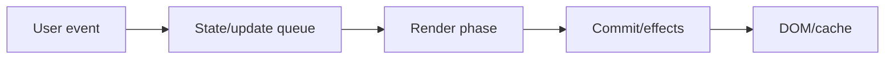
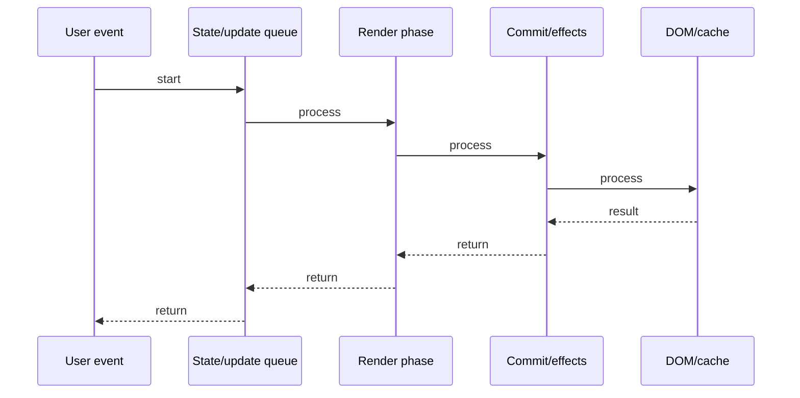

# useMemo & useCallback

## Quick Facts

- Area: React
- Tag: Performance
- Source: `src/modules/topics/react/react-hooks-memo-callback.js`
- Tags: `react`, `usememo`, `usecallback`, `react.memo`, `memoization`, `referential-equality`
- Visual coverage: live visual

## Concept

useMemo caches a computed value. Only recomputes when deps change.
useCallback caches a function reference. Without it, every render creates a NEW function object.
React.memo wraps a component - skips re-render if props are shallowly equal.
Key insight: object/function props break React.memo because new render = new reference = "changed" prop.
useCallback stabilizes function refs so memoized children don't re-render unnecessarily.

## Why It Matters

Without memoization, expensive computations run every render.
More critically, unstable function refs (onClick, onChange) force all child React.memo components to re-render even when nothing logically changed.
In large trees, this cascades - one parent re-render triggers hundreds of child re-renders.

## Architecture / Mental Model



## Runtime / Sequence



## Animation Plan

- Flow lab can use generated mental model steps above.
- UML sequence can use generated sequence diagram above.
- Architecture map can use generated area mental model above.
- Live visual exists in app: topic-specific canvas/ReactViz animation.

Flow steps:

1. User event
2. State/update queue
3. Render phase
4. Commit/effects
5. DOM/cache

## Example

```javascript
// Without memoization - runs every render
const sorted = items.sort((a, b) => a - b); // O(n log n) every time!

// useMemo - only recomputes when items changes
const sorted = useMemo(() => {
  return [...items].sort((a, b) => a - b);
}, [items]);

// Without useCallback - new function every render
const handleClick = () => dispatch({ type: "INC" }); // new ref!

// useCallback - stable reference
const handleClick = useCallback(() => {
  dispatch({ type: "INC" });
}, [dispatch]); // only changes if dispatch changes

// React.memo - skips render if props unchanged
const Child = React.memo(function Child({ value, onClick }) {
  return <button onClick={onClick}>{value}</button>;
}); // onClick must be stable (useCallback) or Child re-renders
```

## Complexity And Performance

- Time/space complexity depends on input size, data volume, and implementation choices.
- Track latency, throughput, memory, saturation, error rate, and correctness invariants.

## Interview Drills

1. When does React.memo re-render despite memoization?

2. useMemo vs useCallback - what is the difference?

3. When is useMemo NOT worth using?

4. How do you memoize a component with context?

5. What is referential equality and why does it matter in React?

6. Can useCallback cause bugs? When?

## Trade-offs

Pros:

- Prevents expensive recomputation
- Stabilizes function refs for memo boundaries
- Critical for large lists

Cons:

- Memory cost to cache
- Wrong deps = stale cache
- Premature optimization overhead

## Gotchas

- useMemo with [] deps = computed once - if the value depends on something else, it will be stale.
- useCallback does NOT prevent the callback from being called - it prevents creating a new function.
- React.memo only does shallow comparison - deep objects still break it.
- Overusing useMemo is worse than not using it - adds memory + complexity.
- useCallback(fn, [dep]) - if dep is unstable (object), still creates new callback every render.
