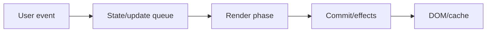
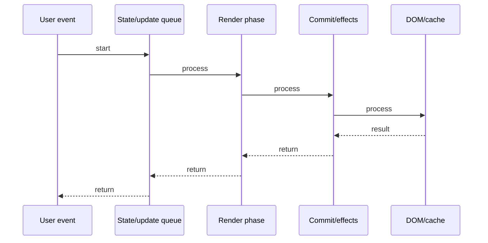

# useRef & useContext

## Quick Facts

- Area: React
- Tag: Hooks
- Source: `src/modules/topics/react/react-hooks-ref-context.js`
- Tags: `react`, `useref`, `usecontext`, `context-api`, `dom`, `mutable-ref`
- Visual coverage: live visual

## Concept

useRef returns a mutable object { current: value } that persists across renders WITHOUT causing re-renders.
Two uses: (1) DOM access - attach ref to element to call .focus()/.scrollIntoView()/.getBoundingClientRect()
(2) Mutable storage - store previous values, timers, instance variables.
useContext subscribes a component to a Context. Any component in the provider tree can consume values without prop drilling.
Context re-renders ALL consumers when value changes - use memoization or split contexts to optimize.

## Why It Matters

useRef solves the "I need to talk to the DOM" problem without breaking React's declarative model.
Context solves prop drilling - passing data 5 levels deep through components that don't care about it.
Context is NOT a replacement for Redux - it has no middleware, no time-travel, no selective subscriptions.

## Architecture / Mental Model



## Runtime / Sequence



## Animation Plan

- Flow lab can use generated mental model steps above.
- UML sequence can use generated sequence diagram above.
- Architecture map can use generated area mental model above.
- Live visual exists in app: topic-specific canvas/ReactViz animation.

Flow steps:

1. User event
2. State/update queue
3. Render phase
4. Commit/effects
5. DOM/cache

## Example

```javascript
// useRef: DOM access
const inputRef = useRef(null);
useEffect(() => {
  inputRef.current.focus(); // access real DOM node
}, []);
<input ref={inputRef} />;

// useRef: mutable value (no re-render)
const countRef = useRef(0);
const handleClick = () => {
  countRef.current += 1; // mutate! doesn't re-render
  console.log(countRef.current);
};

// useRef: previous value pattern
const prevCount = useRef(count);
useEffect(() => {
  prevCount.current = count;
});
// prevCount.current is the value from last render

// useContext: consume context
const theme = useContext(ThemeContext);
// ThemeContext.Provider must be an ancestor

// Context setup
const ThemeContext = createContext("light");
function App() {
  const [theme, setTheme] = useState("dark");
  return (
    <ThemeContext.Provider value={theme}>
      <DeepChild /> {/* no prop drilling needed */}
    </ThemeContext.Provider>
  );
}
```

## Complexity And Performance

- Time/space complexity depends on input size, data volume, and implementation choices.
- Track latency, throughput, memory, saturation, error rate, and correctness invariants.

## Interview Drills

1. Does changing ref.current cause a re-render?

2. When would you use useRef instead of useState?

3. How do you forward a ref to a child component?

4. What is the performance problem with Context?

5. How do you prevent unnecessary Context re-renders?

6. Difference between Context and Redux?

## Trade-offs

Pros:

- useRef: direct DOM access without state
- Context: eliminates prop drilling
- Context: built-in, no deps

Cons:

- Context: all consumers re-render on value change
- useRef mutations are invisible to React
- Context not selective - no per-field subscriptions

## Gotchas

- ref.current changes do NOT cause re-render - reading stale ref in render is a bug.
- Context value should be memoized - {value, setValue} object literal = new ref every render.
- forwardRef needed to pass ref to function components.
- Avoid putting large objects in context - every consumer re-renders on change.
- createContext(defaultValue) - default only used when NO provider is found above in tree.
