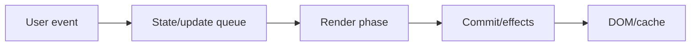
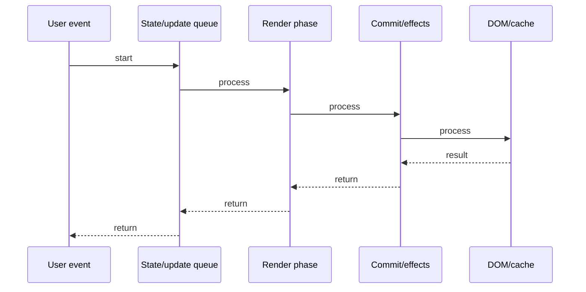

# useState & useEffect

## Quick Facts
- Area: React
- Tag: Hooks
- Source: `src/modules/topics/react/react-hooks-state-effect.js`
- Tags: `react`, `hooks`, `usestate`, `useeffect`, `stale-closure`, `cleanup`
- Visual coverage: live visual

## Concept
useState stores reactive state inside a function component.
React re-renders the component every time setState is called with a new value.
useEffect runs after paint - not during render. It replaces componentDidMount/DidUpdate/WillUnmount.
The dependency array controls WHEN the effect re-runs: [] = once, [x] = when x changes, omitted = every render.
Cleanup function (returned from useEffect) runs before the next effect and on unmount.
Stale closure: effect captures variables at the time it was created - if deps are missing, you read stale values.

## Why It Matters
useState + useEffect are the backbone of React function components.
95% of production React code uses them. Understanding their execution order prevents the most common React bugs:
missing deps -> stale data, no cleanup -> memory leaks, wrong deps -> infinite loops.

## Architecture / Mental Model


## Runtime / Sequence


## Animation Plan
- Flow lab can use generated mental model steps above.
- UML sequence can use generated sequence diagram above.
- Architecture map can use generated area mental model above.
- Live visual exists in app: topic-specific canvas/ReactViz animation.

Flow steps:

1. User event
2. State/update queue
3. Render phase
4. Commit/effects
5. DOM/cache

## Example
```javascript
// useState: local reactive state
const [count, setCount] = useState(0);
const [data, setData]   = useState(null);

// useEffect: side effects after render
useEffect(() => {
  // runs after every render where count changed
  document.title = `Count: ${count}`;

  // cleanup runs before next effect / unmount
  return () => { document.title = 'App'; };
}, [count]); // dependency array

// Fetch on mount ([] = run once)
useEffect(() => {
  let cancelled = false;
  fetch('/api/data')
    .then(r => r.json())
    .then(d => { if (!cancelled) setData(d); });
  return () => { cancelled = true; }; // cleanup = cancel
}, []);

// STALE CLOSURE BUG:
useEffect(() => {
  const id = setInterval(() => {
    setCount(count + 1); // BUG: count is always 0!
  }, 1000);
  return () => clearInterval(id);
}, []); // missing [count]

// FIX: use functional update
setCount(prev => prev + 1); // always fresh
```

## Complexity And Performance
- Time/space complexity depends on deployment, data size, and chosen implementation.
- Track p50/p95/p99 latency, throughput, memory, saturation, and error rate for production topics.

## Interview Drills
1. What is the order of execution: render -> paint -> effect?

2. When does useEffect cleanup run?

3. What causes an infinite useEffect loop?

4. How do you fix a stale closure in useEffect?

5. Difference between useEffect and useLayoutEffect?

6. Can you call hooks conditionally? Why not?

## Trade-offs
Pros:
- Simple state model
- Declarative side effects
- Automatic cleanup

Cons:
- Stale closures hard to debug
- Dependency array must be complete
- Effects run async (not sync)

## Gotchas
- Object/array in deps - new ref every render -> infinite loop. Use useMemo.
- setState in useEffect without deps -> infinite loop.
- Missing cleanup -> memory leak in subscriptions/timers.
- useEffect runs AFTER paint - not during render.
- React batches setState calls in event handlers (React 18: batches everywhere).

