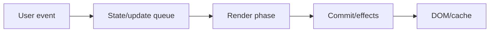
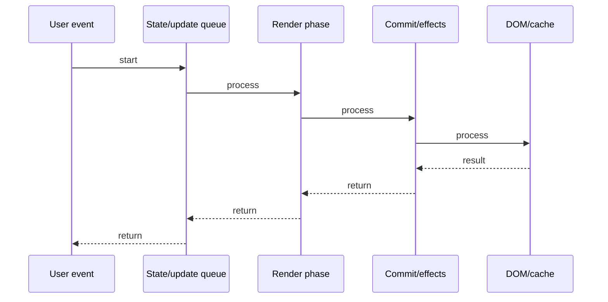

# React.lazy + Suspense

## Quick Facts
- Area: React
- Tag: Performance
- Source: `src/modules/topics/react/react-lazy-suspense.js`
- Tags: `react`, `lazy`, `suspense`, `code-splitting`, `dynamic-import`
- Visual coverage: live visual

## Concept
React.lazy() wraps a dynamic import() to create a lazily-loaded component. Suspense catches the thrown Promise (React's internal mechanism) and renders a fallback while the chunk loads. On first render, the lazy component suspends -> Suspense shows fallback -> chunk loads -> Promise resolves -> component renders. Code splitting reduces initial bundle size.

## Why It Matters
Large apps ship one giant bundle by default. React.lazy + dynamic import() split code at route or feature boundaries. Users load only code they need - critical for performance on mobile/slow connections. Works with Vite, webpack, and Parcel.

## Architecture / Mental Model


## Runtime / Sequence


## Animation Plan
- Flow lab can use generated mental model steps above.
- UML sequence can use generated sequence diagram above.
- Architecture map can use generated area mental model above.
- Live visual exists in app: topic-specific canvas/ReactViz animation.

Flow steps:

1. User event
2. State/update queue
3. Render phase
4. Commit/effects
5. DOM/cache

## Example
```javascript
import { lazy, Suspense } from 'react';

// Chunk only loaded when AdminPanel is first rendered
const AdminPanel = lazy(() => import('./AdminPanel'));
const UserDashboard = lazy(() => import('./UserDashboard'));

function App() {
  return (
    <Suspense fallback={<Spinner />}>
      <Routes>
        <Route path="/admin" element={<AdminPanel />} />
        <Route path="/dashboard" element={<UserDashboard />} />
      </Routes>
    </Suspense>
  );
}

// Fine-grained Suspense boundaries:
function Layout() {
  return (
    <>
      <Navbar />                     {/* always fast */}
      <Suspense fallback={<Skeleton />}>
        <LazyFeature />               {/* suspends independently */}
      </Suspense>
    </>
  );
}
```

## Complexity And Performance
- Time/space complexity depends on deployment, data size, and chosen implementation.
- Track p50/p95/p99 latency, throughput, memory, saturation, and error rate for production topics.

## Interview Drills
1. How does React.lazy work internally (what does it throw)?

2. Where must Suspense be placed relative to lazy components?

3. Can you use React.lazy with named exports?

4. How do you combine lazy loading with React Router v6?

5. What is the difference between Suspense for data fetching vs code splitting?

## Trade-offs
Pros:
- Reduces initial bundle - users only load code they visit
- Zero runtime overhead - pure build-time split
- Works with any bundler supporting dynamic import()
- Nested Suspense boundaries give granular loading states

Cons:
- First visit to a lazy route has loading delay (waterfall)
- React.lazy only works with default exports
- SSR requires additional setup (dynamic() in Next.js)
- Chunk waterfall: lazy loads another lazy -> two round trips

## Gotchas
- React.lazy() must be called at module level - not inside components or conditionals
- Only default exports supported - wrap named exports: () => import("./X").then(m => ({default: m.Foo}))
- Suspense fallback renders for ALL suspended children - nest boundaries for granularity
- Error during chunk load not caught by Suspense - needs ErrorBoundary wrapping it

