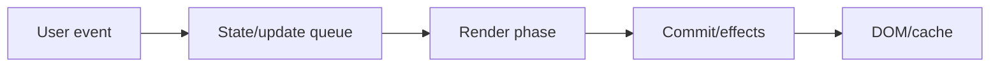
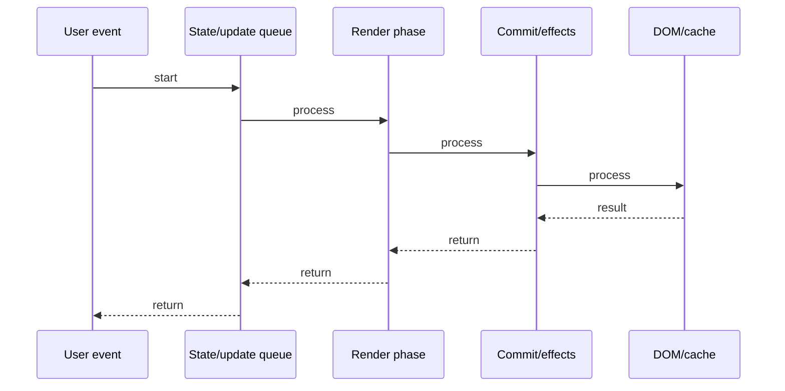

# React Performance

## Quick Facts
- Area: React
- Tag: Performance
- Source: `src/modules/topics/react/react-performance.js`
- Tags: `react`, `performance`, `profiler`, `memo`, `virtualization`, `reconciliation`, `keys`
- Visual coverage: live visual

## Concept
React re-renders a component when: its state changes, its parent re-renders, or context changes.
Re-renders are cheap IF the component is simple. They become expensive when:
  - Many child components re-render unnecessarily
  - Expensive computations run every render
  - Large lists re-render all items
Tools: React.memo (skip re-render), useMemo (cache computation), React Profiler (measure), virtualization (windowing).
Key: helps React identify list items - wrong key = unmount/remount instead of update.

## Why It Matters
Most React apps don't need optimization until they don't.
Profile first - identify the actual bottleneck. 80% of performance issues come from 20% of components.
Common culprits: Context with high-frequency updates, large unvirtualized lists, inline object/function props.

## Architecture / Mental Model


## Runtime / Sequence


## Animation Plan
- Flow lab can use generated mental model steps above.
- UML sequence can use generated sequence diagram above.
- Architecture map can use generated area mental model above.
- Live visual exists in app: topic-specific canvas/ReactViz animation.

Flow steps:

1. User event
2. State/update queue
3. Render phase
4. Commit/effects
5. DOM/cache

## Example
```javascript
// 1. Profile first - identify real bottleneck
import { Profiler } from 'react';

<Profiler id="UserList" onRender={(id, phase, duration) => {
  console.log(id, phase, duration); // 'UserList commit 85ms'
}}>
  <UserList />
</Profiler>

// 2. React.memo - skip re-render if props unchanged
const UserCard = React.memo(function UserCard({ user, onSelect }) {
  return <div onClick={() => onSelect(user.id)}>{user.name}</div>;
}); // shallow comparison - onSelect must be stable!

// 3. Virtualize large lists - only render visible items
import { FixedSizeList } from 'react-window';

<FixedSizeList height={600} itemCount={10000} itemSize={50}>
  {({ index, style }) => (
    <div style={style}><UserCard user={users[index]} /></div>
  )}
</FixedSizeList>

// 4. Key: stable identity for list items
// x index key - causes remount on reorder/insert
users.map((u, i) => <UserCard key={i} user={u} />)

// check stable unique key
users.map(u => <UserCard key={u.id} user={u} />)

// 5. Avoid inline objects/functions in props
// x new object ref every render
<Chart options={{ color: 'blue' }} />

// check stable ref
const chartOpts = useMemo(() => ({ color: 'blue' }), []);
<Chart options={chartOpts} />
```

## Complexity And Performance
- Time/space complexity depends on input size, data volume, and implementation choices.
- Track latency, throughput, memory, saturation, error rate, and correctness invariants.

## Interview Drills
1. When does React re-render a component?

2. What does React.memo do, and when does it fail?

3. How do you profile React component renders?

4. What is virtualization and when should you use it?

5. Why are stable keys important in lists?

6. How do you prevent Context from causing re-renders?

## Trade-offs
Pros:
- React.memo prevents unnecessary renders
- Virtualization enables 100k-item lists
- Profiler identifies exact bottlenecks

Cons:
- memo + useCallback adds complexity
- Premature optimization is harmful
- Profiler has overhead in production

## Gotchas
- React.memo: if parent re-renders and passes new function ref -> child re-renders anyway. Need useCallback.
- key={index}: inserting item at position 0 -> ALL subsequent items remount (wrong keys).
- Profiler measures commit time, not render time - check both.
- Context with split: too many small contexts = hard to maintain.
- react-window requires fixed item sizes - for variable sizes use react-virtual.

