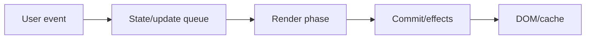
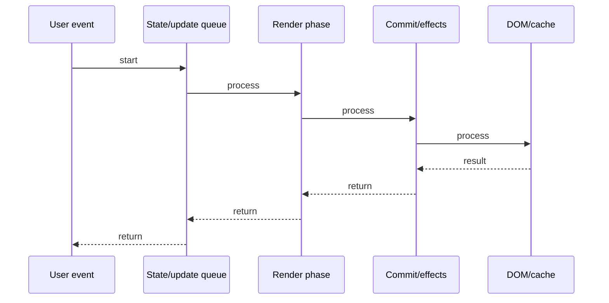

# React Query (TanStack)

## Quick Facts
- Area: React
- Tag: Data Fetching
- Source: `src/modules/topics/react/react-query.js`
- Tags: `react`, `react-query`, `tanstack`, `cache`, `server-state`, `data-fetching`
- Visual coverage: live visual

## Concept
TanStack Query (React Query) manages server state: fetching, caching, synchronizing, and updating async data. useQuery() fetches + caches data keyed by a query key. Data goes stale after staleTime, triggers background refetch on window focus or remount. useMutation() handles writes with optimistic updates. QueryClient holds the cache.

## Why It Matters
Most React apps manually implement loading/error state, caching, and refetching in useEffect - duplicated everywhere and error-prone. React Query replaces all of this with declarative data subscriptions, automatic background sync, and cache deduplication. Server state (fetched data) is fundamentally different from client state (UI state) - it belongs in a different tool.

## Architecture / Mental Model


## Runtime / Sequence


## Animation Plan
- Flow lab can use generated mental model steps above.
- UML sequence can use generated sequence diagram above.
- Architecture map can use generated area mental model above.
- Live visual exists in app: topic-specific canvas/ReactViz animation.

Flow steps:

1. User event
2. State/update queue
3. Render phase
4. Commit/effects
5. DOM/cache

## Example
```javascript
import { useQuery, useMutation, useQueryClient } from '@tanstack/react-query';

// Fetch + cache users
function UserList() {
  const { data, isLoading, error, isFetching } = useQuery({
    queryKey: ['users'],
    queryFn: () => fetch('/api/users').then(r => r.json()),
    staleTime: 5 * 60 * 1000,   // 5 minutes fresh
    gcTime: 10 * 60 * 1000,     // 10 min in cache after unmount
  });

  if (isLoading) return <Spinner />;
  if (error) return <Error message={error.message} />;
  return (
    <>
      {isFetching && <div>Refreshing...</div>}
      <ul>{data.map(u => <li key={u.id}>{u.name}</li>)}</ul>
    </>
  );
}

// Mutation with cache invalidation
function AddUserForm() {
  const queryClient = useQueryClient();
  const mutation = useMutation({
    mutationFn: (user) => fetch('/api/users', { method: 'POST', body: JSON.stringify(user) }),
    onSuccess: () => {
      queryClient.invalidateQueries({ queryKey: ['users'] });
    },
  });

  return <button onClick={() => mutation.mutate({ name: 'Alice' })}>Add</button>;
}
```

## Complexity And Performance
- Time/space complexity depends on input size, data volume, and implementation choices.
- Track latency, throughput, memory, saturation, error rate, and correctness invariants.

## Interview Drills
1. What problem does React Query solve vs useEffect for data fetching?

2. Explain staleTime vs gcTime (cacheTime)

3. What is query key and how does it drive caching?

4. How do optimistic updates work in useMutation?

5. What is background refetching and when does it trigger?

## Trade-offs
Pros:
- Eliminates boilerplate: no manual loading/error/cache state
- Automatic background refetch on window focus, reconnect, component mount
- Request deduplication: same queryKey = one request, shared cache
- Pagination, infinite scroll, prefetching built-in
- Offline support via gcTime

Cons:
- Adds ~12KB to bundle
- QueryClientProvider required at app root
- staleTime=0 default means constant refetching - must configure for your app
- Not a client state manager - still need Zustand/Context for UI state

## Gotchas
- queryKey must include all variables the queryFn depends on - else stale data on param change
- staleTime=0 (default) means data is immediately stale - refetches on every mount
- gcTime (formerly cacheTime): how long unused query stays in cache - defaults to 5 min
- invalidateQueries triggers background refetch only if query has active subscribers

