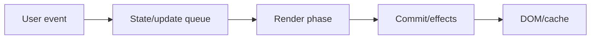
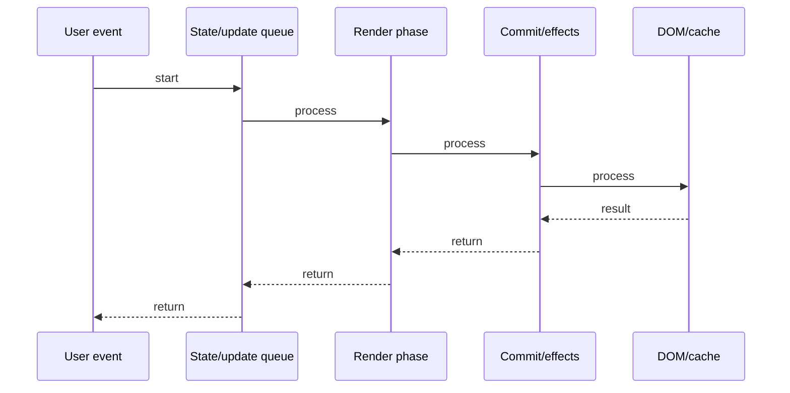

# React Router v6

## Quick Facts
- Area: React
- Tag: Routing
- Source: `src/modules/topics/react/react-router-v6.js`
- Tags: `react`, `router`, `navigation`, `spa`
- Visual coverage: live visual

## Concept
React Router v6 uses a declarative, nested route tree. The <Routes> component matches the current URL against route definitions and renders the deepest matching <Route>. Layouts wrap child routes via <Outlet>. Navigation happens with useNavigate() hook or <Link>. Loaders (React Router 6.4+) fetch data before a route renders.

## Why It Matters
Every SPA needs client-side routing. Router v6 eliminates Switch, makes nested layouts trivial via Outlet, and the 6.4 data APIs (loader/action) co-locate fetching with route definitions - removing waterfall fetching.

## Architecture / Mental Model


## Runtime / Sequence


## Animation Plan
- Flow lab can use generated mental model steps above.
- UML sequence can use generated sequence diagram above.
- Architecture map can use generated area mental model above.
- Live visual exists in app: topic-specific canvas/ReactViz animation.

Flow steps:

1. User event
2. State/update queue
3. Render phase
4. Commit/effects
5. DOM/cache

## Example
```javascript
import { createBrowserRouter, RouterProvider, Outlet } from 'react-router-dom';

const router = createBrowserRouter([
  {
    path: '/',
    element: <Layout />,   // renders <Outlet/>
    children: [
      { index: true, element: <Home /> },
      {
        path: 'users',
        element: <UsersLayout />,
        loader: async () => fetch('/api/users'),
        children: [
          { path: ':id', element: <UserDetail />, loader: ({ params }) => fetchUser(params.id) },
        ],
      },
      { path: '*', element: <NotFound /> },
    ],
  },
]);

function App() {
  return <RouterProvider router={router} />;
}
```

## Complexity And Performance
- Time/space complexity depends on input size, data volume, and implementation choices.
- Track latency, throughput, memory, saturation, error rate, and correctness invariants.

## Interview Drills
1. How does React Router v6 differ from v5? (no Switch, nested routes, Outlet)

2. What is the purpose of <Outlet>?

3. How do loaders work and what problem do they solve?

4. Difference between useNavigate and <Link>?

5. How do you protect a route with authentication in v6?

## Trade-offs
Pros:
- Nested routes + Outlet eliminate complex conditional rendering
- Relative paths by default - cleaner child route definitions
- loaders/actions (6.4+) co-locate data fetching with routes
- useMatches for breadcrumb-style composition

Cons:
- Loaders (6.4+) couple data fetching to routing layer
- Memory router needed for SSR/testing
- Migration from v5 requires rewriting Switch -> Routes

## Gotchas
- Outlet must be in the parent route element or children never render
- index routes (index: true) match "/" exactly - no path property
- useNavigate() only works inside RouterProvider tree
- Loader errors need errorElement on route or they silently fail

