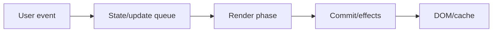
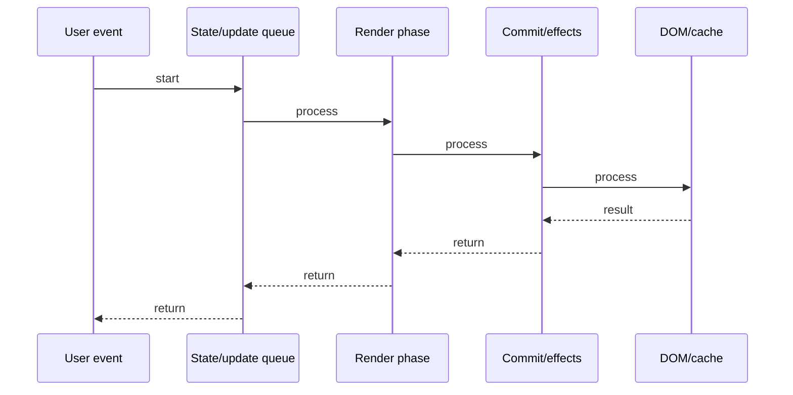

# Server Components (RSC)

## Quick Facts

- Area: React
- Tag: Architecture
- Source: `src/modules/topics/react/react-server-components.js`
- Tags: `react`, `rsc`, `server-components`, `streaming`, `hydration`, `next.js`
- Visual coverage: live visual

## Concept

React Server Components (RSC) run on the server - never sent to the browser.
They can: directly query databases, read files, use server-only secrets.
They CANNOT: use hooks, handle events, use browser APIs.
Client Components ('use client') run in browser - same as traditional React. Use for interactivity.
Streaming: RSC can stream HTML chunks to the browser progressively - no waiting for full page.
Selective hydration: React only hydrates Client Components - server components are pure HTML, zero JS bundle.

## Why It Matters

RSC eliminates the "waterfall" problem: browser fetches JS -> JS fetches data -> renders.
With RSC: server fetches data -> streams HTML -> browser renders immediately, no round-trip.
Bundle size: server-only code (DB clients, heavy libs) never ships to browser - smaller JS bundle.

## Architecture / Mental Model



## Runtime / Sequence



## Animation Plan

- Flow lab can use generated mental model steps above.
- UML sequence can use generated sequence diagram above.
- Architecture map can use generated area mental model above.
- Live visual exists in app: topic-specific canvas/ReactViz animation.

Flow steps:

1. User event
2. State/update queue
3. Render phase
4. Commit/effects
5. DOM/cache

## Example

```javascript
// Server Component (default in Next.js 13+)
// No 'use client' - runs on server only
async function BlogPost({ id }) {
  // check Direct DB access - no API needed!
  const post = await db.posts.findById(id);
  // check fs, secrets, server-only packages
  return (
    <article>
      <h1>{post.title}</h1>
      <Content mdx={post.content} />
      {/* Client Component for interactivity */}
      <LikeButton postId={id} />
    </article>
  );
}

// Client Component - has interactivity
("use client");
function LikeButton({ postId }) {
  const [liked, setLiked] = useState(false);
  return (
    <button
      onClick={() => {
        setLiked(true);
        fetch(`/api/like/${postId}`, { method: "POST" });
      }}
    >
      {liked ? "" : ""} Like
    </button>
  );
}

// Streaming with Suspense:
<Suspense fallback={<PostSkeleton />}>
  <BlogPost id={params.id} /> {/* streams when ready */}
</Suspense>;
```

## Complexity And Performance

- Time/space complexity depends on input size, data volume, and implementation choices.
- Track latency, throughput, memory, saturation, error rate, and correctness invariants.

## Interview Drills

1. What can a Server Component do that a Client Component cannot?

2. How does RSC reduce bundle size?

3. What is streaming and how does it improve TTFB?

4. Can a Server Component import a Client Component? Vice versa?

5. What is selective hydration?

6. How does RSC differ from SSR (getServerSideProps)?

## Trade-offs

Pros:

- Zero JS shipped for server components
- Direct DB access without API layer
- Progressive streaming HTML
- Smaller client bundle

Cons:

- No hooks or event handlers in server components
- Mental model complexity (two environments)
- Framework-specific (Next.js App Router)
- Debugging harder across server/client boundary

## Gotchas

- "use client" marks a component AND all its imports as client - be careful.
- Server components cannot pass functions as props to client components (not serializable).
- Data fetched in server component is not reactive - page must refresh to update.
- Third-party libs without "use client" assume server by default in RSC - may break.
- Context providers must be client components - wrap at boundaries carefully.
