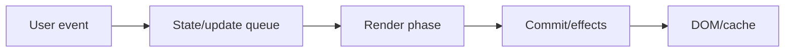
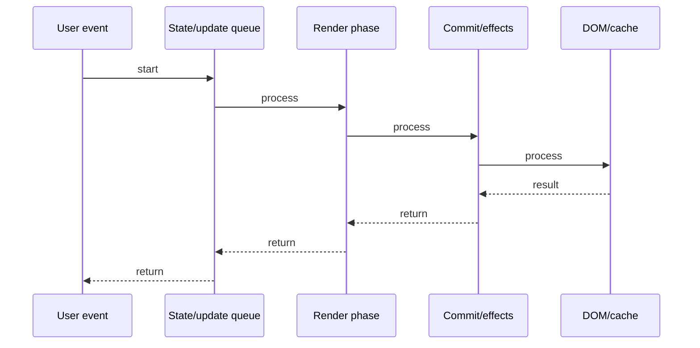

# React Testing (RTL)

## Quick Facts
- Area: React
- Tag: Testing
- Source: `src/modules/topics/react/react-testing.js`
- Tags: `react`, `testing`, `rtl`, `jest`, `vitest`, `user-event`, `accessibility`, `mocking`
- Visual coverage: live visual

## Concept
React Testing Library (RTL) tests components as users interact with them - not implementation details.
Query priority: getByRole > getByLabelText > getByPlaceholderText > getByText > getByTestId.
user-event: simulates real browser events (keyboard, mouse, clipboard) - more realistic than fireEvent.
Async testing: waitFor, findBy* queries wait for DOM updates after async operations.
Mock: jest.fn() for callbacks, jest.spyOn() for methods, msw (Mock Service Worker) for API calls.
Guiding principle: "The more your tests resemble the way your software is used, the more confidence they give."

## Why It Matters
Enzyme tested implementation (internal state, methods) - refactoring broke tests even when app worked.
RTL tests behavior from user's perspective - refactors that don't change UX don't break tests.
Accessibility built-in: RTL queries are ARIA-aware - if getByRole fails, component may have an a11y issue.

## Architecture / Mental Model


## Runtime / Sequence


## Animation Plan
- Flow lab can use generated mental model steps above.
- UML sequence can use generated sequence diagram above.
- Architecture map can use generated area mental model above.
- Live visual exists in app: topic-specific canvas/ReactViz animation.

Flow steps:

1. User event
2. State/update queue
3. Render phase
4. Commit/effects
5. DOM/cache

## Example
```javascript
import { render, screen, waitFor } from '@testing-library/react';
import userEvent from '@testing-library/user-event';
import { rest } from 'msw';
import { setupServer } from 'msw/node';

// Mock API
const server = setupServer(
  rest.post('/api/login', (req, res, ctx) => {
    return res(ctx.json({ token: 'abc123' }));
  })
);
beforeAll(() => server.listen());
afterEach(() => server.resetHandlers());
afterAll(() => server.close());

// Test: user logs in successfully
test('user can login', async () => {
  const user = userEvent.setup();
  render(<LoginForm />);

  await user.type(
    screen.getByRole('textbox', { name: /email/i }),
    'alice@example.com'
  );
  await user.type(
    screen.getByLabelText(/password/i),
    'secret123'
  );
  await user.click(screen.getByRole('button', { name: /login/i }));

  await waitFor(() => {
    expect(screen.getByText(/welcome/i)).toBeInTheDocument();
  });
});

// Test: shows error on failed login
test('shows error on invalid credentials', async () => {
  server.use(rest.post('/api/login', (req, res, ctx) =>
    res(ctx.status(401), ctx.json({ error: 'Invalid credentials' }))
  ));
  const user = userEvent.setup();
  render(<LoginForm />);
  await user.click(screen.getByRole('button', { name: /login/i }));
  expect(await screen.findByRole('alert')).toHaveTextContent(/invalid/i);
});
```

## Complexity And Performance
- Time/space complexity depends on input size, data volume, and implementation choices.
- Track latency, throughput, memory, saturation, error rate, and correctness invariants.

## Interview Drills
1. Why does RTL prefer getByRole over getByTestId?

2. Difference between getBy, queryBy, and findBy?

3. When to use waitFor vs findBy?

4. How do you test a component that fetches data?

5. What is userEvent and how does it differ from fireEvent?

6. What is Mock Service Worker (msw) and why use it over jest.mock(fetch)?

## Trade-offs
Pros:
- Tests behavior, not implementation
- Accessibility built-in
- Resilient to refactors
- msw works in browser too

Cons:
- Async tests can be flaky
- Harder to test complex internal state
- msw setup overhead

## Gotchas
- getBy throws if not found - queryBy returns null. Use queryBy for "should not exist" assertions.
- findBy* is async (returns Promise) - always await it.
- userEvent.setup() must be called once per test.
- screen.debug() prints current DOM - use to diagnose "cannot find element" failures.
- act() warning: RTL handles most cases - manual act() needed for custom timers/intervals.

