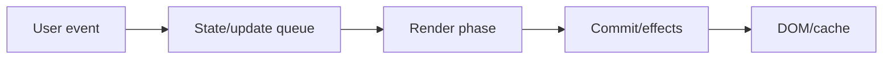
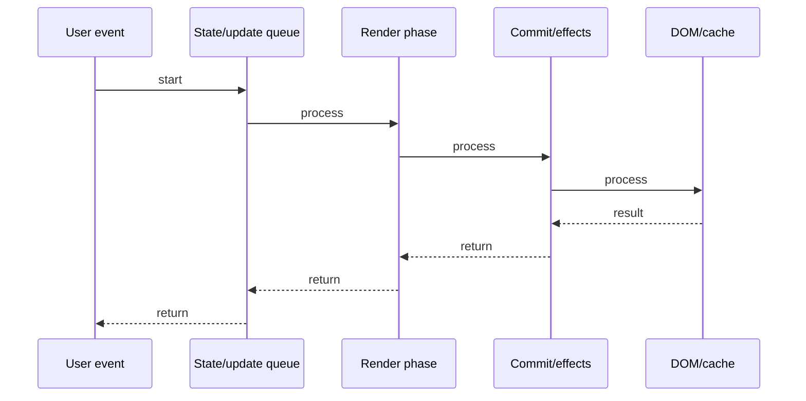

# Zustand Deep Dive

## Quick Facts
- Area: React
- Tag: State
- Source: `src/modules/topics/react/react-zustand.js`
- Tags: `react`, `zustand`, `state-management`, `store`, `selector`
- Visual coverage: live visual

## Concept
Zustand is a minimal state management library using a pub-sub store outside React's component tree. create() produces a store with state + actions. Components subscribe via useStore(selector) - they only re-render when the selected slice changes. No Provider, no boilerplate, no reducers. Internally uses React's useSyncExternalStore hook.

## Why It Matters
Redux adds ~10KB + Provider + actions + reducers + selectors for simple shared state. Zustand achieves the same with 1KB, no Provider, and co-located state+actions. Preferred for mid-scale apps where Context causes too many re-renders but Redux feels like overkill.

## Architecture / Mental Model


## Runtime / Sequence


## Animation Plan
- Flow lab can use generated mental model steps above.
- UML sequence can use generated sequence diagram above.
- Architecture map can use generated area mental model above.
- Live visual exists in app: topic-specific canvas/ReactViz animation.

Flow steps:

1. User event
2. State/update queue
3. Render phase
4. Commit/effects
5. DOM/cache

## Example
```javascript
import { create } from 'zustand';

// Store: state + actions in one place
const useCartStore = create((set, get) => ({
  items: [],
  total: 0,

  addItem: (item) => set((state) => ({
    items: [...state.items, item],
    total: state.total + item.price,
  })),

  removeItem: (id) => set((state) => {
    const items = state.items.filter(i => i.id !== id);
    return { items, total: items.reduce((s, i) => s + i.price, 0) };
  }),

  clearCart: () => set({ items: [], total: 0 }),
}));

// Component - subscribes to only 'items'
function CartList() {
  const items = useCartStore((state) => state.items);
  return <ul>{items.map(i => <li key={i.id}>{i.name}</li>)}</ul>;
}

// Component - subscribes to only 'total'
function CartTotal() {
  const total = useCartStore((state) => state.total);
  return <strong>${total}</strong>;
}
```

## Complexity And Performance
- Time/space complexity depends on deployment, data size, and chosen implementation.
- Track p50/p95/p99 latency, throughput, memory, saturation, and error rate for production topics.

## Interview Drills
1. How does Zustand avoid unnecessary re-renders? (selector equality check)

2. How is Zustand different from Redux and Context?

3. What is useSyncExternalStore and why does Zustand use it?

4. How do you handle async actions in Zustand?

5. Explain Zustand devtools middleware.

## Trade-offs
Pros:
- No Provider - store is module-level singleton
- ~1KB bundle size vs Redux ~10KB
- Selector-based subscriptions prevent unnecessary re-renders
- Actions co-located with state - no separate action/reducer files
- Works outside React (call store.getState() / store.setState() anywhere)

Cons:
- No enforced unidirectional data flow - easy to mutate state inconsistently
- No built-in computed selectors like Reselect (add manually)
- Large stores can become a monolith if not structured
- Time-travel debugging weaker than Redux DevTools

## Gotchas
- Without selector, useStore() re-renders on ANY store change - always pass a selector
- Object selectors create new references - use shallow() from zustand/shallow to compare object slices
- Mutating state directly (state.items.push()) bypasses Zustand - always use set()
- immer middleware available for mutable-style updates: produce(state, draft => { draft.items.push(item) })

