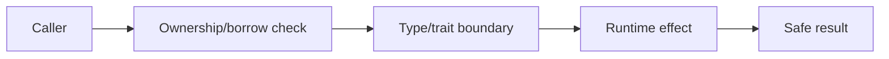
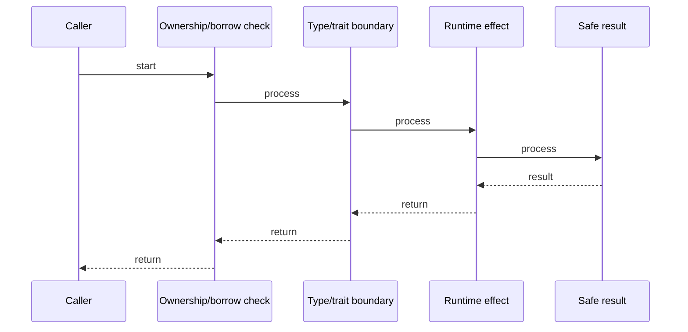

# Rust Lifetimes

## Quick Facts

- Area: Rust
- Tag: Memory
- Source: `src/modules/topics/rust/rust-lifetimes.js`
- Tags: `rust`, `lifetimes`, `references`, `dangling`
- Visual coverage: live visual

## Concept

// TODO - coming soon

## Why It Matters

_No notes yet._

## Architecture / Mental Model

## Runtime / Sequence

## Animation Plan

- Flow lab can use generated mental model steps above.
- UML sequence can use generated sequence diagram above.
- Architecture map can use generated area mental model above.
- Live visual exists in app: topic-specific canvas/ReactViz animation.

Flow steps:

1. Caller
2. Ownership/borrow check
3. Type/trait boundary
4. Runtime effect
5. Safe result

## Example

_No code example configured._

## Complexity And Performance

- Time/space complexity depends on input size, data volume, and implementation choices.
- Track latency, throughput, memory, saturation, error rate, and correctness invariants.

## Interview Drills

_No interview drills configured._

## Trade-offs

// TODO

## Gotchas

_No gotchas configured._
