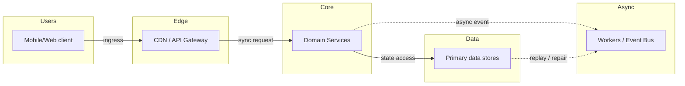
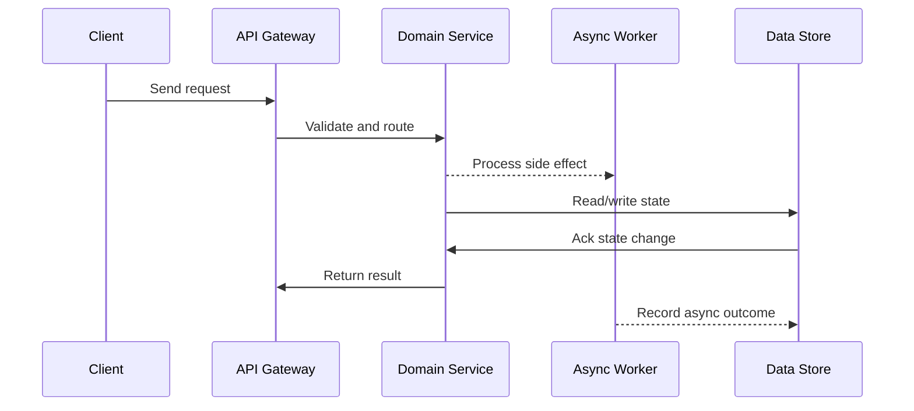

# Case Study: Social Media Feed (Twitter / Instagram)

## Quick Facts
- Area: System Design
- Tag: Case Study
- Source: `src/modules/topics/sysdesign/sd-case-social-feed.js`
- Tags: `social feed`, `fanout`, `fanout on write`, `fanout on read`, `twitter`, `instagram`, `timeline`, `celebrity problem`
- Visual coverage: live visual, flow lab, UML lab, architecture map

## Concept
**Requirements:** Generate a ranked feed of posts from followed users. 500M DAU, 500M tweets/day, 500B feed reads/day.

**Two approaches:**

**Fanout-on-write (push model):**
When user A posts, immediately push to every follower's feed cache.
- Read: O(1) - pre-computed feed in Redis sorted set
- Write: O(followers) - slow for celebrities (Lady Gaga = 50M followers -> 50M Redis writes per tweet)
- Celebrity problem: async fan-out with Kafka; celeb writes go to separate queue

**Fanout-on-read (pull model):**
On feed load, fetch posts from all followed users, merge, rank.
- Write: O(1) - just save the tweet
- Read: O(N accounts followed x posts/account) - slow; requires many DB lookups
- Scales poorly for users following many accounts

**Twitter's hybrid approach:**
- Fanout-on-write for regular users (< 1M followers)
- Fanout-on-read for celebrities (> 1M followers)
- At read time: merge pre-computed feed + real-time fetch of celebrity tweets

**Feed storage:**
Redis sorted set per user: `ZADD feed:{userId} score tweetId`
Score = publish timestamp (or ranking signal: engagement + freshness + relevance).
Keep only last 800 tweets in feed cache; older tweets fetched from DB.

**Ranking:** ML model. Features: author relationship strength, tweet freshness, engagement rate, user interests. Served by a ranking service per request.

**Storage:** Tweets in Cassandra (write-heavy, time-series). User -> followers mapping in graph DB or adjacency list in Cassandra. Media in S3 + CDN.

## Why It Matters
Feed design is asked at Twitter, Instagram, Facebook. Fanout-on-write vs read trade-off demonstrates understanding of the space-time trade-off at scale.

## Architecture / Mental Model


## Runtime / Sequence


## Animation Plan
- Flow lab available: step-by-step path highlighting.
- UML sequence simulation available: actor messages animate in order.
- Architecture map available: clickable nodes and sync/async links.
- Live visual exists in app: topic-specific canvas/ReactViz animation.

Flow steps:

1. Enter system - Request crosses trust boundary and gets normalized before core handling.
2. Execute core path - Gateway routes to owning capability with timeout, auth context, and trace id.
3. Offload slow work - Async path absorbs retries, fanout, indexing, notifications, or heavy processing.
4. Persist state - System writes durable state, cache entries, offsets, or audit evidence.
5. Return or recover - Response returns when sync work succeeds; failure path uses retry, fallback, or replay.

## Example
```java
// Feed service - hybrid fanout
@Service
public class FeedService {

    @Autowired private TweetRepository tweetRepo;         // Cassandra
    @Autowired private FollowerRepository followerRepo;
    @Autowired private RedisTemplate<String,Long> redis;
    @Autowired private KafkaTemplate<String,FanoutTask> kafka;

    // Called when user posts a tweet
    @Async
    public void onTweetCreated(Tweet tweet) {
        long followersCount = followerRepo.countFollowers(tweet.getAuthorId());

        if (followersCount <= 1_000_000) {
            // Regular user: fanout-on-write via Kafka
            kafka.send("fanout.tasks", new FanoutTask(tweet.getId(),
                tweet.getAuthorId(), tweet.getScore()));
        }
        // Celebrities: no fanout - handled at read time
    }

    // Fanout worker - processes FanoutTask from Kafka
    @KafkaListener(topics = "fanout.tasks", concurrency = "20")
    public void fanoutWorker(FanoutTask task) {
        // Get all follower IDs (paginated - may be 100K)
        followerRepo.getFollowerIdsBatch(task.getAuthorId()).forEach(followerId -> {
            // Add tweet to follower's feed sorted set
            redis.opsForZSet().add(
                "feed:" + followerId,
                task.getTweetId(),
                task.getScore()
            );
            // Trim to 800 items
            redis.opsForZSet().removeRange("feed:" + followerId, 0, -801);
        });
    }

    // Get feed for a user
    public List<Tweet> getFeed(String userId, int page, int size) {
        // 1. Get pre-computed feed from Redis
        Set<Long> feedTweetIds = redis.opsForZSet()
            .reverseRange("feed:" + userId, (long)page*size, (long)page*size+size-1);

        // 2. Fetch celebrity tweets user follows (fanout-on-read)
        List<String> celebIds = followerRepo.getCelebrityFollowees(userId);
        List<Tweet> celebTweets = tweetRepo.getRecentTweets(celebIds, 20);

        // 3. Merge + rank
        List<Tweet> allTweets = new ArrayList<>();
        allTweets.addAll(tweetRepo.findAllById(feedTweetIds));
        allTweets.addAll(celebTweets);
        allTweets.sort(Comparator.comparingDouble(Tweet::getScore).reversed());

        return allTweets.subList(0, Math.min(size, allTweets.size()));
    }
}
```

Notes:
Score = timestamp + engagement signal. Freshness ensures new posts appear; engagement signal keeps viral content visible.

## Complexity And Performance
- O(1)
- O(followers)
- O(N accounts followed x posts/account)

## Interview Drills
1. How do you handle the celebrity problem in a social feed?
   Answer: **Problem:** A celebrity with 50M followers posts a tweet. Fanout-on-write = 50M Redis writes in seconds. Redis cluster saturated. Regular fan-outs of normal users starved.
   
   **Solutions:**
   1. **Async batching:** Don't fan-out immediately. Kafka consumer groups process fan-outs over minutes in priority queues. But feed is stale for minutes - unacceptable for real-time.
   2. **Hybrid (Twitter's approach):** Set threshold (1M followers). Regular users -> fanout-on-write. Celebrities -> no precomputed fan-out. At read time, check which celebrities user follows (usually <10), fetch their last 20 tweets, merge with pre-computed feed in real time. Only 10 DB lookups per feed request.
   3. **Sharded fan-out:** Shard celebrity followers into 1000-user batches. Kafka partitions. 50K parallel workers each handle 1000 followers -> complete fan-out in 5 seconds vs 50 seconds sequentially.
   Follow-ups: How does Instagram rank posts in its feed?; How would you implement infinite scroll pagination for a feed?

## Trade-offs
Pros:
- Fanout-on-write: O(1) reads - excellent user experience
- Redis sorted set for feed: sorted by score, O(log N) insert, O(1) read

Cons:
- Fanout-on-write: write amplification for high-follower accounts
- Feed cache must be invalidated on unlike/delete (complex)

When to use:
Always hybrid for social feeds at scale. Fan-out threshold tuned based on follower count. Start with fanout-on-read for simplicity; migrate to write when read latency becomes unacceptable.

## Gotchas
_No gotchas configured._

