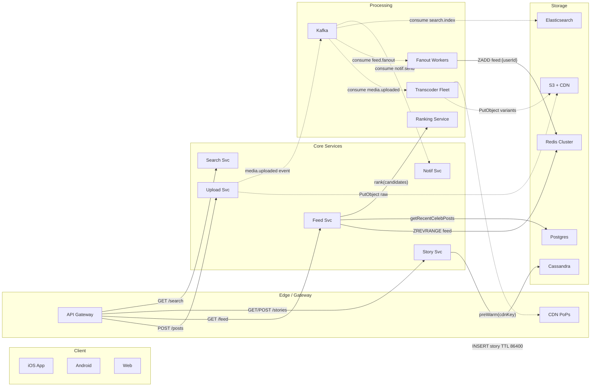
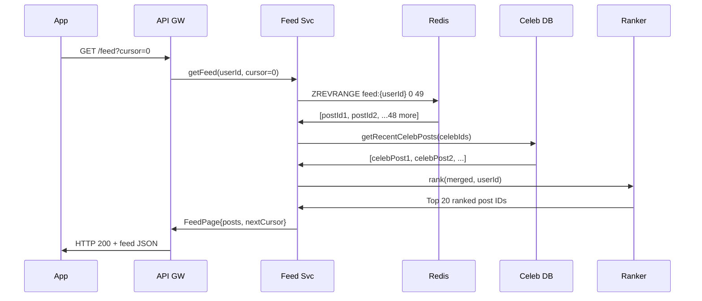

# Case Study: Instagram - Photo/Reel Upload, Feed, Stories & Scale

## Quick Facts
- Area: System Design
- Tag: Case Study
- Source: `src/modules/topics/sysdesign/sd-instagram-deep.js`
- Tags: `instagram`, `photo upload`, `reels`, `stories`, `fanout`, `cdn`, `media processing`, `feed ranking`, `search`, `explore`
- Visual coverage: live visual, flow lab, UML lab, architecture map

## Concept
**Scale:** 2B+ MAU - 100M+ photos/day - 4M likes/second - 500M Stories/day

**Four core flows to master:**

**1 Photo / Reel Upload**
```
Client -> API Gateway -> Upload Service
  -> Object Store (S3 raw)
  -> Kafka: media.uploaded
    -> Transcoder (multiple resolutions: 360/720/1080p, WebP)
    -> CDN Pre-warm (push to edge PoPs)
  -> Metadata DB (Postgres: postId, userId, caption, hashtags)
  -> Search Indexer (Elasticsearch: hashtag/caption)
  -> Fanout Worker (Kafka: feed.fanout)
```

**2 Feed Generation (Hybrid Fanout)**
- **Regular users (<10K followers):** Fanout-on-write -> push postId to each follower's feed in Redis sorted set (score = timestamp)
- **Celebrities (>10K followers):** No precomputed push. At read time, fetch recent posts, merge into feed
- **Feed read:** Merge Redis precomputed + celebrity real-time -> Ranking ML model -> paginated response

**3 Stories (Time-bounded, ring architecture)**
- 24h TTL stored in Cassandra (time-series)
- Viewer ring updated via Redis ZADD storyViews:{storyId} timestamp userId
- Stories CDN pre-warmed for author's top followers (predicted-access pre-push)

**4 Explore / Search**
- Elasticsearch indexes caption + hashtags at upload time
- Trending scored by: view rate x engagement rate x freshness (decaying exponential)
- Personalized Explore: collaborative filtering (users who liked similar posts)

**Storage Architecture:**
| Data | Store | Why |
|------|-------|-----|
| Media files | S3 + CloudFront | Blob, durable, CDN-native |
| Feed cache | Redis sorted set | O(log N) write, O(1) range read |
| Post metadata | Postgres (sharded) | Relational, ACID |
| Stories timeline | Cassandra | Time-series, TTL native |
| Follow graph | adjacency in Postgres + Redis cache | Fast follower lookup |
| Search | Elasticsearch | Full-text + hashtag |

## Why It Matters
Instagram pioneered at-scale media pipelines. Photo upload -> multi-resolution transcode -> CDN pre-warm is the canonical pattern for any media platform. Feed fanout + celebrity hybrid is the textbook answer for all social feed questions. Stories added ephemeral-content pattern (Cassandra TTL, ring viewer tracking).

## Architecture / Mental Model


## Runtime / Sequence


## Animation Plan
- Flow lab available: step-by-step path highlighting.
- UML sequence simulation available: actor messages animate in order.
- Architecture map available: clickable nodes and sync/async links.
- Live visual exists in app: topic-specific canvas/ReactViz animation.

Flow steps:

1. Upload request - Client compresses to JPEG (85% quality), attaches caption + hashtags. Auth token validated at gateway.
2. Store raw media - API writes raw file to S3 bucket (ig-raw). Returns 202 Accepted immediately - rest is async.
3. Publish media.uploaded - S3 event triggers Lambda which publishes MediaEvent{postId, rawKey, userId, followerCount} to Kafka.
4. Transcode to resolutions - Transcoder consumes event. FFmpeg generates 360p/720p/1080p WebP variants in parallel workers.
5. Pre-warm CDN edge - Each variant pushed to CDN with Cache-Control: public, max-age=31536000. Global distribution in <3s.
6. Trigger feed fanout - After transcode complete, FanoutEvent published. Workers skip authors with >10K followers (celebrity path).
7. Write to follower feeds - ZADD feed:{followerId} timestamp postId for each follower. ZREMRANGEBYRANK trims to 800.

## Example
```java
// Instagram-style Upload + Fanout pipeline
@RestController
public class UploadController {

    @Autowired private S3Client s3;
    @Autowired private KafkaTemplate<String,MediaEvent> kafka;
    @Autowired private PostRepository postRepo;

    @PostMapping("/api/v1/posts")
    public ResponseEntity<Post> upload(
            @RequestParam MultipartFile file,
            @RequestParam String caption,
            @AuthenticationPrincipal User user) {

        // 1. Upload raw to S3 (presigned URL flow for large files)
        String rawKey = "raw/" + UUID.randomUUID() + ".jpg";
        s3.putObject(PutObjectRequest.builder().bucket("ig-media").key(rawKey).build(),
                     RequestBody.fromInputStream(file.getInputStream(), file.getSize()));

        // 2. Persist metadata
        Post post = postRepo.save(new Post(user.getId(), rawKey, caption));

        // 3. Trigger async processing pipeline
        kafka.send("media.uploaded", new MediaEvent(post.getId(), rawKey, user.getId(),
                   user.getFollowerCount()));
        return ResponseEntity.accepted().body(post);
    }
}

//  Transcoder Consumer 
@KafkaListener(topics = "media.uploaded", groupId = "transcoder")
public void transcode(MediaEvent evt) {
    List<Integer> resolutions = List.of(360, 720, 1080);
    resolutions.parallelStream().forEach(res -> {
        byte[] transcoded = ffmpegTranscode(evt.getRawKey(), res);
        String cdnKey = "media/" + evt.getPostId() + "/" + res + "p.webp";
        s3.putObject(/* ... */ cdnKey, transcoded);
        cdn.preWarm(cdnKey); // push to edge PoPs
    });
    // Signal fanout worker
    kafka.send("feed.fanout", new FanoutEvent(evt.getPostId(), evt.getUserId(),
               evt.getFollowerCount(), System.currentTimeMillis()));
}

//  Fanout Worker 
@KafkaListener(topics = "feed.fanout", groupId = "fanout", concurrency = "32")
public void fanout(FanoutEvent evt) {
    if (evt.getFollowerCount() > 10_000) return; // celebrities skip - read-time merge

    // Paginate followers (sharded adjacency table)
    followerRepo.streamFollowerIds(evt.getUserId(), 500).forEach(followerId -> {
        double score = evt.getTimestamp();
        redis.opsForZSet().add("feed:" + followerId, evt.getPostId(), score);
        redis.opsForZSet().removeRange("feed:" + followerId, 0, -801); // cap at 800
    });
}

//  Feed Read (Hybrid merge) 
public FeedPage getFeed(String userId, String cursor) {
    // 1. Pre-computed feed from Redis
    long offset = cursor == null ? 0 : Long.parseLong(cursor);
    Set<Long> precomputed = redis.opsForZSet()
        .reverseRange("feed:" + userId, offset, offset + 19);

    // 2. Celebrity followees - fanout-on-read
    List<String> celebrities = followerRepo.getCelebrityFollowees(userId, 10_000);
    List<Post> celebPosts = postRepo.getRecentByAuthors(celebrities, 20);

    // 3. Merge, rank, paginate
    List<Post> all = new ArrayList<>(postRepo.findAllById(precomputed));
    all.addAll(celebPosts);
    rankingService.rank(all, userId); // ML: freshness x engagement x relationship
    return new FeedPage(all.subList(0, Math.min(20, all.size())), String.valueOf(offset+20));
}
```

Notes:
Presigned S3 URL flow: client uploads directly to S3, skipping app servers for large files. Concurrency=32 on fanout consumer handles celebrity bottleneck without blocking regular fanout.

## Complexity And Performance
- O(log N)
- O(1)

## Interview Drills
1. How does Instagram handle a celebrity (500M followers) posting a photo?
   Answer: **Problem:** Fanout-on-write for 500M followers = 500M Redis writes cluster saturated for minutes.
   
   **Instagram hybrid solution:**
   1. **Threshold check** (>10K followers = celebrity) skip precomputed fanout
   2. **At read time:** for each celebrity the user follows, fetch their last 20 posts from post DB
   3. **Merge** celebrity posts with pre-computed regular feed in real time (typically fewer than 10 celebrity followees per user)
   4. **Rank** merged list, return top 20
   
   **Cost:** ~10 extra DB lookups per feed request vs 500M Redis writes per celebrity post.
   **Result:** Feed latency adds ~5ms. Celebrity post visible to all followers instantly.
   
   **Additional trick:** For mega-celebs, Instagram pre-fetches and caches celebrity post IDs at a per-region layer so even the read-time lookup is cached.
   Follow-ups: How would you handle a viral post from a non-celebrity that suddenly gets 10M reposts?; What happens to the Redis feed cache when a user unfollows someone?

2. How do Instagram Stories expire after 24 hours?
   Answer: **Cassandra TTL:** Each story row written with TTL 86400 (24h). Cassandra automatically tombstones and compacts expired rows.
   
   **Feed visibility:** Story ring stored in Redis sorted set stories:{userId} with score = expiry_timestamp. Serve only stories where score > now().
   
   **CDN purge:** Short CDN TTL (1h) + signed URLs with expiry matching story TTL. Expired URL returns 403 from CDN.
   
   **Edge case:** Users expect stories to show until 24h after post time, not midnight. TTL is relative (created_at + 86400), not wall-clock midnight.
   Follow-ups: How would you implement 'Close Friends' stories (restricted visibility)?; How does Instagram track story views without creating a bottleneck at scale?

3. Design Instagram's Explore tab at scale.
   Answer: **Goal:** Surface content the user has not seen but will engage with.
   
   **Two-stage pipeline:**
   1. **Candidate generation:** collaborative filtering - "users who liked posts you liked also liked X". Run offline (Spark) nightly, store top-1000 candidates per user in Cassandra.
   2. **Real-time ranking:** At request time, score candidates by predicted engagement (ML model), content freshness, diversity (avoid N posts from same author).
   
   **Trending hashtags:** Redis sorted set trending:global scored by views in last 1h x engagement rate x decay factor. Updated every 30s by a Flink stream job.
   
   **Content safety:** Each uploaded post runs async through CV classifier (nudity/violence). Flagged posts excluded from Explore.
   Follow-ups: How would you personalize Explore for a brand-new user with no history?; How does hashtag search differ from Explore ranking?

## Trade-offs
Pros:
- Hybrid fanout: O(1) reads for regular users, instant visibility for celebrity posts
- Cassandra TTL for Stories: zero application-level cleanup logic
- CDN pre-warm on upload: first byte to global users in <50ms
- Multi-resolution transcode: adaptive bitrate for bandwidth-constrained devices

Cons:
- Read-time celebrity merge adds latency (acceptable: <10ms with caching)
- Redis feed cache invalidation on unlike/delete requires fan-out of deletions
- Elasticsearch lag: newly uploaded posts searchable after ~2s (eventual consistency)
- Transcode pipeline (Kafka workers) adds 10-30s before HD version available

When to use:
Apply this architecture to any media-first social platform. Fanout threshold tuned per platform (Instagram: ~10K, Twitter: ~1M). Always pre-warm CDN for expected viral content (live events, scheduled drops).

## Gotchas
_No gotchas configured._

