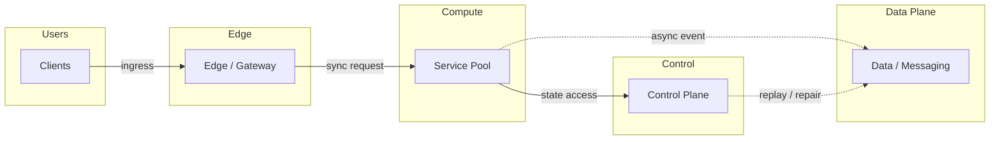
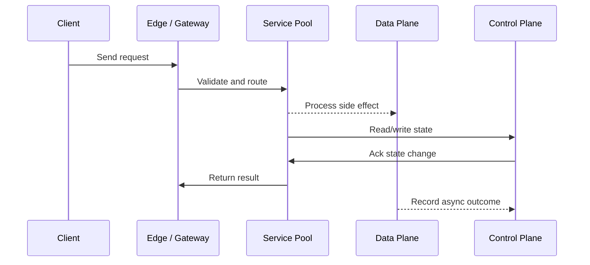

# Kubernetes in Production - Pods, HPA & Rolling Deploys

## Quick Facts
- Area: System Design
- Tag: Compute
- Source: `src/modules/topics/sysdesign/sd-kubernetes-prod.js`
- Tags: `kubernetes`, `k8s`, `pod`, `deployment`, `hpa`, `service`, `ingress`, `rolling deploy`, `liveness probe`, `readiness probe`
- Visual coverage: live visual, flow lab, UML lab, architecture map

## Concept
**Core Kubernetes objects:**

**Pod** - smallest deployable unit. One or more containers sharing network namespace and volumes. Ephemeral - never SSH into a pod.

**Deployment** - manages a ReplicaSet (N pod replicas). Handles rolling updates and rollbacks.

**Service** - stable virtual IP + DNS name for a set of pods. Types: ClusterIP (internal), NodePort, LoadBalancer (cloud LB), ExternalName.

**Ingress** - L7 HTTP routing rule (path/host -> Service). Implemented by ingress controllers (nginx, Traefik, ALB Ingress).

**ConfigMap + Secret** - externalise configuration. Secrets base64-encoded (not encrypted by default - use Sealed Secrets or External Secrets Operator with AWS Secrets Manager).

**HPA (Horizontal Pod Autoscaler)** - scales Deployment replica count based on CPU/memory/custom metrics (via KEDA for queue depth).

**Rolling deploy strategy:**
```
maxSurge: 1      # Allow 1 extra pod during update
maxUnavailable: 0 # Keep all pods available (zero downtime)
```
New pods start -> pass readiness probe -> added to service endpoints -> old pods terminated.

**Probes:**
- **Liveness** - is pod alive? Failure -> container restart.
- **Readiness** - is pod ready to receive traffic? Failure -> removed from service endpoints (but not restarted).
- **Startup** - for slow-starting apps. Disables liveness until started.

## Why It Matters
K8s is the industry standard for container orchestration. Interview questions cover deployments, scaling, networking, and troubleshooting. Understanding probes alone can save hours of incident debugging.

## Architecture / Mental Model


## Runtime / Sequence


## Animation Plan
- Flow lab available: step-by-step path highlighting.
- UML sequence simulation available: actor messages animate in order.
- Architecture map available: clickable nodes and sync/async links.
- Live visual exists in app: topic-specific canvas/ReactViz animation.

Flow steps:

1. Enter system - Request crosses trust boundary and gets normalized before core handling.
2. Execute core path - Gateway routes to owning capability with timeout, auth context, and trace id.
3. Offload slow work - Async path absorbs retries, fanout, indexing, notifications, or heavy processing.
4. Persist state - System writes durable state, cache entries, offsets, or audit evidence.
5. Return or recover - Response returns when sync work succeeds; failure path uses retry, fallback, or replay.

## Example
```yaml
# Production-grade Deployment
apiVersion: apps/v1
kind: Deployment
metadata:
  name: order-service
  namespace: production
spec:
  replicas: 3
  strategy:
    type: RollingUpdate
    rollingUpdate:
      maxSurge: 1
      maxUnavailable: 0        # zero-downtime deploy
  selector:
    matchLabels:
      app: order-service
  template:
    metadata:
      labels:
        app: order-service
        version: v2.1.0
    spec:
      containers:
        - name: order-service
          image: myregistry/order-service:v2.1.0
          ports: [{containerPort: 8080}]
          resources:
            requests: {cpu: "100m", memory: "256Mi"}
            limits:   {cpu: "500m", memory: "512Mi"}
          env:
            - name: DB_PASSWORD
              valueFrom:
                secretKeyRef:
                  name: db-secret
                  key: password
          readinessProbe:
            httpGet: {path: /actuator/health/readiness, port: 8080}
            initialDelaySeconds: 10
            periodSeconds: 5
            failureThreshold: 3
          livenessProbe:
            httpGet: {path: /actuator/health/liveness, port: 8080}
            initialDelaySeconds: 30
            periodSeconds: 10
---
# HPA - scale on CPU + custom metric (queue depth)
apiVersion: autoscaling/v2
kind: HorizontalPodAutoscaler
metadata:
  name: order-service-hpa
spec:
  scaleTargetRef:
    apiVersion: apps/v1
    kind: Deployment
    name: order-service
  minReplicas: 3
  maxReplicas: 20
  metrics:
    - type: Resource
      resource:
        name: cpu
        target:
          type: Utilization
          averageUtilization: 70
    - type: External             # KEDA custom metric
      external:
        metric:
          name: sqs_messages_visible
          selector:
            matchLabels:
              queue: order-queue
        target:
          type: AverageValue
          averageValue: "30"     # Scale up if >30 msgs/pod
```

Notes:
Always set resource requests+limits. Without them, pods can starve other pods (requests) or be OOMKilled (limits). requests=what scheduler uses; limits=hard cap.

## Complexity And Performance
- Time/space complexity depends on deployment, data size, and chosen implementation.
- Track p50/p95/p99 latency, throughput, memory, saturation, and error rate for production topics.

## Interview Drills
1. What happens when a pod fails its liveness probe?
   Answer: The kubelet on the node restarts the container (not the pod). The pod itself stays - it retains its IP, volumes, and resource reservation. The container's process is killed and restarted according to the pod's `restartPolicy` (default: Always).
   
   **Key distinction from readiness:** A failed readiness probe removes the pod from Service endpoints (no traffic) but doesn't restart it. A failed liveness probe restarts the container.
   
   **Common pitfall:** Setting liveness probe path same as a heavyweight health endpoint. If liveness probe itself causes load -> cascade. Use a simple fast endpoint for liveness (`/live`) separate from deep health check.
   Follow-ups: What is pod disruption budget and why is it important?; How does K8s handle node failure?

## Trade-offs
Pros:
- Self-healing (pod restart, node replacement)
- Declarative - desired state reconciled automatically
- Rich ecosystem: Helm, Kustomize, ArgoCD, KEDA

Cons:
- Steep learning curve
- etcd is a critical single point - must be HA
- Networking complexity (CNI, service mesh)

When to use:
K8s for anything running more than a handful of microservices in production. Use managed K8s (EKS, GKE, AKS) - running your own control plane is expensive.

## Gotchas
_No gotchas configured._

