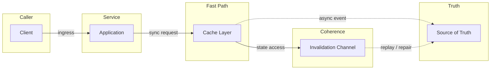
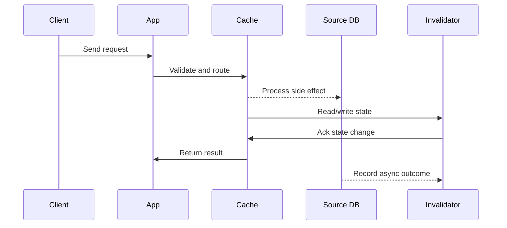

# LLD: LRU & LFU Cache - O(1) Get and Put

## Quick Facts
- Area: System Design
- Tag: LLD
- Source: `src/modules/topics/sysdesign/sd-lld-cache.js`
- Tags: `lru`, `lfu`, `cache`, `hashmap`, `doubly linked list`, `linked hashmap`, `o(1)`
- Visual coverage: live visual, flow lab, UML lab, architecture map

## Concept
**LRU (Least Recently Used):** Evict the item that was accessed longest ago.

**O(1) LRU implementation:** HashMap + Doubly Linked List.
- HashMap: key -> node (O(1) lookup)
- DLL: nodes in access-time order (head = most recent, tail = least recent)
- Get: O(1) - lookup in map, move node to head
- Put: O(1) - add to head; if capacity exceeded, remove tail and map entry

**Java:** LinkedHashMap with accessOrder=true is a built-in LRU cache.

**LFU (Least Frequently Used):** Evict the item accessed fewest times. On tie, evict LRU among those.

**O(1) LFU implementation:** Three maps:
1. `keyToVal` - key -> value
2. `keyToFreq` - key -> frequency count
3. `freqToKeys` - frequency -> LinkedHashSet of keys (LRU order within same freq)
Track `minFreq`. On evict: remove oldest key from `freqToKeys[minFreq]`.

**When to use LRU vs LFU:**
- LRU: general web cache. Recent access = likely to be accessed again.
- LFU: media libraries, CDN content. Popular items (high freq) should stay regardless of recent access.
- LRU simpler to implement; LFU resists scan pollution better.

## Why It Matters
LRU cache implementation is one of the most common coding interview questions. Every caching layer internally uses one of these algorithms.

## Architecture / Mental Model


## Runtime / Sequence


## Animation Plan
- Flow lab available: step-by-step path highlighting.
- UML sequence simulation available: actor messages animate in order.
- Architecture map available: clickable nodes and sync/async links.
- Live visual exists in app: topic-specific canvas/ReactViz animation.

Flow steps:

1. Enter system - Request crosses trust boundary and gets normalized before core handling.
2. Execute core path - Gateway routes to owning capability with timeout, auth context, and trace id.
3. Offload slow work - Async path absorbs retries, fanout, indexing, notifications, or heavy processing.
4. Persist state - System writes durable state, cache entries, offsets, or audit evidence.
5. Return or recover - Response returns when sync work succeeds; failure path uses retry, fallback, or replay.

## Example
```java
// LRU Cache - O(1) get and put
public class LRUCache<K, V> {
    private final int capacity;
    private final LinkedHashMap<K, V> cache;

    public LRUCache(int capacity) {
        this.capacity = capacity;
        // accessOrder=true: get() moves entry to end (most recent)
        this.cache = new LinkedHashMap<>(capacity, 0.75f, true) {
            @Override
            protected boolean removeEldestEntry(Map.Entry<K, V> eldest) {
                return size() > capacity;  // auto-evict LRU entry
            }
        };
    }

    public synchronized V get(K key) {
        return cache.getOrDefault(key, null);
    }

    public synchronized void put(K key, V value) {
        cache.put(key, value);
    }
}

// Custom DLL implementation (for interview - shows understanding)
public class LRUCacheManual {
    private final int capacity;
    private final Map<Integer, Node> map = new HashMap<>();
    private final Node head = new Node(0, 0); // dummy
    private final Node tail = new Node(0, 0); // dummy

    public LRUCacheManual(int capacity) {
        this.capacity = capacity;
        head.next = tail; tail.prev = head;
    }

    public int get(int key) {
        Node n = map.get(key);
        if (n == null) return -1;
        moveToHead(n);  // mark as recently used
        return n.val;
    }

    public void put(int key, int val) {
        Node n = map.get(key);
        if (n != null) { n.val = val; moveToHead(n); return; }
        Node newNode = new Node(key, val);
        map.put(key, newNode);
        addToHead(newNode);
        if (map.size() > capacity) {
            Node lru = removeTail();
            map.remove(lru.key);
        }
    }

    private void addToHead(Node n) {
        n.prev = head; n.next = head.next;
        head.next.prev = n; head.next = n;
    }
    private void removeNode(Node n) {
        n.prev.next = n.next; n.next.prev = n.prev;
    }
    private void moveToHead(Node n) { removeNode(n); addToHead(n); }
    private Node removeTail() { Node n = tail.prev; removeNode(n); return n; }

    static class Node {
        int key, val; Node prev, next;
        Node(int k, int v) { key=k; val=v; }
    }
}

// LFU Cache - O(1) all operations
public class LFUCache {
    private final int capacity;
    private int minFreq = 0;
    private final Map<Integer, Integer> keyToVal = new HashMap<>();
    private final Map<Integer, Integer> keyToFreq = new HashMap<>();
    private final Map<Integer, LinkedHashSet<Integer>> freqToKeys = new HashMap<>();

    public LFUCache(int capacity) { this.capacity = capacity; }

    public int get(int key) {
        if (!keyToVal.containsKey(key)) return -1;
        increaseFreq(key);
        return keyToVal.get(key);
    }

    public void put(int key, int val) {
        if (capacity <= 0) return;
        if (keyToVal.containsKey(key)) {
            keyToVal.put(key, val); increaseFreq(key); return;
        }
        if (keyToVal.size() >= capacity) removeMinFreq();
        keyToVal.put(key, val); keyToFreq.put(key, 1);
        freqToKeys.computeIfAbsent(1, k -> new LinkedHashSet<>()).add(key);
        minFreq = 1;
    }

    private void increaseFreq(int key) {
        int freq = keyToFreq.get(key);
        keyToFreq.put(key, freq + 1);
        freqToKeys.get(freq).remove(key);
        if (freqToKeys.get(freq).isEmpty()) {
            freqToKeys.remove(freq);
            if (minFreq == freq) minFreq++;
        }
        freqToKeys.computeIfAbsent(freq+1, k -> new LinkedHashSet<>()).add(key);
    }

    private void removeMinFreq() {
        LinkedHashSet<Integer> keys = freqToKeys.get(minFreq);
        int lfu = keys.iterator().next(); // LRU among min-freq (LinkedHashSet preserves insertion order)
        keys.remove(lfu); if (keys.isEmpty()) freqToKeys.remove(minFreq);
        keyToVal.remove(lfu); keyToFreq.remove(lfu);
    }
}
```

Notes:
LinkedHashSet preserves insertion order - so iteration gives LRU order among keys with the same frequency. This makes LFU O(1) for all operations.

## Complexity And Performance
- O(1)

## Interview Drills
1. Implement a thread-safe LRU cache in Java.
   Answer: Wrap LinkedHashMap with synchronized methods (as shown above) for simplicity. For production:
   - Use `Collections.synchronizedMap` around LinkedHashMap - coarse-grained lock
   - For better concurrency: use ConcurrentHashMap + ConcurrentLinkedDeque (approximate LRU with lower contention)
   - For high-performance: Caffeine library uses a window TinyLFU algorithm - lock-free, SLRU, ~10x faster than synchronizedLinkedHashMap
   
   Caffeine is what Spring Boot uses internally when you add `@Cacheable` with Caffeine configuration.
   Follow-ups: What is the Window TinyLFU algorithm used by Caffeine?; When is LFU strictly better than LRU?

## Trade-offs
Pros:
- LRU: simple, O(1), handles temporal locality
- LFU: resists cache pollution from one-time scans
- Both: bounded memory, automatic eviction

Cons:
- LRU: scan can evict popular items
- LFU: frequency counts inflate for old items (frequency aging needed)
- Both: no awareness of item size - small and large items treated equally

When to use:
LRU for general application caches (HTTP responses, DB query results). LFU for content libraries (videos, images) where popularity matters more than recency.

## Gotchas
_No gotchas configured._

