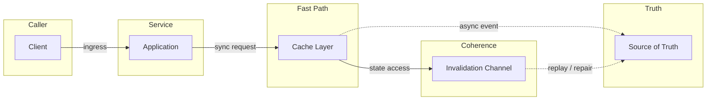
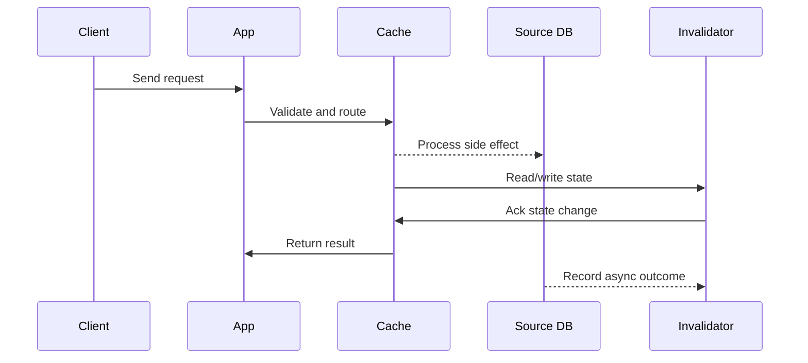

# LLD: Consistent Hashing - Hash Ring & Virtual Nodes

## Quick Facts
- Area: System Design
- Tag: LLD
- Source: `src/modules/topics/sysdesign/sd-lld-consistent-hash.js`
- Tags: `consistent hashing`, `hash ring`, `virtual nodes`, `vnodes`, `distributed cache`, `memcached`, `chord`
- Visual coverage: live visual, flow lab, UML lab, architecture map

## Concept
**Problem with mod-N hashing:** `shard = hash(key) % N`. When N changes (add/remove a node), nearly all keys remap -> massive cache miss storm.

**Consistent hashing solution:**
1. Hash space is a circular ring [0, 2^32). 
2. Place servers on the ring by hashing their ID: `hash("server-1") -> position P`.
3. For a key, hash it -> find the next server clockwise on the ring.
4. When a server is added/removed, only keys between it and its predecessor move.
5. On average, only K/N keys remap (K = total keys, N = node count).

**Virtual nodes (vnodes):**
Real problem: few servers -> uneven distribution (load imbalance).
Solution: each physical server gets V virtual node positions on the ring (V=100-300).
- Uniform distribution across the ring.
- More powerful servers get more vnodes -> weighted assignment.
- On failure: keys spread across all remaining servers (no single successor overwhelmed).

**Used by:** Apache Cassandra (256 vnodes default), Amazon DynamoDB, Redis Cluster (16384 hash slots  consistent hashing), Memcached client libraries.

**Hash slots (Redis Cluster):** 16384 fixed slots instead of continuous ring. Each master owns a range. Gossip protocol tracks slot assignments.

## Why It Matters
Consistent hashing is foundational to distributed systems. It appears in every database, cache, and CDN design. Interviewers expect you to draw the ring and explain vnodes.

## Architecture / Mental Model


## Runtime / Sequence


## Animation Plan
- Flow lab available: step-by-step path highlighting.
- UML sequence simulation available: actor messages animate in order.
- Architecture map available: clickable nodes and sync/async links.
- Live visual exists in app: topic-specific canvas/ReactViz animation.

Flow steps:

1. Enter system - Request crosses trust boundary and gets normalized before core handling.
2. Execute core path - Gateway routes to owning capability with timeout, auth context, and trace id.
3. Offload slow work - Async path absorbs retries, fanout, indexing, notifications, or heavy processing.
4. Persist state - System writes durable state, cache entries, offsets, or audit evidence.
5. Return or recover - Response returns when sync work succeeds; failure path uses retry, fallback, or replay.

## Example
```java
// Consistent Hash Ring implementation
public class ConsistentHashRing<T> {
    private final TreeMap<Long, T> ring = new TreeMap<>();
    private final int virtualNodes;
    private final MessageDigest md5;

    public ConsistentHashRing(int virtualNodes) throws NoSuchAlgorithmException {
        this.virtualNodes = virtualNodes;
        this.md5 = MessageDigest.getInstance("MD5");
    }

    public void addServer(T server) {
        for (int i = 0; i < virtualNodes; i++) {
            long hash = hash(server.toString() + "#vnode-" + i);
            ring.put(hash, server);
        }
    }

    public void removeServer(T server) {
        for (int i = 0; i < virtualNodes; i++) {
            long hash = hash(server.toString() + "#vnode-" + i);
            ring.remove(hash);
        }
    }

    public T getServer(String key) {
        if (ring.isEmpty()) return null;
        long hash = hash(key);
        // Find first server clockwise from key's position
        Map.Entry<Long, T> entry = ring.ceilingEntry(hash);
        if (entry == null) entry = ring.firstEntry(); // wrap around ring
        return entry.getValue();
    }

    private long hash(String key) {
        byte[] digest = md5.digest(key.getBytes(StandardCharsets.UTF_8));
        // Use first 4 bytes as unsigned int
        return ((long)(digest[3] & 0xFF) << 24)
             | ((long)(digest[2] & 0xFF) << 16)
             | ((long)(digest[1] & 0xFF) << 8)
             | ((long)(digest[0] & 0xFF));
    }
}

// Usage - Memcached-style key routing
ConsistentHashRing<String> ring = new ConsistentHashRing<>(150);
ring.addServer("cache-1:11211");
ring.addServer("cache-2:11211");
ring.addServer("cache-3:11211");

String server = ring.getServer("user:42:profile"); // always routes to same server
// -> "cache-2:11211"

ring.addServer("cache-4:11211");  // only ~25% of keys remap (vs 75% with mod-4)
ring.getServer("user:42:profile"); // may now route to "cache-4:11211" or still "cache-2"
```

Notes:
With 150 vnodes per server, standard deviation of load across servers is <10%. With 1 vnode it can be 200%+.

## Complexity And Performance
- Time/space complexity depends on deployment, data size, and chosen implementation.
- Track p50/p95/p99 latency, throughput, memory, saturation, and error rate for production topics.

## Interview Drills
1. How does consistent hashing minimise key remapping when a node is added?
   Answer: With mod-N hashing and N -> N+1: key K remaps if `hash(K) % (N+1)  hash(K) % N`. This is true for ~N/(N+1) of all keys -> nearly everything remaps.
   
   With consistent hashing: the new node takes the position between two existing nodes on the ring. It only claims keys that would have gone to the next clockwise node - approximately K/N keys. All other keys are unaffected.
   
   Math: if we add 1 server to a 10-server ring, only 10% of keys move (1/11). With mod-N: 91% move.
   
   Vnodes amplify this: the new server's 150 vnodes are spread across the ring, claiming small slices from many existing servers - very uniform redistribution.
   Follow-ups: How does Redis Cluster implement consistent hashing with hash slots?; What happens to in-flight requests when a node is added to a Cassandra cluster?

## Trade-offs
Pros:
- Only K/N keys remap on topology change
- Vnodes give near-uniform distribution
- Weighted assignment via vnode count

Cons:
- More complex than mod-N
- Vnodes add memory overhead (ring size = servers x vnodes entries)
- Hot spots still possible if many popular keys hash to same region

When to use:
Use consistent hashing for any distributed cache or storage system where nodes join/leave dynamically. Essential for Cassandra, DynamoDB, Redis Cluster, and CDN routing.

## Gotchas
_No gotchas configured._

