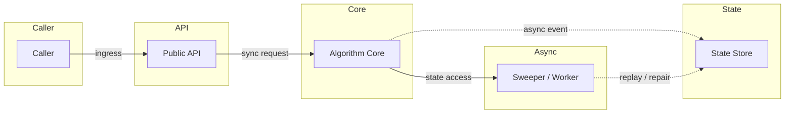
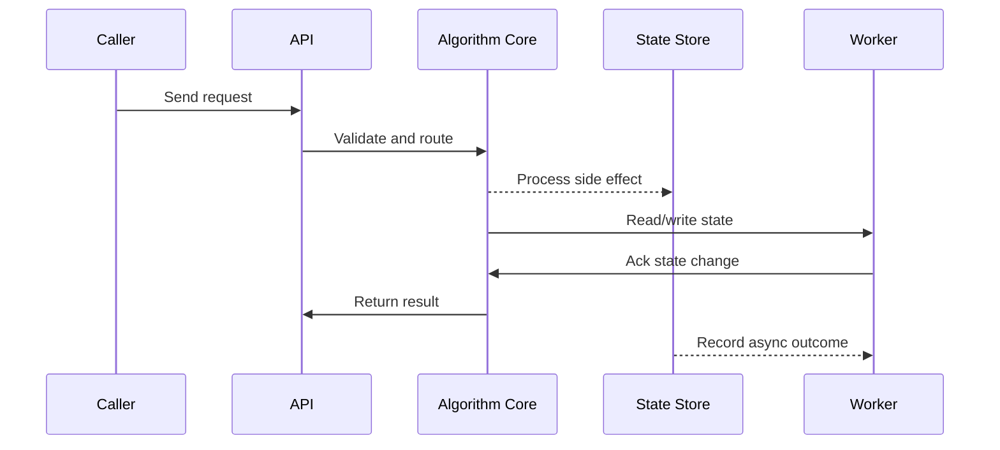

# LLD: Distributed Lock - Redlock, Zookeeper & Fencing

## Quick Facts
- Area: System Design
- Tag: LLD
- Source: `src/modules/topics/sysdesign/sd-lld-distributed-lock.js`
- Tags: `distributed lock`, `redlock`, `zookeeper`, `fencing token`, `mutex`, `lease`, `etcd`, `leader election`
- Visual coverage: live visual, flow lab, UML lab, architecture map

## Concept
**Why distributed locks?** Multiple nodes must not simultaneously perform a non-idempotent operation (e.g., deduct inventory, send email, run cron job once).

**Single Redis lock (SET NX PX):**
```
SET lock:resource uniqueToken NX PX 30000
```
- NX = set if not exists (atomic compare-and-set)
- PX 30000 = auto-expire after 30s (avoid deadlock on crash)
- Release: Lua script - only delete if value matches (you own the lock)
- Problem: single Redis node SPOF; clock skew on failover.

**Redlock (Multi-node Redis):**
Acquire lock on N Redis nodes (typically 5) quorum (N/2+1 = 3). Reject if total acquisition time > lock validity. Release from all nodes.
- More resilient than single node.
- Debated: Martin Kleppmann argues it's unsafe without fencing tokens.

**Fencing tokens:**
Monotonically increasing token issued with each lock acquisition. Storage layer rejects writes with token < max seen. Safe even if lock expires early due to GC pause.

**Zookeeper / etcd locks:**
- ZK ephemeral nodes: create ephemeral sequential node; watch lowest node -> you hold lock.
- etcd: optimistic concurrency via compare-and-swap on a key with lease TTL.
- Strong consistency (linearisable) - safer than Redis for critical sections.

**Leader election:** Same mechanism - first to acquire distributed lock becomes leader. Heartbeat to renew lease. Others watch for expiry.

## Why It Matters
Distributed locks are a classic LLD problem. The subtle failure modes (process pause, clock skew, network partition) demonstrate senior-level thinking.

## Architecture / Mental Model


## Runtime / Sequence


## Animation Plan
- Flow lab available: step-by-step path highlighting.
- UML sequence simulation available: actor messages animate in order.
- Architecture map available: clickable nodes and sync/async links.
- Live visual exists in app: topic-specific canvas/ReactViz animation.

Flow steps:

1. Node A: SET lock NX PX 10000 - Node A acquires lock. Redis returns unique token + fencing token (monotonic counter).
2. Node B: SET lock NX -> fails - Node B tries to acquire. Key exists -> fails. Node B retries with backoff.
3. Node A writes with token=42 - Node A performs critical section work. Includes token=42 in write request.
4. Write accepted (token 42 > max 41) - Storage accepts because token 42 is the highest seen.
5. Node A GC pause - lock expires - Node A pauses for 15 seconds. Lock TTL expires after 10 seconds.
6. Node B acquires expired lock - Node B retries, finds lock expired. Acquires with token=43.
7. Node A resumes, tries write with token=42 - Node A comes back, still thinks it holds lock. Tries to write with old token=42.
8. Write REJECTED (token 42 < max 43) - Storage rejects - token 42 is stale. Node B's write (token 43) is safe.

## Example
```java
// Redis distributed lock with fencing token simulation
@Component
public class RedisDistributedLock {

    @Autowired private StringRedisTemplate redis;

    private static final String RELEASE_SCRIPT =
        "if redis.call('GET', KEYS[1]) == ARGV[1] then " +
        "  return redis.call('DEL', KEYS[1]) " +
        "else return 0 end";

    public Optional<String> tryAcquire(String resource, Duration ttl) {
        String token = UUID.randomUUID().toString(); // unique owner ID
        Boolean acquired = redis.opsForValue()
            .setIfAbsent("lock:" + resource, token, ttl);
        return Boolean.TRUE.equals(acquired) ? Optional.of(token) : Optional.empty();
    }

    public boolean release(String resource, String token) {
        Long result = redis.execute(
            new DefaultRedisScript<>(RELEASE_SCRIPT, Long.class),
            List.of("lock:" + resource), token);
        return Long.valueOf(1L).equals(result);
    }

    // Acquire with retry
    public String acquireWithRetry(String resource, Duration ttl,
                                    int maxRetries, Duration retryDelay)
            throws InterruptedException {
        for (int i = 0; i < maxRetries; i++) {
            Optional<String> token = tryAcquire(resource, ttl);
            if (token.isPresent()) return token.get();
            Thread.sleep(retryDelay.toMillis() + ThreadLocalRandom.current().nextInt(50));
        }
        throw new LockAcquisitionException("Failed to acquire lock for: " + resource);
    }
}

// Usage pattern - always use try-finally to release
@Service
public class InventoryService {
    @Autowired private RedisDistributedLock lock;

    public void deductInventory(String productId, int quantity) throws Exception {
        String token = lock.acquireWithRetry("inventory:" + productId,
                                              Duration.ofSeconds(10), 3,
                                              Duration.ofMillis(100));
        try {
            // Critical section - only one node executes this at a time
            int current = inventoryRepo.getQuantity(productId);
            if (current < quantity) throw new InsufficientInventoryException();
            inventoryRepo.setQuantity(productId, current - quantity);
        } finally {
            lock.release("inventory:" + productId, token); // always release
        }
    }
}
```

Notes:
TTL is a safety net - not the normal release path. Always release explicitly in finally block. TTL prevents deadlock if the holder crashes before releasing.

## Complexity And Performance
- Time/space complexity depends on deployment, data size, and chosen implementation.
- Track p50/p95/p99 latency, throughput, memory, saturation, and error rate for production topics.

## Interview Drills
1. What is a fencing token and why does it matter for distributed locks?
   Answer: The fundamental problem: a process can acquire a lock, then pause (GC, OS scheduling, network lag). The lock expires. Another process acquires it. The first process resumes and thinks it still holds the lock - two processes in the critical section simultaneously.
   
   **Fencing token solution:**
   1. Lock service issues a monotonically increasing token with each lock grant (e.g., etcd revision number, ZK sequence number)
   2. Lock holder includes token in every write to the storage layer
   3. Storage layer rejects any write with a token <= max seen
   
   Result: even if paused process resumes and tries to write, storage rejects it because new lock holder's token is higher.
   
   Redis SET NX doesn't issue fencing tokens - this is Martin Kleppmann's critique of Redlock. Use etcd or ZooKeeper for safety-critical distributed locks.
   Follow-ups: Explain the ZooKeeper ephemeral node approach to distributed locking.; How does etcd use compare-and-swap for leader election?

## Trade-offs
Pros:
- Prevents concurrent modification of shared resource
- Redis lock is simple and fast (~1ms)
- etcd/ZK: strongly consistent, fencing tokens possible

Cons:
- Redis lock: not safe under clock skew or network partition
- ZK/etcd: slower than Redis, more complex to operate
- Distributed locks are a code smell - prefer idempotent design

When to use:
Use distributed locks as last resort. First, try: idempotent operations, optimistic concurrency (version check in DB), CRDT-based design. When you do need a lock, use etcd/ZK for correctness; Redis for performance-critical non-critical-path operations.

## Gotchas
_No gotchas configured._

