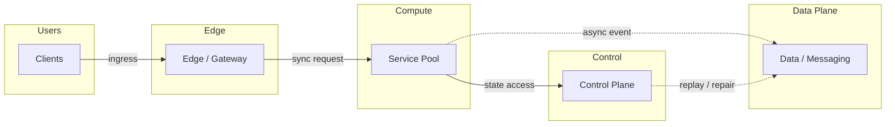
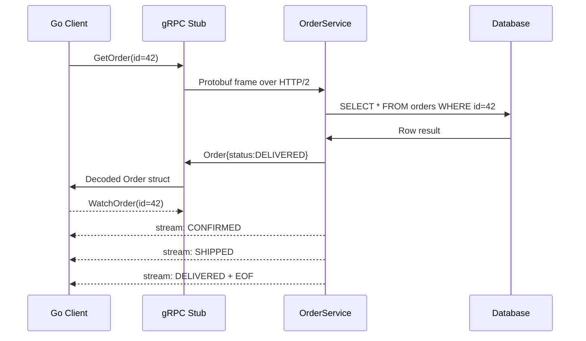

# gRPC, Protobuf & Bidirectional Streaming

## Quick Facts
- Area: System Design
- Tag: Protocols
- Source: `src/modules/topics/sysdesign/sd-protocols-grpc.js`
- Tags: `grpc`, `protobuf`, `streaming`, `http2`, `rpc`, `service mesh`
- Visual coverage: live visual, flow lab, UML lab, architecture map

## Concept
**gRPC** is a high-performance RPC framework by Google. It uses **Protocol Buffers** (Protobuf) for serialisation and **HTTP/2** for transport.

**Why gRPC over REST+JSON?**
- Protobuf binary is **5-10x smaller** and **6x faster** to serialise than JSON
- HTTP/2 multiplexing - all streams share one connection
- **Strongly typed** contract via .proto files - compile-time checking
- Native **streaming** (4 modes: unary, server-stream, client-stream, bidirectional)
- First-class code generation for 12+ languages

**The 4 RPC modes:**
```protobuf
service OrderService {
  // 1. Unary - one request, one response
  rpc GetOrder(OrderRequest) returns (Order);

  // 2. Server streaming - one request, stream of responses
  rpc WatchOrder(OrderRequest) returns (stream OrderEvent);

  // 3. Client streaming - stream of requests, one response
  rpc BatchCreate(stream CreateRequest) returns (BatchResult);

  // 4. Bidirectional - both sides stream
  rpc Chat(stream Message) returns (stream Message);
}
```

**When to prefer REST:** public APIs (browser clients can't call gRPC natively without grpc-web proxy), simple CRUD, teams unfamiliar with Protobuf.

## Why It Matters
Microservice-to-microservice communication at scale (Google, Netflix, Uber internal) uses gRPC because the payload savings and streaming modes reduce bandwidth by 10x and latency by 2-3x vs JSON/REST.

## Architecture / Mental Model


## Runtime / Sequence


## Animation Plan
- Flow lab available: step-by-step path highlighting.
- UML sequence simulation available: actor messages animate in order.
- Architecture map available: clickable nodes and sync/async links.
- Live visual exists in app: topic-specific canvas/ReactViz animation.

Flow steps:

1. Enter system - Request crosses trust boundary and gets normalized before core handling.
2. Execute core path - Gateway routes to owning capability with timeout, auth context, and trace id.
3. Offload slow work - Async path absorbs retries, fanout, indexing, notifications, or heavy processing.
4. Persist state - System writes durable state, cache entries, offsets, or audit evidence.
5. Return or recover - Response returns when sync work succeeds; failure path uses retry, fallback, or replay.

## Example
```go
// proto definition
// file: order.proto
syntax = "proto3";
service OrderService {
  rpc GetOrder(OrderRequest) returns (Order);
  rpc WatchOrder(OrderRequest) returns (stream OrderEvent);
}
message OrderRequest { string order_id = 1; }
message Order {
  string id = 1;
  string status = 2;
  double total = 3;
}
message OrderEvent { string order_id = 1; string event = 2; }

//  Go server implementation 
package main

import (
    "context"
    "time"
    pb "myapp/gen/order"
    "google.golang.org/grpc"
    "net"
)

type server struct{ pb.UnimplementedOrderServiceServer }

func (s *server) GetOrder(ctx context.Context, req *pb.OrderRequest) (*pb.Order, error) {
    return &pb.Order{Id: req.OrderId, Status: "DELIVERED", Total: 99.99}, nil
}

func (s *server) WatchOrder(req *pb.OrderRequest, stream pb.OrderService_WatchOrderServer) error {
    events := []string{"CONFIRMED", "PACKED", "SHIPPED", "DELIVERED"}
    for _, ev := range events {
        if err := stream.Send(&pb.OrderEvent{OrderId: req.OrderId, Event: ev}); err != nil {
            return err
        }
        time.Sleep(500 * time.Millisecond)
    }
    return nil
}

func main() {
    lis, _ := net.Listen("tcp", ":50051")
    s := grpc.NewServer()
    pb.RegisterOrderServiceServer(s, &server{})
    s.Serve(lis)
}
```

Notes:
Run `protoc --go_out=. --go-grpc_out=. order.proto` to generate type-safe client/server stubs.

## Complexity And Performance
- Time/space complexity depends on deployment, data size, and chosen implementation.
- Track p50/p95/p99 latency, throughput, memory, saturation, and error rate for production topics.

## Interview Drills
1. How does Protobuf serialisation achieve smaller payload sizes than JSON?
   Answer: Protobuf uses field **numbers** (varint-encoded) instead of string field names. Each field is encoded as a tag (field number + wire type) followed by the value - no quotes, no brackets, no whitespace.
   
   Example: `{"status":"DELIVERED","total":99.99}` is 34 bytes JSON vs ~10 bytes Protobuf.
   
   Additionally: integers use variable-length encoding (small numbers = fewer bytes), repeated fields avoid repeated keys, default values are omitted entirely.
   Follow-ups: What happens when you add a new field to a Protobuf schema?; How do you handle Protobuf schema evolution without breaking clients?

2. How would you expose a gRPC service to a browser-based frontend?
   Answer: Browsers can't call gRPC natively (no HTTP/2 trailer support). Options:
   
   1. **grpc-web** - Envoy/nginx proxy translates gRPC-web (HTTP/1.1) -> gRPC. Supports unary and server streaming.
   2. **Transcoding** - gRPC-gateway generates a REST+JSON proxy from proto annotations. Same service, two interfaces.
   3. **Connect protocol** - modern alternative (Buf Connect); works natively in browsers without proxy, compatible with gRPC servers.
   Follow-ups: What is the Connect protocol?

## Trade-offs
Pros:
- 5-10x smaller payload vs JSON
- HTTP/2 multiplexing - no connection per call
- Native streaming - bidirectional is unique to gRPC
- Strong typing + codegen eliminates serialisation bugs

Cons:
- Not human-readable - harder to debug without tooling
- Browser support requires proxy (grpc-web)
- Protobuf schema management adds overhead
- Steeper learning curve than REST

When to use:
Internal microservice communication, high-throughput data pipelines, streaming use cases. Use REST for public APIs or when browser clients call directly.

## Gotchas
_No gotchas configured._

