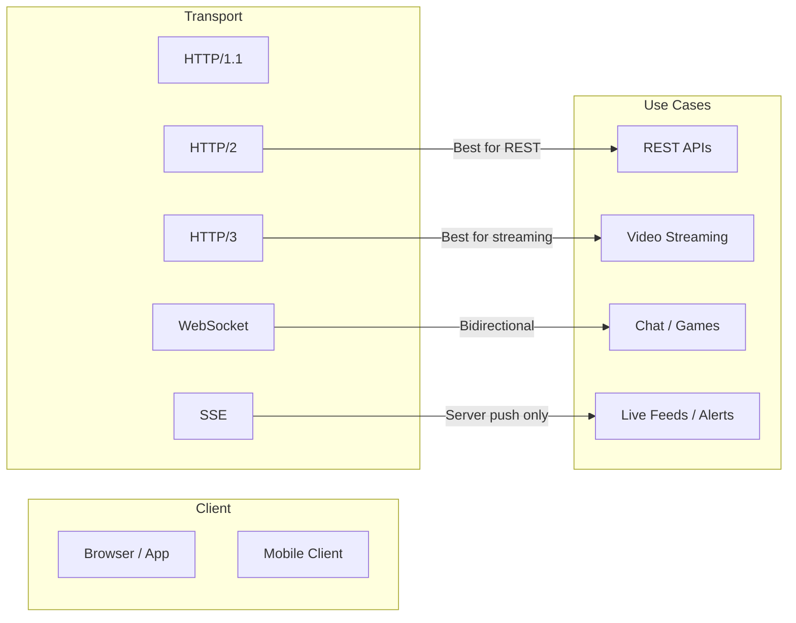
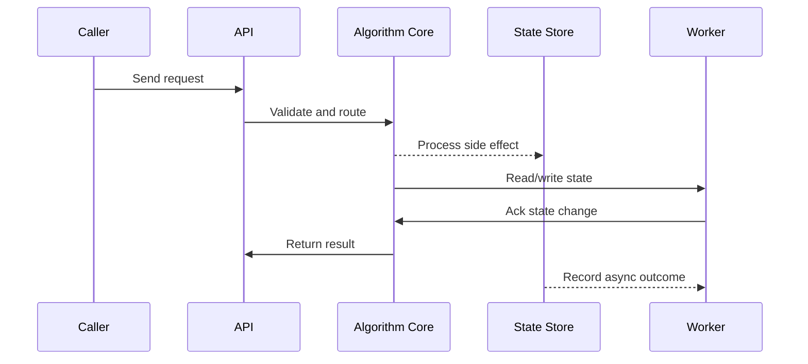

# HTTP 1.1 / 2 / 3, WebSocket & SSE

## Quick Facts
- Area: System Design
- Tag: Protocols
- Source: `src/modules/topics/sysdesign/sd-protocols-http.js`
- Tags: `http2`, `http3`, `quic`, `websocket`, `sse`, `long-polling`, `hol blocking`
- Visual coverage: live visual, flow lab, UML lab, architecture map

## Concept
**HTTP/1.1** (1997): text protocol, one request per connection (keep-alive allows reuse but still serial). Head-of-line (HOL) blocking at application layer.

**HTTP/2** (2015): binary framing, **multiplexing** (multiple streams on one TCP connection), header compression (HPACK), server push. Eliminates app-layer HOL but TCP-layer HOL remains.

**HTTP/3** (2022): runs on **QUIC** (UDP-based), eliminates TCP HOL blocking. Built-in TLS 1.3. Connection migration (IP change doesn't break session - great for mobile).

**Comparison table:**
| Feature | HTTP/1.1 | HTTP/2 | HTTP/3 |
|---|---|---|---|
| Protocol | TCP | TCP | QUIC (UDP) |
| Multiplexing | No | Yes | Yes |
| HOL Blocking | App + TCP | TCP only | None |
| Header compression | None | HPACK | QPACK |
| TLS | Optional | Optional | Built-in |
| 0-RTT resumption | No | No | Yes |

**Real-time communication options:**
- **Short polling**: client polls every N seconds - simple, wastes bandwidth
- **Long polling**: client holds connection open until server has data - better but complex
- **SSE** (Server-Sent Events): unidirectional server->client stream over HTTP, built-in reconnect, text only
- **WebSocket**: full-duplex binary/text, single TCP upgrade, low overhead per message

## Why It Matters
Protocol choice affects throughput, latency, and infrastructure cost at scale. HTTP/2 multiplexing removes the need for domain sharding. WebSocket vs SSE is a common interview design question.

## Architecture / Mental Model


## Runtime / Sequence


## Animation Plan
- Flow lab available: step-by-step path highlighting.
- UML sequence simulation available: actor messages animate in order.
- Architecture map available: clickable nodes and sync/async links.
- Live visual exists in app: topic-specific canvas/ReactViz animation.

Flow steps:

1. Enter system - Request crosses trust boundary and gets normalized before core handling.
2. Execute core path - Gateway routes to owning capability with timeout, auth context, and trace id.
3. Offload slow work - Async path absorbs retries, fanout, indexing, notifications, or heavy processing.
4. Persist state - System writes durable state, cache entries, offsets, or audit evidence.
5. Return or recover - Response returns when sync work succeeds; failure path uses retry, fallback, or replay.

## Example
```go
// SSE server in Go - push live updates to browser
package main

import (
    "fmt"
    "net/http"
    "time"
)

func sseHandler(w http.ResponseWriter, r *http.Request) {
    w.Header().Set("Content-Type", "text/event-stream")
    w.Header().Set("Cache-Control", "no-cache")
    w.Header().Set("Connection", "keep-alive")
    w.Header().Set("Access-Control-Allow-Origin", "*")

    flusher, ok := w.(http.Flusher)
    if !ok {
        http.Error(w, "SSE unsupported", http.StatusInternalServerError)
        return
    }

    ticker := time.NewTicker(1 * time.Second)
    defer ticker.Stop()

    for {
        select {
        case t := <-ticker.C:
            fmt.Fprintf(w, "data: {"time":"%s"}\n\n", t.Format(time.RFC3339))
            flusher.Flush()
        case <-r.Context().Done():
            return // client disconnected
        }
    }
}

func main() {
    http.HandleFunc("/events", sseHandler)
    http.ListenAndServe(":8080", nil)
}
```

Notes:
SSE auto-reconnects on disconnect; browser EventSource API handles this natively. Use WebSocket only when you need client->server messages.

## Complexity And Performance
- Time/space complexity depends on deployment, data size, and chosen implementation.
- Track p50/p95/p99 latency, throughput, memory, saturation, and error rate for production topics.

## Interview Drills
1. When would you choose WebSocket over SSE?
   Answer: **Use SSE when:** data flows only server -> client (live dashboards, notifications, feeds). Simpler, works over HTTP/2, proxy-friendly, built-in reconnect.
   
   **Use WebSocket when:** you need bidirectional communication (chat, multiplayer games, collaborative editing, trading terminals). WebSocket is a TCP upgrade so it escapes HTTP semantics but also loses HTTP/2 multiplexing benefits.
   
   **At scale:** SSE is easier to load-balance (stateless HTTP); WebSocket requires sticky sessions or a pub-sub backplane (Redis pub-sub, Kafka) so any server can push to any client.
   Follow-ups: How do you scale WebSocket servers?; What is the WebSocket ping/pong mechanism?

2. What is HOL blocking and how does HTTP/3 solve it?
   Answer: Head-of-line blocking: if packet N is lost on a TCP connection, all subsequent packets wait for retransmission even if they belong to independent streams. HTTP/2 multiplexes on one TCP connection - a single packet loss stalls all streams.
   
   HTTP/3 uses QUIC (UDP) which implements streams at the transport layer. A lost packet only blocks the single stream that owns it; other streams continue unaffected. Additionally QUIC has built-in TLS 1.3 and supports connection migration (changing IP mid-connection).
   Follow-ups: Why is HTTP/3 especially beneficial on mobile networks?

## Trade-offs
Pros:
- HTTP/2 multiplexing eliminates connection-count limits
- HTTP/3 QUIC reduces latency on lossy networks
- SSE is simplest for server-push use cases

Cons:
- HTTP/3 not supported by all infrastructure/proxies yet
- WebSocket breaks some CDN/proxy setups
- SSE is text-only and unidirectional

When to use:
Default to HTTP/2 for REST APIs. HTTP/3 for user-facing products. SSE for live feeds. WebSocket for true bidirectional needs.

## Gotchas
_No gotchas configured._

