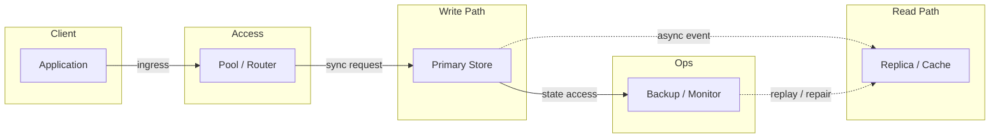
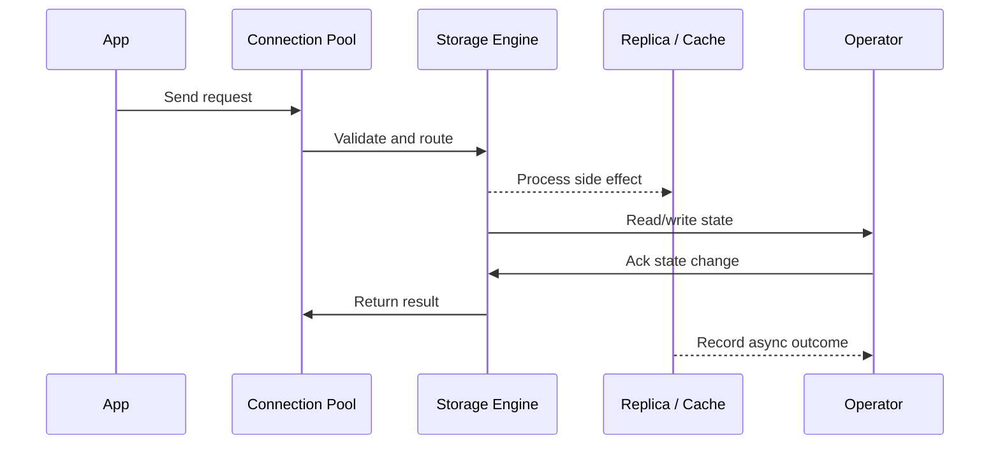

# Redis - Data Structures, Patterns & Cluster

## Quick Facts
- Area: System Design
- Tag: Caching
- Source: `src/modules/topics/sysdesign/sd-redis-patterns.js`
- Tags: `redis`, `sorted set`, `pub sub`, `lua`, `redis cluster`, `streams`, `sentinel`, `ttl`, `keyspace notification`
- Visual coverage: live visual, flow lab, UML lab, architecture map

## Concept
Redis is an in-memory data structure store - far more than a simple cache.

**Core data structures and use cases:**
| Structure | Commands | Use Case |
|---|---|---|
| String | GET/SET/INCR/INCRBY | Counters, sessions, locks |
| Hash | HGET/HSET/HMGET | User profiles, config |
| List | LPUSH/RPOP/LRANGE | Queues, activity feeds |
| Set | SADD/SMEMBERS/SINTER | Unique visitors, tags |
| Sorted Set | ZADD/ZRANGE/ZRANGEBYSCORE | Leaderboards, rate limiting, job priority |
| Stream | XADD/XREAD/XGROUP | Event streaming, message queues |
| Bitmap | SETBIT/BITCOUNT | Daily active users, feature flags |
| HyperLogLog | PFADD/PFCOUNT | Approximate unique counts (~1% error) |

**Key patterns:**

**Leaderboard:** ZADD leaderboard score userId + ZREVRANGE leaderboard 0 9 -> top 10 in O(log N)

**Sliding window rate limit:**
```lua
-- Atomic Lua script for sliding window
local key = KEYS[1]
local now = tonumber(ARGV[1])
local window = tonumber(ARGV[2])
local limit = tonumber(ARGV[3])
redis.call('ZREMRANGEBYSCORE', key, 0, now - window)
local count = redis.call('ZCARD', key)
if count < limit then
    redis.call('ZADD', key, now, now)
    redis.call('EXPIRE', key, window)
    return 1
end
return 0
```

**Distributed lock (Redlock):** SET key value NX PX 30000 (set-if-not-exists with 30s expiry)

**Redis Cluster:** 16384 hash slots distributed across nodes. Consistent hashing. Automatic failover via gossip protocol. Minimum 3 primary + 3 replica nodes.

## Why It Matters
Redis is the most commonly used cache and real-time data structure in backend systems. Every platform (Airbnb, Twitter, GitHub) uses it for rate limiting, sessions, and pub/sub.

## Architecture / Mental Model


## Runtime / Sequence


## Animation Plan
- Flow lab available: step-by-step path highlighting.
- UML sequence simulation available: actor messages animate in order.
- Architecture map available: clickable nodes and sync/async links.
- Live visual exists in app: topic-specific canvas/ReactViz animation.

Flow steps:

1. Enter system - Request crosses trust boundary and gets normalized before core handling.
2. Execute core path - Gateway routes to owning capability with timeout, auth context, and trace id.
3. Offload slow work - Async path absorbs retries, fanout, indexing, notifications, or heavy processing.
4. Persist state - System writes durable state, cache entries, offsets, or audit evidence.
5. Return or recover - Response returns when sync work succeeds; failure path uses retry, fallback, or replay.

## Example
```java
// Redis patterns with Spring Data Redis + Lettuce
@Component
public class RedisPatterns {

    @Autowired private RedisTemplate<String, String> redis;
    @Autowired private StringRedisTemplate str;

    //  Leaderboard 
    public void addScore(String userId, double score) {
        redis.opsForZSet().add("game:leaderboard", userId, score);
    }
    public Set<ZSetOperations.TypedTuple<String>> getTop10() {
        return redis.opsForZSet()
            .reverseRangeWithScores("game:leaderboard", 0, 9);
    }

    //  Distributed Lock 
    public boolean acquireLock(String resource, String token, long ttlMs) {
        Boolean result = redis.opsForValue()
            .setIfAbsent("lock:" + resource, token,
                         Duration.ofMillis(ttlMs));
        return Boolean.TRUE.equals(result);
    }
    public void releaseLock(String resource, String token) {
        // Lua: only delete if value matches (we own the lock)
        String script = "if redis.call('GET',KEYS[1])==ARGV[1] then " +
                        "return redis.call('DEL',KEYS[1]) else return 0 end";
        redis.execute(new DefaultRedisScript<>(script, Long.class),
            List.of("lock:" + resource), token);
    }

    //  HyperLogLog - unique daily visitors 
    public void trackVisit(String date, String userId) {
        redis.opsForHyperLogLog().add("visits:" + date, userId);
    }
    public long uniqueVisitors(String date) {
        return redis.opsForHyperLogLog().size("visits:" + date);
    }

    //  Pub/Sub 
    public void publish(String channel, String message) {
        redis.convertAndSend(channel, message);
    }
}
```

Notes:
Always use Lua scripts for multi-step atomic operations. MULTI/EXEC (transactions) don't support conditional logic - Lua does.

## Complexity And Performance
- O(log N)

## Interview Drills
1. How does Redis achieve persistence without sacrificing speed?
   Answer: Redis offers two persistence mechanisms:
   
   **RDB (snapshot):** Fork the process, write a point-in-time snapshot to disk. Zero overhead on main thread. Fork takes ~10ms for 10GB dataset. Data loss up to last snapshot interval (every 60s-900s).
   
   **AOF (Append-Only File):** Log every write command. Replayable on restart. `fsync` policy options:
   - `always` - fsync every write (safe, ~1ms overhead)
   - `everysec` - fsync every second (common choice - max 1s data loss)
   - `no` - OS decides (fastest, most data loss)
   
   **In production:** Enable both - RDB for fast restart, AOF for durability. Use `appendfsync everysec`.
   Follow-ups: What is Redis replication and how is it different from persistence?; Explain Redis Sentinel vs Redis Cluster.

## Trade-offs
Pros:
- Sub-millisecond latency for all data structures
- Rich atomic operations via Lua
- Versatile - cache, queue, pub-sub, rate-limiter in one

Cons:
- Data must fit in RAM (cluster helps but adds complexity)
- Eventual consistency across replicas
- Single-threaded command processing (I/O threaded since Redis 6)

When to use:
Use Redis for: session store, rate limiting, leaderboards, pub-sub, distributed locks, job queues. Don't use as primary DB - use as cache/complement.

## Gotchas
_No gotchas configured._

