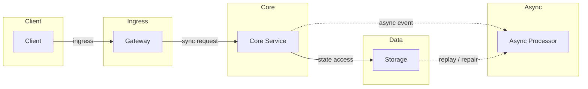
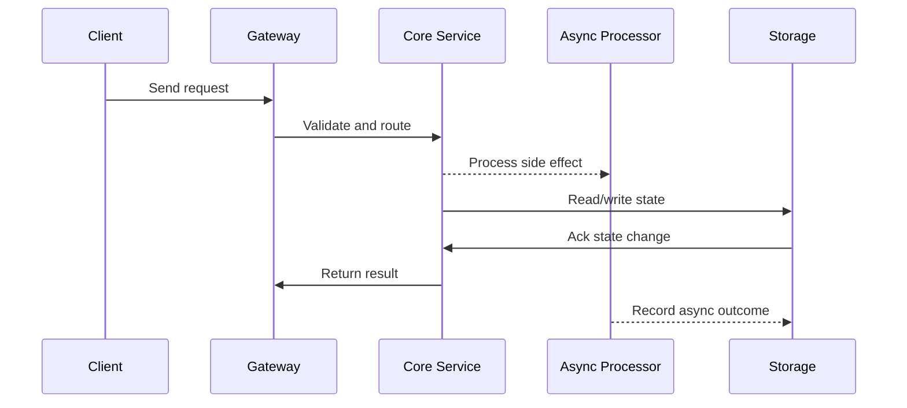

# Resilience - Circuit Breaker, Bulkhead, Retry & Backpressure

## Quick Facts
- Area: System Design
- Tag: Resilience
- Source: `src/modules/topics/sysdesign/sd-resilience-all.js`
- Tags: `circuit breaker`, `bulkhead`, `retry`, `timeout`, `backpressure`, `resilience4j`, `hystrix`, `rate limiting`, `fallback`
- Visual coverage: live visual, flow lab, UML lab, architecture map

## Concept
**Why resilience?** In a system of 20 services, if each has 99.9% availability, end-to-end availability is 0.999^20 = 98%. Cascading failures can make it much worse.

**Circuit Breaker (Fowler pattern):**
Three states: **CLOSED** (normal) -> **OPEN** (fail fast) -> **HALF_OPEN** (probe recovery).
- CLOSED: requests pass through. Track failure rate (e.g., >50% failures in 10s window).
- OPEN: reject immediately with fallback. Wait cooldown (e.g., 30s).
- HALF_OPEN: allow N test requests. If pass -> CLOSED. If fail -> OPEN again.

**Bulkhead (ship compartment analogy):**
Isolate resources per downstream. Thread pool or semaphore per dependency. If one dependency is slow, it exhausts only its own pool - doesn't starve other calls.

**Retry with exponential backoff + jitter:**
```
Attempt 1: immediate
Attempt 2: wait 2^1 * 100ms = 200ms
Attempt 3: wait 2^2 * 100ms = 400ms + random jitter (0-100ms)
Max retries: 3
```
Jitter prevents thundering herd on retry storms.

**Timeout:** Every network call MUST have a timeout. Without it, threads block forever on dead services -> thread pool exhaustion -> service death.

**Backpressure:** Producer slows down when consumer is overwhelmed. In Reactive (Project Reactor/RxJava), subscriber signals demand upstream. In Kafka, consumer lag serves as natural backpressure signal.

**Fallback strategies:**
- Return cached/stale data
- Return default/empty response
- Degrade gracefully (hide the feature)
- Queue for later processing

## Why It Matters
A service that doesn't protect itself will fail when its dependencies fail. Circuit breaker + timeout + bulkhead is the minimum viable resilience stack.

## Architecture / Mental Model


## Runtime / Sequence


## Animation Plan
- Flow lab available: step-by-step path highlighting.
- UML sequence simulation available: actor messages animate in order.
- Architecture map available: clickable nodes and sync/async links.
- Live visual exists in app: topic-specific canvas/ReactViz animation.

Flow steps:

1. Normal: CLOSED state - All requests pass through. Failure rate tracked in sliding window (50% threshold, 10 calls).
2. Call forwarded - Request reaches downstream service normally. Latency and errors recorded.
3. Threshold exceeded -> OPEN - Failure rate >50% in window. Circuit opens immediately. Cooldown timer starts (30s).
4. Fail fast in OPEN - No calls reach downstream. Circuit breaker returns fallback immediately (<1ms).
5. Return fallback response - Cached data, default response, or error returned to caller.
6. Cooldown elapsed -> HALF_OPEN - After 30s, circuit allows 3 test requests through.
7. Tests pass -> CLOSED - If test requests succeed -> circuit closes. Normal operation resumes.
8. Tests fail -> OPEN again - If test requests fail -> circuit reopens. Cooldown resets.

## Example
```java
// Resilience4j - full stack: circuit breaker + retry + bulkhead + timeout
@Service
public class PaymentClient {

    private final CircuitBreaker circuitBreaker;
    private final Retry retry;
    private final Bulkhead bulkhead;
    private final TimeLimiter timeLimiter;

    public PaymentClient(Resilience4jConfig config) {
        // Circuit breaker: open after 50% failure rate in 10 call sliding window
        circuitBreaker = CircuitBreaker.of("payment",
            CircuitBreakerConfig.custom()
                .failureRateThreshold(50)
                .slidingWindowSize(10)
                .waitDurationInOpenState(Duration.ofSeconds(30))
                .permittedNumberOfCallsInHalfOpenState(3)
                .build());

        // Retry: 3 attempts, exponential backoff + jitter
        retry = Retry.of("payment",
            RetryConfig.custom()
                .maxAttempts(3)
                .intervalFunction(IntervalFunction.ofExponentialRandomBackoff(
                    Duration.ofMillis(200), 2.0, Duration.ofSeconds(2)))
                .retryOnException(e -> e instanceof RetryableException)
                .build());

        // Bulkhead: max 10 concurrent calls to payment service
        bulkhead = Bulkhead.of("payment",
            BulkheadConfig.custom()
                .maxConcurrentCalls(10)
                .maxWaitDuration(Duration.ofMillis(100))
                .build());

        timeLimiter = TimeLimiter.of("payment",
            TimeLimiterConfig.custom()
                .timeoutDuration(Duration.ofSeconds(5))
                .build());
    }

    public PaymentResult charge(ChargeRequest req) {
        Supplier<PaymentResult> call = () -> paymentApi.charge(req);

        // Compose: bulkhead -> circuitBreaker -> retry -> timeLimiter
        return Decorators.ofSupplier(call)
            .withBulkhead(bulkhead)
            .withCircuitBreaker(circuitBreaker)
            .withRetry(retry)
            .withFallback(List.of(CallNotPermittedException.class,
                                   BulkheadFullException.class),
                          e -> PaymentResult.degraded("Payment service unavailable"))
            .get();
    }
}
```

Notes:
Order of decorators matters: bulkhead -> circuit breaker -> retry. Retry inside circuit breaker means retries count toward failure rate.

## Complexity And Performance
- Time/space complexity depends on deployment, data size, and chosen implementation.
- Track p50/p95/p99 latency, throughput, memory, saturation, and error rate for production topics.

## Interview Drills
1. Why add jitter to retry backoff?
   Answer: Without jitter, all retrying clients wait exactly the same duration and fire simultaneously - creating a thundering herd that overloads the recovering service.
   
   With jitter, each client waits `backoff + random(0, backoff)` - spreading requests over time and avoiding the synchronized burst.
   
   **Full-jitter formula (AWS recommendation):** `sleep = random(0, min(cap, base * 2^attempt))`
   
   This ensures no two clients retry at the same instant, giving the recovering service time to stabilise.
   Follow-ups: When should you NOT retry?; What is circuit breaker half-open state and why is it needed?

## Trade-offs
Pros:
- Circuit breaker prevents cascade failures
- Bulkhead limits blast radius of slow dependencies
- Retry handles transient failures transparently

Cons:
- Retry can amplify load on struggling service (without circuit breaker)
- Circuit breaker adds configuration surface area
- Timeout tuning is hard - too short = false positives, too long = thread starvation

When to use:
Apply to every synchronous external call. Minimum: timeout + circuit breaker. Add retry only for idempotent operations. Add bulkhead for critical dependency isolation.

## Gotchas
_No gotchas configured._

