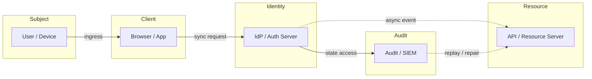
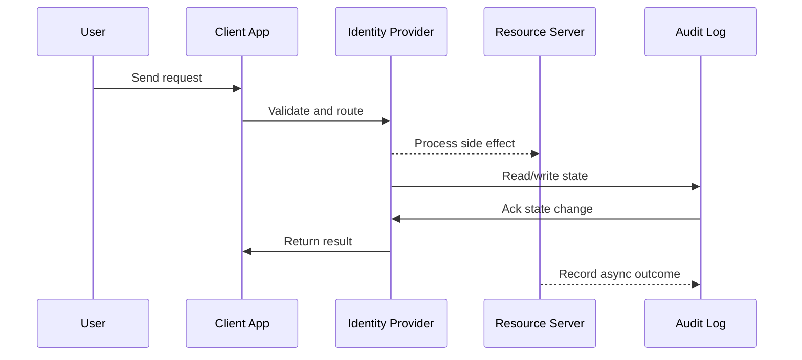

# Security - OAuth2, JWT, mTLS & RBAC

## Quick Facts
- Area: System Design
- Tag: Security
- Source: `src/modules/topics/sysdesign/sd-security-auth.js`
- Tags: `oauth2`, `jwt`, `rbac`, `mtls`, `api key`, `zero trust`, `oidc`, `pkce`, `refresh token`
- Visual coverage: live visual, flow lab, UML lab, architecture map

## Concept
**Authentication (AuthN):** Who are you? (identity)
**Authorization (AuthZ):** What can you do? (permissions)

**OAuth2 flows:**
- **Authorization Code + PKCE** - web/mobile apps. Client redirects user to IdP, gets code, exchanges for tokens. PKCE prevents code interception.
- **Client Credentials** - machine-to-machine. Service presents client_id + client_secret -> gets access_token.
- **Device Flow** - smart TVs, CLIs. User enters code on separate device.

**JWT (JSON Web Token):**
`header.payload.signature` - base64url encoded. Stateless - no DB lookup needed.
- **Access token** - short-lived (15 min). Verified locally by services.
- **Refresh token** - long-lived (7-30 days). Stored in HttpOnly cookie. Used to get new access token.
- **Signature** - RS256 (asymmetric): IdP signs with private key; services verify with public key (fetched from JWKS endpoint).

**RBAC (Role-Based Access Control):**
Roles assigned to users. Permissions assigned to roles. Services check: `user.roles.contains("admin") && resource.ownerId == userId`.

**mTLS (Mutual TLS):**
Both client and server present certificates. Used for service-to-service in zero-trust networks.
- Istio / service mesh automates certificate issuance (SPIFFE/SPIRE).
- No password - proof of identity via certificate.

**Zero Trust:** Never trust, always verify. Even internal traffic is authenticated.
- Traditional: trust everything inside the firewall.
- Zero Trust: every request authenticated + authorised regardless of network location.

## Why It Matters
Auth is asked in every security-related design question. JWT revocation and token refresh patterns are common deep-dive topics.

## Architecture / Mental Model


## Runtime / Sequence


## Animation Plan
- Flow lab available: step-by-step path highlighting.
- UML sequence simulation available: actor messages animate in order.
- Architecture map available: clickable nodes and sync/async links.
- Live visual exists in app: topic-specific canvas/ReactViz animation.

Flow steps:

1. Redirect to IdP with code_challenge - Browser generates random code_verifier, hashes to code_challenge (SHA256). Redirects to IdP authorization endpoint.
2. IdP authenticates user - User enters credentials. IdP validates against user store, checks MFA if enabled.
3. Authorization code returned - IdP redirects to callback URL with short-lived authorization code (10 seconds TTL).
4. Exchange code + code_verifier - Browser sends code + code_verifier. IdP verifies hash matches. Prevents code interception attacks.
5. Access token + refresh token - IdP returns JWT access token (15min) + refresh token (30 days in HttpOnly cookie).
6. API call with Bearer token - All API calls include Authorization: Bearer <JWT>. App validates signature locally via JWKS.
7. Silent refresh via refresh token - Before access token expires, browser sends refresh token to get new access token without re-login.

## Example
```java
// Spring Security 6 - JWT validation + RBAC
@Configuration
@EnableWebSecurity
@EnableMethodSecurity
public class SecurityConfig {

    @Bean
    public SecurityFilterChain securityFilterChain(HttpSecurity http) throws Exception {
        return http
            .csrf(AbstractHttpConfigurer::disable)  // stateless API
            .sessionManagement(s -> s.sessionCreationPolicy(STATELESS))
            .authorizeHttpRequests(auth -> auth
                .requestMatchers("/actuator/health").permitAll()
                .requestMatchers(HttpMethod.GET, "/api/products/**").permitAll()
                .requestMatchers("/api/admin/**").hasRole("ADMIN")
                .anyRequest().authenticated()
            )
            .oauth2ResourceServer(oauth2 -> oauth2
                .jwt(jwt -> jwt.decoder(jwtDecoder()))  // validate JWT signature
            )
            .build();
    }

    @Bean
    public JwtDecoder jwtDecoder() {
        // Verify with IdP's public key (fetched from JWKS endpoint)
        return NimbusJwtDecoder
            .withJwkSetUri("https://auth.example.com/.well-known/jwks.json")
            .build();
    }

    // Fine-grained RBAC on methods
    @Service
    public class OrderService {
        @PreAuthorize("hasRole('ADMIN') or #userId == authentication.name")
        public Order getOrder(String orderId, String userId) {
            return orderRepository.findById(orderId).orElseThrow();
        }

        @PreAuthorize("hasRole('ADMIN')")
        public void deleteOrder(String orderId) {
            orderRepository.deleteById(orderId);
        }
    }
}

// JWT refresh token rotation - HttpOnly cookie
@RestController
public class AuthController {

    @PostMapping("/auth/refresh")
    public ResponseEntity<TokenResponse> refresh(
            @CookieValue("refresh_token") String refreshToken) {
        // Validate refresh token from DB (check not revoked)
        RefreshToken stored = refreshTokenRepo.findByToken(hash(refreshToken))
            .orElseThrow(() -> new UnauthorizedException("Invalid refresh token"));

        if (stored.isExpired()) throw new UnauthorizedException("Refresh token expired");

        // Rotate: revoke old, issue new
        stored.revoke();
        refreshTokenRepo.save(stored);

        String newAccessToken = jwtService.generateAccessToken(stored.getUserId());
        String newRefreshToken = jwtService.generateRefreshToken(stored.getUserId());
        refreshTokenRepo.save(new RefreshToken(stored.getUserId(), hash(newRefreshToken)));

        ResponseCookie cookie = ResponseCookie.from("refresh_token", newRefreshToken)
            .httpOnly(true).secure(true).sameSite("Strict")
            .maxAge(Duration.ofDays(30)).path("/auth/refresh").build();

        return ResponseEntity.ok()
            .header(HttpHeaders.SET_COOKIE, cookie.toString())
            .body(new TokenResponse(newAccessToken));
    }
}
```

Notes:
Never store refresh tokens in localStorage - XSS can steal them. HttpOnly cookie prevents JS access. Refresh token rotation detects theft: if old token used after rotation, revoke all sessions.

## Complexity And Performance
- Time/space complexity depends on deployment, data size, and chosen implementation.
- Track p50/p95/p99 latency, throughput, memory, saturation, and error rate for production topics.

## Interview Drills
1. How do you revoke a JWT before it expires?
   Answer: JWTs are stateless - the server doesn't track them. To revoke:
   
   1. **Short expiry** - 15-minute access token. Only 15 minutes of exposure. Mitigates most cases without revocation.
   2. **Token blocklist** - store revoked JTI (JWT ID) in Redis with TTL = remaining token lifetime. Check blocklist on every request. Fast (Redis ~1ms) but adds state.
   3. **Refresh token revocation** - the access token is short-lived; revoke the refresh token in DB. User is logged out at next refresh.
   4. **Version number in token** - store `tokenVersion` per user in DB. JWT includes version. On logout, increment version. Any token with old version rejected.
   5. **Opaque tokens** - use reference tokens (random string), validate by calling IdP introspection endpoint. Fully revocable but adds network hop per request.
   Follow-ups: What is the difference between OAuth2 and OpenID Connect?; Explain PKCE and why it's needed for SPAs.

## Trade-offs
Pros:
- JWT: stateless - no DB lookup per request
- OAuth2: standardised delegation - users don't share passwords with third-party apps
- RBAC: simple to reason about and audit

Cons:
- JWT: revocation complexity
- OAuth2: complex flow - many tokens, scopes, endpoints
- mTLS: certificate rotation operational overhead

When to use:
JWT access token + refresh token rotation for APIs. OAuth2 Authorization Code + PKCE for user-facing apps. Client credentials for M2M. mTLS for internal service auth in zero-trust environments.

## Gotchas
_No gotchas configured._

