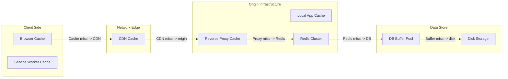
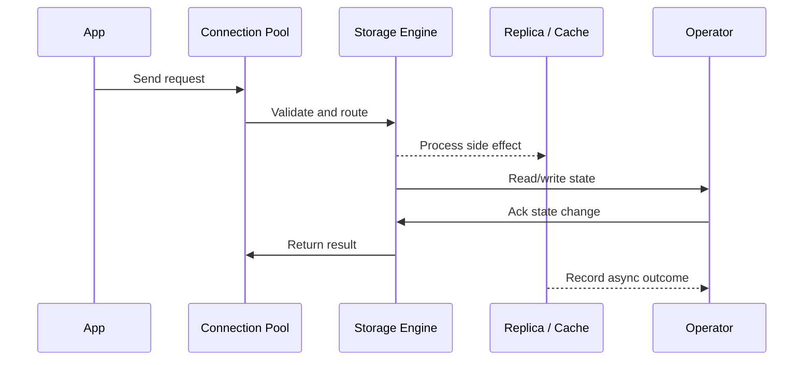

# Caching Layers - Browser to DB, Eviction & Strategies

## Quick Facts

- Area: System Design
- Tag: Caching
- Source: `src/modules/topics/sysdesign/sd-caching-layers.js`
- Tags: `cache`, `redis`, `memcached`, `cdn cache`, `browser cache`, `eviction`, `lru`, `write-through`, `write-back`, `cache aside`
- Visual coverage: live visual, flow lab, UML lab, architecture map

## Concept

**Caching hierarchy (closest to user -> furthest):**

1. **Browser cache** - Cache-Control, ETag. Free; respects max-age/must-revalidate.
2. **CDN cache** - Shared across all users. Cloudflare/Akamai PoPs. HIT rate 80-95% for static assets.
3. **Reverse proxy cache** - nginx proxy_cache / Varnish. In-datacenter, shared by all app instances.
4. **Application-level (local)** - In-process; Caffeine (Java), bigcache (Go). Zero network latency. Not shared across instances.
5. **Distributed cache** - Redis / Memcached. Shared across all app instances. 1-3ms network latency.
6. **DB buffer pool** - PostgreSQL shared_buffers. Auto-managed. Hot pages kept in RAM.

**Cache strategies:**

| Strategy                  | Write                               | Read                                    | Consistency             | Use Case                         |
| ------------------------- | ----------------------------------- | --------------------------------------- | ----------------------- | -------------------------------- |
| Cache-aside (lazy)        | App writes DB only                  | App checks cache, miss -> DB + populate | Eventual                | General read-heavy               |
| Read-through              | App writes DB                       | Cache fetches from DB on miss           | Eventual                | Library-managed (Spring Cache)   |
| Write-through             | App writes cache + DB               | Cache always hit                        | Strong                  | Config, critical reads           |
| Write-back (write-behind) | App writes cache; async flush to DB | Cache always hit                        | Eventual (risk of loss) | Write-heavy, tolerate small loss |
| Refresh-ahead             | Pre-warm before expiry              | Cache always hit                        | Strong                  | Predictable access patterns      |

**Eviction policies:**

- **LRU** (Least Recently Used) - evict oldest accessed. Best general-purpose.
- **LFU** (Least Frequently Used) - evict least accessed. Better for scan-resistant hot items.
- **TTL** - time-based expiry regardless of access. Simple, prevents stale data.
- **FIFO** - evict oldest added. Rarely optimal.
- **Random** - fast but arbitrary.

## Why It Matters

A well-designed cache can reduce DB load by 90% and response latency from 50ms to <1ms. Cache design is asked in virtually every system design interview.

## Architecture / Mental Model



## Runtime / Sequence



## Animation Plan

- Flow lab available: step-by-step path highlighting.
- UML sequence simulation available: actor messages animate in order.
- Architecture map available: clickable nodes and sync/async links.
- Live visual exists in app: topic-specific canvas/ReactViz animation.

Flow steps:

1. Enter system - Request crosses trust boundary and gets normalized before core handling.
2. Execute core path - Gateway routes to owning capability with timeout, auth context, and trace id.
3. Offload slow work - Async path absorbs retries, fanout, indexing, notifications, or heavy processing.
4. Persist state - System writes durable state, cache entries, offsets, or audit evidence.
5. Return or recover - Response returns when sync work succeeds; failure path uses retry, fallback, or replay.

## Example

```java
// Spring Boot - multi-level caching with Caffeine (L1) + Redis (L2)
@Configuration
@EnableCaching
public class CacheConfig {

    @Bean
    public CacheManager cacheManager(RedisConnectionFactory redis) {
        // L1: local Caffeine (in-process, 0ms)
        CaffeineCacheManager l1 = new CaffeineCacheManager("products");
        l1.setCaffeine(Caffeine.newBuilder()
            .maximumSize(1_000)
            .expireAfterWrite(30, TimeUnit.SECONDS)
            .recordStats());

        // L2: Redis (distributed, 1-3ms)
        RedisCacheManager l2 = RedisCacheManager.builder(redis)
            .cacheDefaults(RedisCacheConfiguration.defaultCacheConfig()
                .entryTtl(Duration.ofMinutes(5))
                .serializeValuesWith(RedisSerializationContext
                    .SerializationPair.fromSerializer(new GenericJackson2JsonRedisSerializer())))
            .build();

        return new CompositeCacheManager(l1, l2);
    }
}

@Service
public class ProductService {

    @Cacheable(value = "products", key = "#id",
               unless = "#result == null")
    public Product getProduct(String id) {
        // Only called on cache miss (L1 + L2 both missed)
        return productRepository.findById(id).orElse(null);
    }

    @CacheEvict(value = "products", key = "#product.id")
    public Product updateProduct(Product product) {
        return productRepository.save(product);
    }

    // Evict all on bulk update
    @CacheEvict(value = "products", allEntries = true)
    public void clearAll() {}
}
```

Notes:
CompositeCacheManager checks L1 first (Caffeine); on miss, checks L2 (Redis); on miss, calls the actual method and populates both caches.

## Complexity And Performance

- Time/space complexity depends on input size, data volume, and implementation choices.
- Track latency, throughput, memory, saturation, error rate, and correctness invariants.

## Interview Drills

1. What is cache stampede and how do you prevent it?
   Answer: Cache stampede (thundering herd): when a popular key expires, hundreds of concurrent requests all miss simultaneously, flood the DB, possibly causing cascade failure.

   **Prevention:**
   1. **Mutex/distributed lock** - first miss takes a Redis lock, fetches from DB, populates cache, releases lock. Others wait (risk: lock becomes bottleneck).
   2. **Probabilistic early expiration (XFetch)** - each request has a small random chance of refreshing the cache before it expires. No thundering herd.
   3. **Stale-while-revalidate** - serve stale data immediately; refresh in background.
   4. **Background refresh** - scheduled job refreshes popular keys before TTL, never letting them expire under load.
      Follow-ups: Implement a thread-safe LRU cache in Java.; What is the XFetch algorithm?

2. When would you use write-back caching and what are the risks?
   Answer: Write-back (write-behind): writes go to cache first; DB is updated asynchronously in batches.

   **When to use:** write-heavy workloads where DB can't keep up (IoT telemetry, counters, leaderboards). Dramatically reduces DB write pressure.

   **Risks:**
   - **Data loss** - if cache node crashes before flush, unflushed writes are lost. Mitigate with Redis AOF persistence + replicas.
   - **Stale DB reads** - direct DB queries bypass cache and see old data.
   - **Complex failure recovery** - need to track which writes are pending.

   Acceptable for: view counts, like counts, analytics. NOT acceptable for: financial transactions, inventory.
   Follow-ups: How does Redis AOF persistence work?

## Trade-offs

Pros:

- 10-100x latency reduction
- Dramatic DB load reduction
- Horizontal read scale via shared distributed cache

Cons:

- Cache invalidation is hard
- Memory cost
- Cache-aside introduces inconsistency window

When to use:
Cache-aside for most applications. Write-through for config/reference data. Write-back for high-volume counters. Always set TTL - never cache indefinitely without expiry.

## Gotchas

_No gotchas configured._
