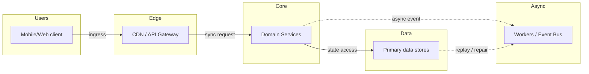
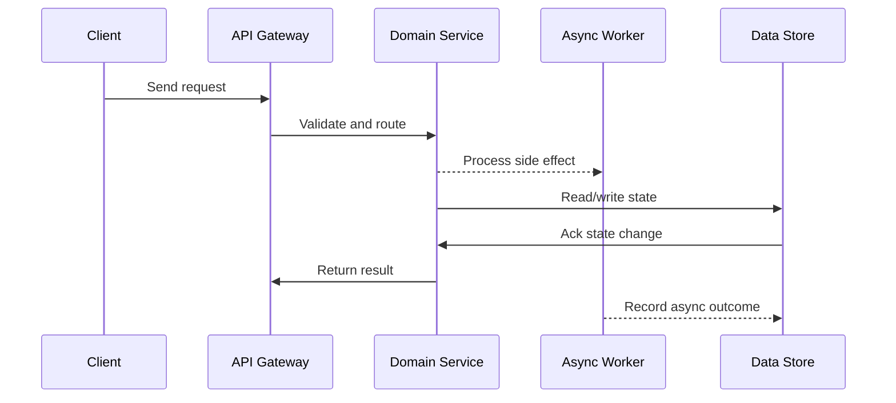

# Case Study: Real-Time Chat System (WhatsApp / Slack)

## Quick Facts

- Area: System Design
- Tag: Case Study
- Source: `src/modules/topics/sysdesign/sd-case-chat-system.js`
- Tags: `websocket`, `kafka`, `cassandra`, `fan-out`, `presence`, `read-receipts`, `messaging`, `real-time`, `redis`, `horizontal-scaling`
- Visual coverage: live visual, flow lab, UML lab, architecture map

## Concept

**Requirements:** 2B users, 100B messages/day, sub-200ms delivery, group chats up to 1000 members, offline message delivery, read receipts.

**Core challenges:**

1. **Routing messages** - User A and B are connected to different WebSocket servers. How does A's message reach B's server?
2. **Message persistence** - 100B messages/day = ~1.1M messages/second. Need write-optimized storage.
3. **Fan-out** - group chat: 1 message -> 1000 recipients -> fan-out to 1000 connection servers.
4. **Presence** - know which users are online without polling every user.
5. **Offline delivery** - messages must survive when recipient is offline.

**Architecture:**

**WebSocket servers (stateful):**

- Each server maintains open WebSocket connections for N users.
- Horizontally scaled behind a Layer-4 load balancer (consistent hashing by user_id).
- A user always reconnects to the same server (sticky sessions by user_id hash).

**Message routing via Kafka:**

- When Server 1 receives message from User A -> publish to Kafka topic `chat-messages`.
- Each WebSocket server subscribes to Kafka. Routes message to connected users on that server.
- Kafka fan-out for group chats: one message -> all member servers consume it.

**Message storage - Cassandra:**

- Partition key: `conversation_id` - all messages in a conversation collocated.
- Clustering key: `timestamp DESC` - efficient range queries for chat history.
- Replication factor: 3. Write consistency: ONE (fast writes). Read consistency: QUORUM.
- 100B messages/day @ 200 bytes avg = 20TB/day. TTL policy: 1 year default.

**Presence service:**

- Redis key: `presence:{user_id}` with TTL = 35s.
- Client sends heartbeat every 30s -> Redis SET with TTL refresh.
- No heartbeat for 35s -> key expires -> user considered offline.
- Presence change events published to Kafka -> fan-out to contacts.

**Read receipts (eventually consistent):**

- Client sends ACK when message rendered. Server writes to Cassandra asynchronously.
- `message_status` table: (conversation_id, message_id, user_id, status, updated_at).
- Sender queries status periodically (pull) or receives push via WebSocket.

**Offline users:**

- Message stored in Cassandra regardless of recipient status.
- When user reconnects -> WebSocket server queries Cassandra for all messages after `last_seen_message_id`.
- Push notifications (APNs/FCM) sent via async worker when recipient is offline.

## Why It Matters

Chat systems appear in nearly every FAANG interview. They combine WebSockets, Kafka fan-out, write-heavy NoSQL, presence (Redis TTL), and offline delivery - covering distributed systems breadth in one problem.

## Architecture / Mental Model



## Runtime / Sequence



## Animation Plan

- Flow lab available: step-by-step path highlighting.
- UML sequence simulation available: actor messages animate in order.
- Architecture map available: clickable nodes and sync/async links.
- Live visual exists in app: topic-specific canvas/ReactViz animation.

Flow steps:

1. Enter system - Request crosses trust boundary and gets normalized before core handling.
2. Execute core path - Gateway routes to owning capability with timeout, auth context, and trace id.
3. Offload slow work - Async path absorbs retries, fanout, indexing, notifications, or heavy processing.
4. Persist state - System writes durable state, cache entries, offsets, or audit evidence.
5. Return or recover - Response returns when sync work succeeds; failure path uses retry, fallback, or replay.

## Example

```python
# WebSocket server - message send + Kafka publish
from fastapi import FastAPI, WebSocket
from aiokafka import AIOKafkaProducer
from cassandra.cluster import Cluster
import json, asyncio, uuid, time

app = FastAPI()
# In-memory map: user_id -> websocket (per server instance)
connections: dict[str, WebSocket] = {}

kafka_producer: AIOKafkaProducer = None
cassandra_session = None

@app.on_event("startup")
async def startup():
    global kafka_producer, cassandra_session
    kafka_producer = AIOKafkaProducer(bootstrap_servers='kafka:9092')
    await kafka_producer.start()
    cluster = Cluster(['cassandra-1', 'cassandra-2'])
    cassandra_session = cluster.connect('chat')

@app.websocket("/ws/{user_id}")
async def websocket_endpoint(ws: WebSocket, user_id: str):
    await ws.accept()
    connections[user_id] = ws
    # Refresh presence in Redis
    await redis.setex(f"presence:{user_id}", 35, "online")
    try:
        while True:
            data = await ws.receive_json()
            msg_id = str(uuid.uuid4())
            msg = {
                "id": msg_id,
                "conversation_id": data["conversation_id"],
                "sender_id": user_id,
                "content": data["content"],
                "timestamp": int(time.time() * 1000)
            }
            # 1. Persist to Cassandra (write-through)
            cassandra_session.execute(
                """INSERT INTO messages
                   (conversation_id, timestamp, id, sender_id, content)
                   VALUES (%s, %s, %s, %s, %s)""",
                (msg["conversation_id"], msg["timestamp"],
                 msg_id, user_id, msg["content"])
            )
            # 2. Publish to Kafka -> all servers fan-out to recipients
            await kafka_producer.send(
                "chat-messages",
                key=msg["conversation_id"].encode(),
                value=json.dumps(msg).encode()
            )
    finally:
        del connections[user_id]

# Kafka consumer (runs on every WebSocket server)
async def consume_messages():
    consumer = AIOKafkaConsumer(
        "chat-messages", bootstrap_servers='kafka:9092',
        group_id=f"ws-server-{SERVER_ID}"  # unique per server
    )
    await consumer.start()
    async for record in consumer:
        msg = json.loads(record.value)
        conv_id = msg["conversation_id"]
        # Get members of this conversation
        members = await get_conversation_members(conv_id)
        for member_id in members:
            if member_id in connections:  # connected to THIS server
                await connections[member_id].send_json(msg)
```

## Complexity And Performance

- Time/space complexity depends on input size, data volume, and implementation choices.
- Track latency, throughput, memory, saturation, error rate, and correctness invariants.

## Interview Drills

1. How do you route a message from User A (on Server 1) to User B (on Server 2)?
   Answer: Server 1 publishes the message to a Kafka topic partitioned by conversation_id. Every WebSocket server subscribes to Kafka with a unique consumer group ID. Each server receives every message and checks its local connection map - if the recipient is connected to that server, it delivers the message. This avoids direct server-to-server routing and decouples the servers completely.
   Follow-ups: Why not use a service registry to find which server holds the connection?; What are the trade-offs between Kafka fan-out vs direct server-to-server RPC?; How does this scale when you have 10,000 WebSocket servers?

2. How do you store 100 billion messages per day?
   Answer: Cassandra is ideal: partition key = conversation_id (all messages for a chat collocated), clustering key = timestamp DESC (efficient pagination of history). Write consistency = ONE (fast, async replication). Replication factor = 3 for durability. 100B msgs x 200 bytes 20TB/day - use TTL (1 year) and tiered storage (hot data on SSDs, cold on S3 via DSE/Stargate). Avoid relational DB - joins and transactions don't scale to this write volume.
   Follow-ups: Why Cassandra over DynamoDB for chat?; How do you handle message ordering guarantees in Cassandra?; How do you paginate chat history efficiently?

3. How do you handle offline users?
   Answer: Messages are always written to Cassandra regardless of recipient's online status. Each user has a last_seen_message_id stored server-side. When user reconnects, the WebSocket server queries Cassandra: SELECT \* FROM messages WHERE conversation_id = ? AND timestamp > last_seen_timestamp. For mobile, an async worker checks Redis presence and if offline, sends a push notification (APNs/FCM) with message preview.
   Follow-ups: How do you avoid sending duplicate messages on reconnect?; How do you handle push notification failures?; What if the user is offline for 30 days - do you store all messages?

4. Design WhatsApp's end-to-end encryption at scale.
   Answer: Signal Protocol: each client generates a key bundle (identity key, signed prekey, one-time prekeys). Published to the server's key distribution server on registration. When A sends to B: A fetches B's key bundle, derives a shared secret using X3DH (Extended Triple Diffie-Hellman). Messages encrypted client-side with AES-256. Server only stores ciphertext - cannot decrypt. For group chats: sender distributes a group session key to each member individually, encrypted with their public key. Server acts as blind message store and key distribution service only.
   Follow-ups: How do you handle key rotation?; How does E2E encryption work for group chats with 1000 members?; How do you verify identity to prevent MITM attacks?

## Trade-offs

Pros:

- Kafka decouples WebSocket servers - no direct server-to-server communication needed
- Cassandra's partition-by-conversation gives predictable performance at scale
- Redis TTL presence is extremely lightweight (O(1) check per heartbeat)
- Fan-out via Kafka naturally handles group chats without special logic

Cons:

- Kafka fan-out for large groups (1000 members) means 1 message read 1000 times by servers
- Cassandra eventual consistency means read-your-own-writes may briefly fail
- WebSocket connections are stateful - server restarts disconnect all users on that server
- Presence with 35s TTL means up to 35s lag in detecting offline status

When to use:
Use this architecture for any real-time messaging product with >10M users. For smaller scale, simplify: single WebSocket server tier with Redis Pub/Sub instead of Kafka.

## Gotchas

- Naive fan-out breaks for celebrity accounts / large groups - use 'write on read' (pull fan-out) for groups > 500 members
- Sticky WebSocket sessions mean losing a server = losing all connections on it - need graceful reconnect logic with exponential backoff
- Message ordering: Cassandra uses timestamp as clustering key, but client clocks can skew - use server-assigned HLC (Hybrid Logical Clocks) instead
- Don't store media in Cassandra - store only media_url. Files go to S3/CDN with client-side encryption
- Read receipts at scale: avoid per-message DB write on every read - batch ACKs every 5s instead
- Presence fan-out storm: user with 5000 contacts goes online -> 5000 presence events -> filter to only contacts who are also online
