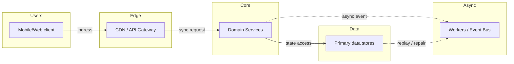
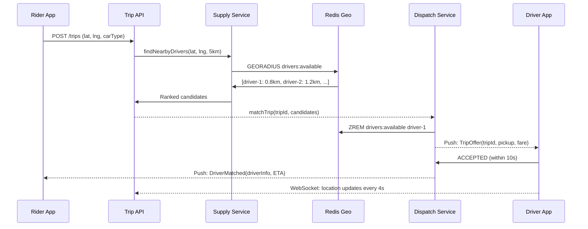

# Case Study: Ride Sharing (Uber / Lyft)

## Quick Facts

- Area: System Design
- Tag: Case Study
- Source: `src/modules/topics/sysdesign/sd-case-ride-sharing.js`
- Tags: `uber`, `lyft`, `geospatial`, `geohash`, `h3`, `matching`, `dispatch`, `websocket`, `surge pricing`, `location tracking`
- Visual coverage: live visual, flow lab, UML lab, architecture map

## Concept

**Requirements:** 5M trips/day, real-time driver location updates (every 4s), sub-5s match time, surge pricing.

**Core challenges:**

1. **Location tracking** - drivers send GPS coordinates every 4 seconds. ~500K active drivers = 125K updates/second.
2. **Nearby driver search** - given rider location, find available drivers within 5km in <100ms.
3. **Matching** - assign the best driver (ETA + rating + car type) to rider.
4. **Real-time communication** - push trip status updates to both rider and driver.

**Geospatial indexing:**

- **Geohash** - encode lat/lng into a base32 string. Nearby locations share a prefix. 7-char geohash 150m x 150m cell. Query: find drivers in same geohash + 8 neighbors.
- **H3 (Uber's hexagonal grid)** - hexagonal cells at multiple resolutions. Hexagons tile uniformly - no distortion at cell boundaries. Used for surge pricing regions.
- **S2 (Google)** - spherical geometry, quadtree-based. Used by Google Maps.
- **PostGIS / Redis GEOADD** - store points, radius search with GEORADIUS command.

**Architecture:**

- **Location service** - receives WebSocket/HTTP stream of driver positions. Updates Redis GEOADD (lng,lat per driver). Each driver position = 1 Redis geo write/4s.
- **Supply service** - GEORADIUS search on Redis. Returns drivers within 5km. Filter: available, correct car type, not in trip.
- **Dispatch/matching** - ranks candidates by ETA (computed by routing engine). Sends offer to best driver. Driver accepts/declines in 10s. On decline, next candidate offered.
- **Trip service** - manages trip state machine (REQUESTED -> ACCEPTED -> PICKUP -> IN_PROGRESS -> COMPLETED).
- **Surge pricing** - H3 hexagon aggregation. If demand/supply ratio > threshold in a hex -> surge multiplier applied.

**Communication:** WebSocket for real-time push (driver location on map). SSE as fallback.

## Why It Matters

Uber's architecture covers geospatial, real-time matching, state machines, and event-driven design - touching nearly every system design concept in one problem.

## Architecture / Mental Model



## Runtime / Sequence



## Animation Plan

- Flow lab available: step-by-step path highlighting.
- UML sequence simulation available: actor messages animate in order.
- Architecture map available: clickable nodes and sync/async links.
- Live visual exists in app: topic-specific canvas/ReactViz animation.

Flow steps:

1. Enter system - Request crosses trust boundary and gets normalized before core handling.
2. Execute core path - Gateway routes to owning capability with timeout, auth context, and trace id.
3. Offload slow work - Async path absorbs retries, fanout, indexing, notifications, or heavy processing.
4. Persist state - System writes durable state, cache entries, offsets, or audit evidence.
5. Return or recover - Response returns when sync work succeeds; failure path uses retry, fallback, or replay.

## Example

```python
# Location service - FastAPI + Redis Geo
from fastapi import FastAPI, WebSocket
from redis.asyncio import Redis
import asyncio, json

app = FastAPI()
redis = Redis(host='redis-cluster', decode_responses=True)

@app.websocket("/driver/location")
async def driver_location_ws(ws: WebSocket, driver_id: str):
    await ws.accept()
    try:
        while True:
            data = await ws.receive_json()
            lat, lng, status = data['lat'], data['lng'], data['status']

            if status == 'AVAILABLE':
                # GEOADD: store driver position in Redis geo index
                await redis.geoadd('drivers:available', {driver_id: (lng, lat)})
                # Also store metadata
                await redis.hset(f'driver:{driver_id}',
                    mapping={'lat': lat, 'lng': lng,
                             'updated': data['timestamp'],
                             'rating': data.get('rating', 4.5)})
            else:
                # Remove from available pool
                await redis.zrem('drivers:available', driver_id)

    except Exception:
        await redis.zrem('drivers:available', driver_id)

# Supply service - find nearby drivers
@app.get("/supply/nearby")
async def nearby_drivers(lat: float, lng: float, radius_km: float = 5.0):
    # GEORADIUS: find all drivers within radius
    drivers = await redis.georadius(
        'drivers:available', lng, lat,
        radius_km, unit='km',
        withcoord=True, withdist=True,
        sort='ASC', count=20)

    results = []
    for driver_id, dist, coords in drivers:
        meta = await redis.hgetall(f'driver:{driver_id}')
        results.append({
            'driverId': driver_id,
            'distanceKm': dist,
            'lat': coords[1], 'lng': coords[0],
            'rating': float(meta.get('rating', 4.5))
        })
    return results

# Dispatch - Saga-like matching
@app.post("/trips/match")
async def match_trip(rider_lat: float, rider_lng: float, trip_id: str):
    candidates = await nearby_drivers(rider_lat, rider_lng, radius_km=5.0)

    for candidate in candidates[:5]:  # try top 5
        driver_id = candidate['driverId']

        # Atomic: claim driver (remove from available + mark as pending)
        removed = await redis.zrem('drivers:available', driver_id)
        if removed == 0: continue  # already taken by another request

        # Send offer to driver via WebSocket/push notification
        await redis.publish(f'driver:{driver_id}:offers',
                           json.dumps({'tripId': trip_id, 'ttl': 10}))

        # Wait for acceptance (10s timeout)
        response = await wait_for_driver_response(driver_id, trip_id, timeout=10)
        if response == 'ACCEPTED':
            return {'tripId': trip_id, 'driverId': driver_id, 'status': 'MATCHED'}

        # Declined - put driver back in available pool
        meta = await redis.hgetall(f'driver:{driver_id}')
        await redis.geoadd('drivers:available',
                          {driver_id: (float(meta['lng']), float(meta['lat']))})

    raise HTTPException(503, "No drivers available")
```

Notes:
GEORADIUS is O(N+log M) where N is elements within radius. For 500K drivers in city, narrow radius (5km) returns ~200 drivers - fast enough for real-time matching.

## Complexity And Performance

- Time/space complexity depends on input size, data volume, and implementation choices.
- Track latency, throughput, memory, saturation, error rate, and correctness invariants.

## Interview Drills

1. How would you design the surge pricing system?
   Answer: **Goal:** Dynamically increase prices in areas where demand > supply to incentivise drivers.

   **Design:**
   1. **H3 hexagonal grid** - divide city into ~1km hexagonal cells (resolution 8). Hexagons tile uniformly - no distortion.
   2. **Demand signal** - count trip requests per cell in last 5 minutes (Redis ZADD with sliding window).
   3. **Supply signal** - count available drivers per cell (Redis GEORADIUS count per cell centroid).
   4. **Surge multiplier** - if demand/supply ratio > 2 -> 1.5x surge. > 5 -> 2x surge. Capped at 3x (brand protection).
   5. **Cache + refresh** - surge multipliers computed every 60s by a cron job. Cached in Redis per H3 cell ID.
   6. **Display** - rider app fetches surge multiplier for their H3 cell before booking. Shows surge warning.
   7. **Feedback loop** - higher prices -> more drivers enter area -> supply increases -> surge decreases (Uber intentionally shows driver earnings in surge zones).
      Follow-ups: How do you prevent drivers from colluding to artificially create surge?; How would you handle the matching algorithm when multiple riders request simultaneously?

## Trade-offs

Pros:

- Redis GEORADIUS: sub-millisecond nearby driver search
- Geohash/H3: efficient spatial partitioning
- WebSocket: real-time location updates without polling overhead

Cons:

- Redis is in-memory: 500K driver positions x 64 bytes = 32MB - easily fits but requires HA
- WebSocket: sticky sessions or pub-sub backplane required
- Matching race conditions: need atomic claim (ZREM) to prevent double-assignment

When to use:
This pattern (Redis geo + WebSocket + event-driven matching) applies to any real-time location-aware service: food delivery, logistics tracking, peer-to-peer marketplace.

## Gotchas

Watch for edge cases, assumptions, and hidden performance costs that can make this topic fail in production if handled incorrectly.
