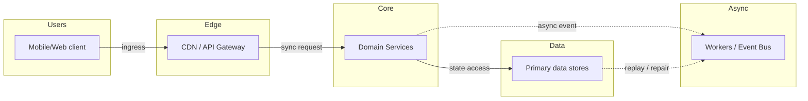
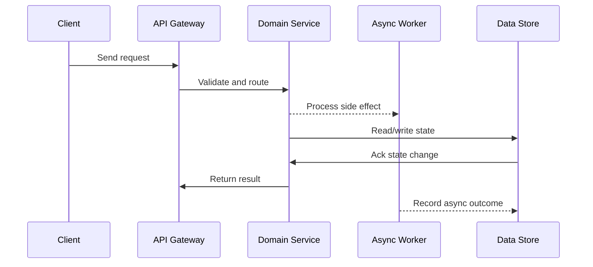

# Case Study: Ticket Booking System (BookMyShow / Ticketmaster)

## Quick Facts

- Area: System Design
- Tag: Case Study
- Source: `src/modules/topics/sysdesign/sd-case-ticket-booking.js`
- Tags: `optimistic-locking`, `pessimistic-locking`, `cas`, `redis-setnx`, `virtual-queue`, `overbooking`, `race-condition`, `seat-reservation`, `high-contention`, `concert`
- Visual coverage: live visual, flow lab, UML lab, architecture map

## Concept

**Requirements:** 100K concurrent users for a Taylor Swift concert release. 50,000 seats. Prevent double booking. Handle traffic spike. Show seat availability in real-time.

**The core problem:** Two users view the same seat as AVAILABLE simultaneously. Both click "Book". Without protection, both succeed -> same seat double-booked. This is a classic race condition.

**Solutions:**

**1. Optimistic Locking (Compare-And-Swap)**

- SELECT seat WHERE status='AVAILABLE' AND version=N.
- Process booking logic (price calculation, etc.).
- UPDATE seat SET status='BOOKED', version=N+1 WHERE id=? AND version=N AND status='AVAILABLE'.
- If 0 rows updated -> another user booked it first -> return "seat taken".
- Pro: No locks held during processing. High throughput for low-contention scenarios.
- Con: Under high contention, many retries needed - degraded UX.

**2. Pessimistic Locking (SELECT FOR UPDATE)**

- BEGIN TRANSACTION; SELECT \* FROM seats WHERE id=? FOR UPDATE (acquires row lock).
- Nobody else can touch that row until this transaction completes.
- UPDATE seat SET status='BOOKED'; COMMIT.
- Pro: Guaranteed consistency. Con: Locks held during HTTP call - deadlocks, slow throughput.

**3. Redis Distributed Lock (best for seat hold)**

- SETNX seat:hold:{seat_id} {user_id} EX 300 (5-minute hold, atomic).
- Returns 1 (success) or 0 (another user holds it).
- User completes payment -> final DB write.
- Hold expires -> seat released back to pool (TTL handles cleanup automatically).
- Pro: Sub-millisecond. No DB row locking. Con: Redis failure = hold data lost (use Redis Sentinel/Cluster).

**4. Atomic inventory counter**

- Redis: DECR available_seats:{event_id}. If result < 0 -> INCR back -> no seats available.
- Fast check before expensive DB write.
- Prevents overbooking at the Redis level.

**5. Virtual waiting room (for traffic spike)**

- All 100K users who hit "Buy" at 10:00 AM are placed in a Redis queue (ZADD with join_timestamp as score).
- Throttle: every second, dequeue 100 users (configurable) -> redirect to booking page.
- Show user their position in queue + estimated wait time.
- Queue is fair (FIFO). Prevents server overload. Improves perceived fairness.

**Complete flow:**
Browser -> Load Balancer -> Wait Room Service -> (if admitted) Seat Selection -> Redis hold (SETNX) -> Payment -> DB write (CAS) -> Kafka event -> Ticket generation service

## Why It Matters

High-contention resource booking (concert tickets, flight seats, hotel rooms) is one of the richest system design problems. It forces you to choose between optimistic vs pessimistic locking, use Redis for distributed locks, design virtual queues, and handle the thundering herd - all in one problem.

## Architecture / Mental Model



## Runtime / Sequence



## Animation Plan

- Flow lab available: step-by-step path highlighting.
- UML sequence simulation available: actor messages animate in order.
- Architecture map available: clickable nodes and sync/async links.
- Live visual exists in app: topic-specific canvas/ReactViz animation.

Flow steps:

1. Enter system - Request crosses trust boundary and gets normalized before core handling.
2. Execute core path - Gateway routes to owning capability with timeout, auth context, and trace id.
3. Offload slow work - Async path absorbs retries, fanout, indexing, notifications, or heavy processing.
4. Persist state - System writes durable state, cache entries, offsets, or audit evidence.
5. Return or recover - Response returns when sync work succeeds; failure path uses retry, fallback, or replay.

## Example

```python
# Seat booking service - Redis hold + CAS DB write
from fastapi import FastAPI, HTTPException
from redis.asyncio import Redis
from sqlalchemy import text
import asyncio

app = FastAPI()
redis = Redis(host='redis-cluster', decode_responses=True)

HOLD_TTL = 300  # 5 minutes
VIRTUAL_QUEUE = "booking:queue:{event_id}"

# --- Virtual waiting room ---
@app.post("/booking/join-queue")
async def join_queue(event_id: str, user_id: str):
    import time
    key = VIRTUAL_QUEUE.format(event_id=event_id)
    # ZADD with timestamp - FIFO ordering
    await redis.zadd(key, {user_id: time.time()}, nx=True)
    position = await redis.zrank(key, user_id)
    return {
        "position": position + 1,
        "estimated_wait_secs": (position // 100) * 60  # 100 users/min
    }

# Background process: admit 100 users/second
async def queue_drainer(event_id: str):
    key = VIRTUAL_QUEUE.format(event_id=event_id)
    while True:
        # Atomically pop 100 users from front of queue
        users = await redis.zpopmin(key, count=100)
        for user_id, _ in users:
            await send_booking_token(user_id, event_id)  # notify user
        await asyncio.sleep(1)

# --- Seat hold (distributed lock) ---
@app.post("/booking/hold-seat")
async def hold_seat(event_id: str, seat_id: str, user_id: str):
    hold_key = f"seat:hold:{event_id}:{seat_id}"

    # Atomic: SETNX + EXPIRE in one command
    acquired = await redis.set(hold_key, user_id, nx=True, ex=HOLD_TTL)
    if not acquired:
        raise HTTPException(status_code=409,
            detail="Seat already held by another user")

    # Check inventory (prevent overbooking)
    inv_key = f"inventory:{event_id}"
    remaining = await redis.decr(inv_key)
    if remaining < 0:
        await redis.incr(inv_key)
        await redis.delete(hold_key)
        raise HTTPException(status_code=410, detail="Event sold out")

    return {"hold_key": hold_key, "expires_in": HOLD_TTL}

# --- Confirm booking (CAS on DB) ---
@app.post("/booking/confirm")
async def confirm_booking(event_id: str, seat_id: str, user_id: str):
    hold_key = f"seat:hold:{event_id}:{seat_id}"
    holder = await redis.get(hold_key)
    if holder != user_id:
        raise HTTPException(status_code=403, detail="Hold expired or not yours")

    # Optimistic locking: UPDATE only if status=AVAILABLE
    async with db.begin() as conn:
        result = await conn.execute(
            text("""UPDATE seats
                    SET status='BOOKED', booked_by=:uid
                    WHERE id=:sid AND event_id=:eid AND status='AVAILABLE'"""),
            {"uid": user_id, "sid": seat_id, "eid": event_id}
        )
        if result.rowcount == 0:
            # Another process snuck in (CAS failed)
            await redis.incr(f"inventory:{event_id}")  # restore count
            raise HTTPException(status_code=409, detail="Seat no longer available")

    # Booking confirmed - release hold (cleanup)
    await redis.delete(hold_key)
    # Publish event for ticket generation
    await kafka.publish("booking.confirmed", {
        "user_id": user_id, "seat_id": seat_id, "event_id": event_id
    })
    return {"status": "booked", "seat": seat_id}
```

## Complexity And Performance

- Time/space complexity depends on input size, data volume, and implementation choices.
- Track latency, throughput, memory, saturation, error rate, and correctness invariants.

## Interview Drills

1. How do you prevent 2 users from booking the same seat?
   Answer: Three-layer defense: (1) Redis SETNX for seat hold - atomic set-if-not-exists. First user to call SETNX gets the hold. Second user gets 0 (failure). Sub-millisecond, no DB load. (2) DB optimistic locking - even if Redis fails, the UPDATE WHERE status='AVAILABLE' CAS (compare-and-swap) ensures only one DB write succeeds. If 0 rows updated, the booking fails safely. (3) Database UNIQUE constraint on (event_id, seat_id, status='BOOKED') as a last line of defense. All three layers together make double-booking virtually impossible.
   Follow-ups: What happens if Redis goes down between the hold and the DB write?; How do you handle the seat hold expiring while payment is in progress?; Why not use SELECT FOR UPDATE (pessimistic locking) instead?

2. How do you handle 100K concurrent users for a Taylor Swift concert?
   Answer: Virtual waiting room pattern: when tickets go on sale, all users who arrive in the first second are redirected to a queue (Redis sorted set, score = arrival timestamp). A drainer process admits N users per second (configurable, e.g., 500/sec). Admitted users receive a short-lived JWT token to enter the booking flow. This converts a 100K simultaneous spike into a steady stream. The booking servers only see N users at a time - no overload. Benefits: fair (FIFO), transparent (show queue position), graceful degradation.
   Follow-ups: How do you handle users who leave the queue (browser closed)?; How do you prevent users from sharing their queue position tokens?; Should the waiting room be implemented server-side or at the CDN level?

3. How do you implement a virtual waiting room?
   Answer: Redis sorted set: ZADD booking:queue:{event_id} {unix_timestamp} {user_id} with NX flag (no re-join). User sees their position via ZRANK. A background worker runs every second: ZPOPMIN queue 500 -> issue each popped user a time-limited booking token (JWT with exp=10min). If user doesn't use token in 10 minutes -> token expires -> they'd need to re-join queue. The front-end polls GET /queue-position every 5 seconds using long-polling or SSE for live updates. The queue drainer adjusts throughput based on booking server load metrics.
   Follow-ups: How do you scale the queue drainer itself (what if it crashes)?; How do you handle users who get admitted but abandon without booking?; Should you show real-time seat availability during the queue wait?

4. What's the difference between optimistic and pessimistic locking here?
   Answer: Pessimistic: acquire a DB row lock (SELECT FOR UPDATE) before reading - no other transaction can modify the row until yours commits. Safe but slow: lock is held for the entire booking duration (including payment processing, which can take seconds). Risk: deadlocks if multiple locks acquired in different orders. Optimistic: no lock on read. On write: UPDATE WHERE version=N (CAS). If another transaction changed the row, version differs -> your update fails -> retry or fail. Better for high-read, low-write-conflict workloads. For seat booking: Redis hold acts like a fast pessimistic lock, DB CAS is the safety net - best of both worlds.
   Follow-ups: When would you prefer pessimistic locking over optimistic locking?; How do you implement optimistic locking in JPA/Hibernate?; What's the cost of a retry storm in optimistic locking under high contention?

## Trade-offs

Pros:

- Redis SETNX for seat hold: sub-millisecond, no DB load, auto-expiry on TTL
- Virtual waiting room converts thundering herd into smooth throughput - protects backend completely
- Optimistic CAS on DB is a safe backstop without holding locks during payment
- Atomic Redis DECR for inventory prevents overbooking before touching DB

Cons:

- Redis failure during hold phase = hold data lost -> users may lose their held seat (mitigate with Redis Sentinel/Cluster)
- Virtual queue adds latency for users - requires investment in queue UX to avoid frustration
- Optimistic locking under extreme contention (100 users for 1 seat) = many retries = wasted DB writes
- Seat hold TTL must balance user patience (5 min) vs seat turnover (can't hold forever)

When to use:
Any high-contention resource reservation: concert tickets, airline seats, hotel rooms, restaurant tables, flash sale inventory. The virtual waiting room is specifically for known traffic spikes (on-sale events).

## Gotchas

- Never show 'AVAILABLE' seats in real-time to all 100K waiting users - they'll all try to book the same popular seat simultaneously. Reveal seat map only after user is admitted from the queue.
- Seat hold TTL must be strictly enforced - a user who abandons payment must not block that seat forever. Run a background job every 30s to scan for expired holds and update DB status back to AVAILABLE.
- Redis DECR can go negative if Redis and DB get out of sync - always check DECR result immediately and INCR back if negative before issuing hold.
- Ticket scalpers use bots to hold seats without completing payment - implement CAPTCHA + rate limiting at the queue join step, and monitor for users who join queue multiple times.
- The virtual queue drainer is a SPOF - run multiple instances with leader election (Redis Redlock) to ensure only one drainer runs at a time.
- Payment timeout during seat hold: if payment gateway takes >5 min (your hold TTL), the seat is released while payment is in-flight. Set hold TTL > max expected payment time, or implement hold extension API.
