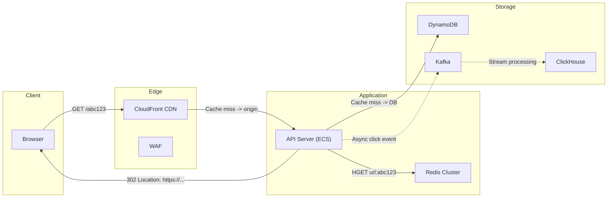
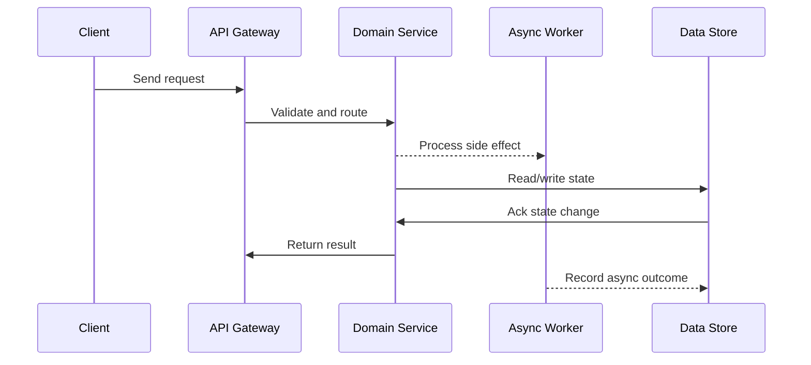

# Case Study: URL Shortener (TinyURL / Bit.ly)

## Quick Facts

- Area: System Design
- Tag: Case Study
- Source: `src/modules/topics/sysdesign/sd-case-url-shortener.js`
- Tags: `url shortener`, `tinyurl`, `base62`, `bloom filter`, `analytics`, `redirect`, `case study`
- Visual coverage: live visual, flow lab, UML lab, architecture map

## Concept

**Requirements:**

- Shorten a long URL to a 7-character code (base62: a-z, A-Z, 0-9)
- Redirect short URL -> original URL
- Optional: expiry, custom aliases, click analytics
- Scale: 100M URLs created/day, 10B redirects/day (read-heavy 100:1)

**Core algorithm - ID generation:**

1. Generate unique 64-bit ID (Snowflake or auto-increment DB)
2. Encode to base62: `62^7 = 3.5 trillion` unique codes - sufficient for decades

**Architecture decisions:**

**Storage:** DynamoDB or Redis (hash) - key: shortCode -> { originalUrl, createdAt, expiresAt, userId }.
Cache in Redis (TTL 24h) - 99% of redirects served from cache.

**Redirect flow:**
`short.ly/abc123` -> DNS -> CDN edge (cache HIT ~80%) -> API server -> Redis lookup -> 301/302 redirect.

**301 vs 302:**

- 301 (Permanent): browser caches redirect -> no server hit on repeat. Reduces load but no analytics.
- 302 (Temporary): browser always checks server -> full analytics but more load.
- Solution: serve 302 for analytics; 301 only for CDN-cached redirects.

**Analytics:** Async - on redirect, publish event to Kafka. Analytics consumers aggregate: clicks/hour, geo, device, referer. Write to ClickHouse / Redshift.

**Collision handling:** Bloom filter checks if generated code exists before DB insert. If collision (rare), regenerate.

**Custom aliases:** Check availability in DB. Rate-limit custom alias creation to prevent squatting.

## Why It Matters

URL shortener is the entry-level system design question. Expected to cover: encoding, storage choice, caching, redirect semantics, scale calculation.

## Architecture / Mental Model



## Runtime / Sequence



## Animation Plan

- Flow lab available: step-by-step path highlighting.
- UML sequence simulation available: actor messages animate in order.
- Architecture map available: clickable nodes and sync/async links.
- Live visual exists in app: topic-specific canvas/ReactViz animation.

Flow steps:

1. Enter system - Request crosses trust boundary and gets normalized before core handling.
2. Execute core path - Gateway routes to owning capability with timeout, auth context, and trace id.
3. Offload slow work - Async path absorbs retries, fanout, indexing, notifications, or heavy processing.
4. Persist state - System writes durable state, cache entries, offsets, or audit evidence.
5. Return or recover - Response returns when sync work succeeds; failure path uses retry, fallback, or replay.

## Example

```java
// URL Shortener core logic
@Service
public class UrlShortenerService {

    @Autowired private UrlRepository urlRepo;          // DynamoDB / PostgreSQL
    @Autowired private RedisTemplate<String,String> redis;
    @Autowired private SnowflakeIdGenerator idGen;
    @Autowired private KafkaTemplate<String,ClickEvent> kafka;

    private static final String BASE62 = "0123456789abcdefghijklmnopqrstuvwxyzABCDEFGHIJKLMNOPQRSTUVWXYZ";

    public String shorten(String originalUrl, String userId) {
        // Dedup: check if this user already shortened this URL
        Optional<String> existing = urlRepo.findByOriginalAndUser(originalUrl, userId);
        if (existing.isPresent()) return "https://short.ly/" + existing.get();

        long id = idGen.nextId();
        String shortCode = toBase62(id);

        urlRepo.save(new UrlMapping(shortCode, originalUrl, userId,
                                    Instant.now().plus(365, ChronoUnit.DAYS)));
        return "https://short.ly/" + shortCode;
    }

    public String redirect(String shortCode, HttpServletRequest req) {
        // L1: Redis cache
        String cached = redis.opsForValue().get("url:" + shortCode);
        if (cached != null) {
            publishClick(shortCode, req, "cache");
            return cached;
        }

        // L2: DB lookup
        UrlMapping mapping = urlRepo.findByCode(shortCode)
            .orElseThrow(() -> new NotFoundException("Short code not found"));

        if (mapping.isExpired()) throw new GoneException("Link expired");

        // Populate cache (TTL 24h for popular links)
        redis.opsForValue().set("url:" + shortCode, mapping.getOriginalUrl(),
                                Duration.ofHours(24));

        publishClick(shortCode, req, "db");
        return mapping.getOriginalUrl();
    }

    private void publishClick(String code, HttpServletRequest req, String source) {
        kafka.send("url.clicks", new ClickEvent(code,
            req.getHeader("X-Forwarded-For"),
            req.getHeader("User-Agent"),
            req.getHeader("Referer"),
            Instant.now()));
    }

    private String toBase62(long num) {
        StringBuilder sb = new StringBuilder();
        while (num > 0) { sb.append(BASE62.charAt((int)(num % 62))); num /= 62; }
        return sb.reverse().toString();
    }
}
```

Notes:
Snowflake IDs are time-ordered - recent URLs get similar codes, which helps with cache locality (CDN prefix caching).

## Complexity And Performance

- Time/space complexity depends on input size, data volume, and implementation choices.
- Track latency, throughput, memory, saturation, error rate, and correctness invariants.

## Interview Drills

1. How would you scale the URL shortener to 10 billion redirects per day?
   Answer: 10B/day = ~116K req/s. Peak ~3x = 350K req/s.

   **Read path (redirects):**
   1. **CloudFront/Fastly CDN** - cache redirects at edge (301 cached by browser, 302 cached by CDN with Cache-Control). 80% hit rate = 70K req/s to origin.
   2. **Redis Cluster** - remaining 30% (21K req/s) served from Redis (~sub-ms). 3-node cluster handles 500K ops/s easily.
   3. **DB** - only cold misses (<1% of traffic) hit the DB. DynamoDB or PostgreSQL with read replicas.

   **Write path (create):**
   100M/day = 1,160 creates/s. Single DynamoDB table with Snowflake IDs handles this easily.

   **Storage:** 100M URLs/day x 365 days x 5 years = 182B URLs. At 500 bytes/URL = 91TB. S3 for cold archive, DynamoDB for active.

   **Analytics:** Kafka at 350K events/s -> Flink aggregations -> ClickHouse for query.
   Follow-ups: How do you handle custom vanity URLs?; How would you detect and prevent abuse (spam/phishing)?

## Trade-offs

Pros:

- Simple read path - DynamoDB + Redis handles any scale
- Base62 encoding is trivial to implement
- CDN makes 80% of traffic free to serve

Cons:

- Analytics adds complexity (Kafka + stream processing)
- Custom alias creates need for availability check + rate limiting
- URL expiry requires cleanup job (DynamoDB TTL handles this natively)

When to use:
This design pattern (hash/encode -> cache -> redirect) applies to: QR codes, invite links, payment links, affiliate tracking.

## Gotchas

Watch for edge cases, assumptions, and hidden performance costs that can make this topic fail in production if handled incorrectly.
