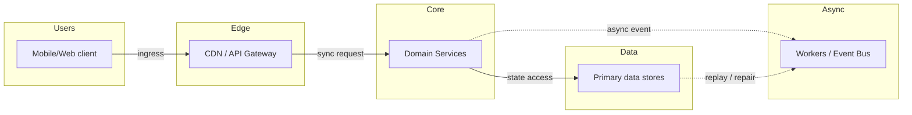
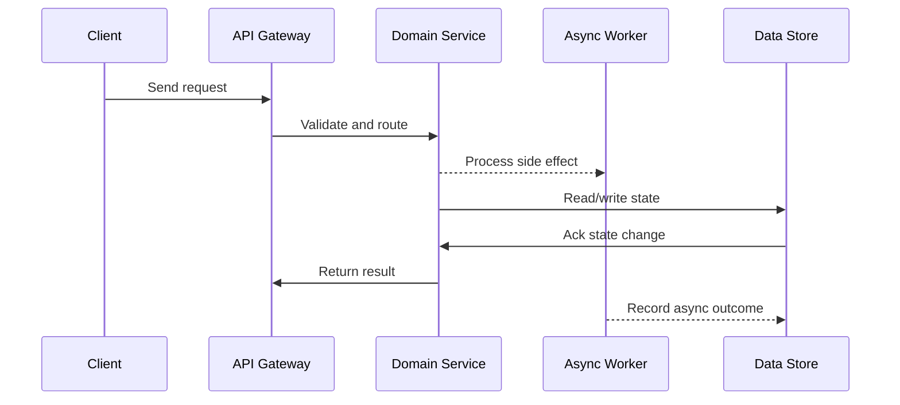

# Case Study: Video Platform (Netflix / YouTube)

## Quick Facts

- Area: System Design
- Tag: Case Study
- Source: `src/modules/topics/sysdesign/sd-case-video-platform.js`
- Tags: `netflix`, `youtube`, `video streaming`, `hls`, `dash`, `adaptive bitrate`, `cdn`, `transcoding`, `chunked upload`
- Visual coverage: live visual, flow lab, UML lab, architecture map

## Concept

**Requirements:** 500M users, 1B hours watched/day, 500 hours of video uploaded/minute.

**Upload pipeline:**

1. **Chunked upload** - client splits video into 5-10MB chunks, uploads in parallel. Resumable on failure.
2. **Raw storage** - chunks assembled in S3 bucket (upload bucket).
3. **Transcoding** - distributed job: split video into 5s segments -> transcode each segment to multiple resolutions (2160p/1080p/720p/480p/360p/240p) and codecs (H.264, H.265, AV1) in parallel.
4. **Adaptive Bitrate (ABR)** - generate HLS (HTTP Live Streaming) or MPEG-DASH manifest file listing all variants. Player selects bitrate based on network speed.
5. **CDN distribution** - transcoded segments pushed to 200+ CDN PoPs.

**Streaming:**

- Player requests manifest (`.m3u8` or `.mpd`).
- Downloads 2-10 second segments. Measures download speed.
- Switches bitrate every segment - seamless quality adaptation.
- No persistent connection - pure HTTP. Works through proxies, firewalls.

**Recommendation engine:**
Two-stage: candidate generation (ALS matrix factorisation - 1M videos -> top 100) -> ranking model (features: watch history, freshness, CTR, diversity) -> top 10-20 shown.

**Storage:**

- Video segments: S3 / GCS (object storage)
- Metadata (title, uploader, description): PostgreSQL / Spanner
- View counts, likes: Redis (real-time) + Cassandra (batch aggregated)
- Search index: Elasticsearch
- CDN: Netflix uses their own Open Connect CDN; YouTube uses Google's CDN

## Why It Matters

Video streaming design is a common senior-level question. Transcoding pipeline, HLS/DASH, and CDN strategy are unique to this domain.

## Architecture / Mental Model



## Runtime / Sequence



## Animation Plan

- Flow lab available: step-by-step path highlighting.
- UML sequence simulation available: actor messages animate in order.
- Architecture map available: clickable nodes and sync/async links.
- Live visual exists in app: topic-specific canvas/ReactViz animation.

Flow steps:

1. Enter system - Request crosses trust boundary and gets normalized before core handling.
2. Execute core path - Gateway routes to owning capability with timeout, auth context, and trace id.
3. Offload slow work - Async path absorbs retries, fanout, indexing, notifications, or heavy processing.
4. Persist state - System writes durable state, cache entries, offsets, or audit evidence.
5. Return or recover - Response returns when sync work succeeds; failure path uses retry, fallback, or replay.

## Example

```yaml
# Video transcoding pipeline - AWS MediaConvert or custom FFmpeg workers

# 1. Upload initiation
POST /uploads/initiate
Response: { uploadId: "abc123", chunks: [{chunkNum: 1, presignedUrl: "..."}, ...] }

# 2. Client uploads chunks in parallel (5 concurrent)
PUT <presignedUrl>  # each chunk uploaded directly to S3 (bypasses API server)

# 3. Upload completion trigger
POST /uploads/complete { uploadId: "abc123" }
  -> SQS message -> Transcoding workers

# 4. Transcoding worker (Python + FFmpeg)
# Split into 4-second segments, transcode each in parallel:
Resolutions:
  - 2160p (4K):  bitrate 15Mbps, codec H.265
  - 1080p (FHD): bitrate 4Mbps, codec H.264/H.265/AV1
  - 720p (HD):   bitrate 2Mbps, codec H.264
  - 480p:        bitrate 1Mbps, codec H.264
  - 360p:        bitrate 500Kbps, codec H.264
  - 240p:        bitrate 200Kbps, codec H.264 (mobile/slow networks)

# 5. HLS manifest generation (.m3u8)
#EXTM3U
#EXT-X-VERSION:3
#EXT-X-STREAM-INF:BANDWIDTH=4000000,RESOLUTION=1920x1080
https://cdn.example.com/videos/abc123/1080p/playlist.m3u8
#EXT-X-STREAM-INF:BANDWIDTH=2000000,RESOLUTION=1280x720
https://cdn.example.com/videos/abc123/720p/playlist.m3u8
#EXT-X-STREAM-INF:BANDWIDTH=500000,RESOLUTION=640x360
https://cdn.example.com/videos/abc123/360p/playlist.m3u8

# 6. CDN pre-warm for popular content
# On publish, push first 30s of all resolutions to all PoPs (popular content anticipation)
# Long-tail content: serve from S3 on cache miss
```

Notes:
Netflix's Open Connect appliances are deployed IN ISP datacenters - video bytes travel only from ISP's own rack to user. Eliminates internet transit cost.

## Complexity And Performance

- Time/space complexity depends on input size, data volume, and implementation choices.
- Track latency, throughput, memory, saturation, error rate, and correctness invariants.

## Interview Drills

1. How does adaptive bitrate streaming work?
   Answer: ABR (HLS/DASH) works in 5 steps:
   1. Server transcodes video into multiple quality levels (2160p -> 240p) and divides each into short segments (2-10 seconds).
   2. A manifest file lists all quality variants with bandwidth requirements.
   3. Player downloads the manifest, picks initial quality based on measured bandwidth.
   4. Player downloads segment, measures download time. If download took longer than segment duration -> bandwidth too low -> switch to lower quality next segment.
   5. If download is consistently fast -> buffer ahead and switch to higher quality.

   **Key insight:** Switching happens at segment boundaries - seamless. Player maintains a 15-30 second buffer to absorb network jitter without pause.

   HLS uses `.m3u8` (Apple format, supported natively by iOS/Safari). DASH is ISO standard (Chrome, Android). Both achieve same result - adaptive quality.
   Follow-ups: Why does Netflix pre-transcode to AV1 codec?; How do you handle DRM (Digital Rights Management) for premium content?

## Trade-offs

Pros:

- HLS/DASH: works over plain HTTP, CDN-friendly, adaptive quality
- Chunked upload: resumable, parallel - fast for large files
- Distributed transcoding: elastic scale - 500h/minute is feasible

Cons:

- Transcoding is compute-intensive and expensive ($0.50/min of video for 1080p)
- Manifest + segment files multiply storage (6 resolutions x many segments)
- ABR introduces complexity in player implementation

When to use:
HLS for iOS/Safari. DASH for Android/Chrome. AV1 codec for bandwidth-constrained mobile markets. Always CDN for video - sending video from origin is economically infeasible at scale.

## Gotchas

_No gotchas configured._
