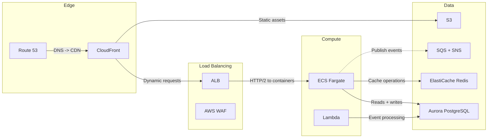
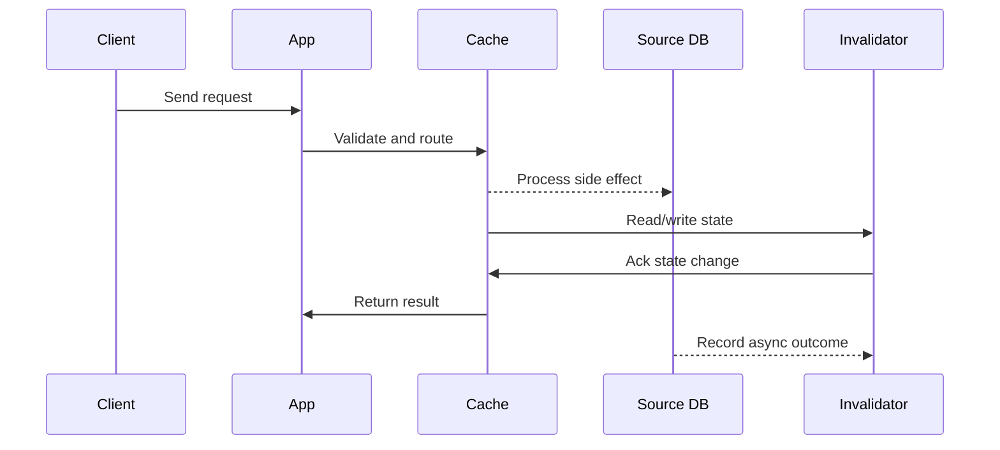

# AWS Cloud - Services by Layer & When to Use Each

## Quick Facts

- Area: System Design
- Tag: Cloud
- Source: `src/modules/topics/sysdesign/sd-cloud-aws.js`
- Tags: `aws`, `ec2`, `s3`, `rds`, `dynamodb`, `sqs`, `sns`, `lambda`, `cloudfront`, `route53`, `eks`, `elasticache`, `kinesis`
- Visual coverage: live visual, flow lab, UML lab, architecture map

## Concept

**AWS services organised by system layer:**

**Compute:**

- **EC2** - virtual machines. Full control. Use for: DB servers, batch compute, custom OS requirements.
- **ECS** (Fargate) - managed containers, no cluster management. Use for: containerised services without K8s complexity.
- **EKS** - managed Kubernetes. Use for: complex microservice orchestration.
- **Lambda** - serverless functions. Use for: event-driven, infrequent, short-duration tasks (<15 min).

**Storage:**

- **S3** - object storage. Unlimited, 11 nines durability. Use for: file uploads, static assets, data lake, backups. Cost: ~$0.023/GB.
- **EBS** - block storage for EC2 instances. SSD (gp3) or provisioned IOPS.
- **EFS** - managed NFS. Shared across multiple EC2 instances.

**Database:**

- **RDS** (Aurora) - managed relational. Aurora is MySQL/Postgres-compatible with 3-6x throughput. Multi-AZ HA.
- **DynamoDB** - managed NoSQL. Single-digit ms at any scale. Global tables for multi-region.
- **ElastiCache** (Redis/Memcached) - managed cache. Use for: session, rate limiting, pub-sub.
- **Redshift** - data warehouse. Petabyte-scale analytics. Columnar storage.
- **Neptune** - managed graph DB.

**Networking:**

- **VPC** - isolated virtual network. Subnets (public/private), security groups (stateful firewall), NACLs.
- **Route 53** - DNS + health checks + routing policies (latency, geo, weighted, failover).
- **CloudFront** - CDN. 400+ PoPs. Lambda@Edge for edge compute.
- **ALB/NLB** - managed load balancers. ALB=L7 (HTTP routing), NLB=L4 (TCP, ultra-low latency).

**Messaging:**

- **SQS** - managed queue. At-least-once delivery. FIFO option for exactly-once.
- **SNS** - managed pub-sub. Fan-out to SQS, Lambda, email, SMS.
- **Kinesis** (Data Streams) - managed Kafka alternative. Real-time streaming, 7-day retention.
- **EventBridge** - event bus with routing rules. SaaS integration, scheduled events.

**DevOps:**

- **IAM** - identity + access management. Roles, policies, least privilege.
- **CloudWatch** - metrics, logs, alarms, dashboards.
- **CodePipeline + CodeBuild + CodeDeploy** - CI/CD.
- **CDK / CloudFormation / Terraform** - infrastructure as code.

## Why It Matters

AWS is asked in nearly every infrastructure design interview. Knowing which managed service to choose (and why) vs building yourself is a core senior architect skill.

## Architecture / Mental Model



## Runtime / Sequence



## Animation Plan

- Flow lab available: step-by-step path highlighting.
- UML sequence simulation available: actor messages animate in order.
- Architecture map available: clickable nodes and sync/async links.
- Live visual exists in app: topic-specific canvas/ReactViz animation.

Flow steps:

1. Enter system - Request crosses trust boundary and gets normalized before core handling.
2. Execute core path - Gateway routes to owning capability with timeout, auth context, and trace id.
3. Offload slow work - Async path absorbs retries, fanout, indexing, notifications, or heavy processing.
4. Persist state - System writes durable state, cache entries, offsets, or audit evidence.
5. Return or recover - Response returns when sync work succeeds; failure path uses retry, fallback, or replay.

## Example

```yaml
# AWS CDK (TypeScript concept in YAML pseudocode)
# Typical 3-tier web app stack

# Networking
VPC:
  cidr: 10.0.0.0/16
  subnets:
    public:  [10.0.1.0/24, 10.0.2.0/24]   # ALB, NAT Gateway
    private: [10.0.3.0/24, 10.0.4.0/24]   # ECS tasks, Lambda
    data:    [10.0.5.0/24, 10.0.6.0/24]   # RDS, ElastiCache

# CDN + DNS
CloudFront:
  origins:
    - S3 (static assets) - cache 1 year
    - ALB (API) - cache 0s (dynamic)
Route53:
  A record: api.example.com -> CloudFront distribution

# Compute
ALB:
  listeners: [HTTPS:443 -> ECS TargetGroup]
  rules:
    - /api/* -> order-service TG
    - /admin/* -> admin-service TG (auth required)

ECS Fargate:
  services:
    order-service:
      image: 123456789.dkr.ecr.us-east-1.amazonaws.com/order:v2
      cpu: 512, memory: 1024
      desiredCount: 3
      autoScaling: cpu>70% -> scale out, cpu<30% -> scale in
      minHealthyPercent: 100, maxPercent: 200  # zero-downtime rolling deploy

# Database
Aurora PostgreSQL:
  instanceClass: db.r6g.large
  multiAZ: true             # automatic failover <30s
  enablePerformanceInsights: true
  backupRetentionDays: 7

ElastiCache Redis:
  nodeType: cache.r6g.large
  clusterMode: true         # Redis Cluster - sharded
  replicasPerShard: 2

# Messaging
SQS:
  order-queue:
    visibilityTimeout: 300s
    messageRetentionPeriod: 14d
    deadLetterQueue: order-dlq (maxReceiveCount: 3)

SNS:
  order-events-topic: -> [fulfillment-queue, analytics-queue, notification-queue]

# Storage
S3:
  bucket: myapp-assets
  versioning: enabled
  lifecycleRules:
    - transition to Glacier after 90 days
  blockPublicAccess: true   # CloudFront OAC access only
```

Notes:
Always use IAM roles (not access keys) for service-to-service auth in AWS. Least-privilege: each Lambda/ECS task gets only the permissions it needs.

## Complexity And Performance

- Time/space complexity depends on input size, data volume, and implementation choices.
- Track latency, throughput, memory, saturation, error rate, and correctness invariants.

## Interview Drills

1. How would you design a highly available, multi-region AWS architecture?
   Answer: 1. **Two regions** (us-east-1, eu-west-1) with Route 53 latency-based or failover routing. 2. **Route 53 health checks** monitor ALB in each region. On failure, traffic automatically shifts to healthy region. 3. **Aurora Global Database** - primary in us-east-1, read replica in eu-west-1. Replication lag < 1s. On failure, promote secondary in <1 minute. 4. **DynamoDB Global Tables** - multi-active, automatic conflict resolution (last-write-wins). 5. **S3 Cross-Region Replication** - static assets replicated to both regions. CloudFront serves from nearest PoP. 6. **ElastiCache** - separate cluster per region. Cache warms up from DB after region failover. 7. **Chaos testing** - periodic failover drills to validate RTO/RPO targets.

   RTO (Recovery Time Objective): < 5 minutes. RPO (Recovery Point Objective): < 1 second (Aurora Global).
   Follow-ups: What is the difference between RTO and RPO?; How would you handle data residency requirements (EU data must stay in EU)?

## Trade-offs

Pros:

- Managed services reduce operational burden
- Pay-as-you-go - no upfront hardware costs
- Global infrastructure with 30+ regions

Cons:

- Vendor lock-in (especially DynamoDB, Aurora, EventBridge)
- Cost can exceed on-prem at very large scale
- Managed service limitations (DynamoDB 400KB item limit, Lambda 15min)

When to use:
Use managed services by default - the operational savings outweigh the lock-in risk. Only consider self-managed (e.g. self-hosted Kafka) at massive scale (>$1M/month cloud spend) where savings justify operational cost.

## Gotchas

_No gotchas configured._
