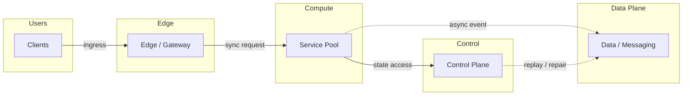
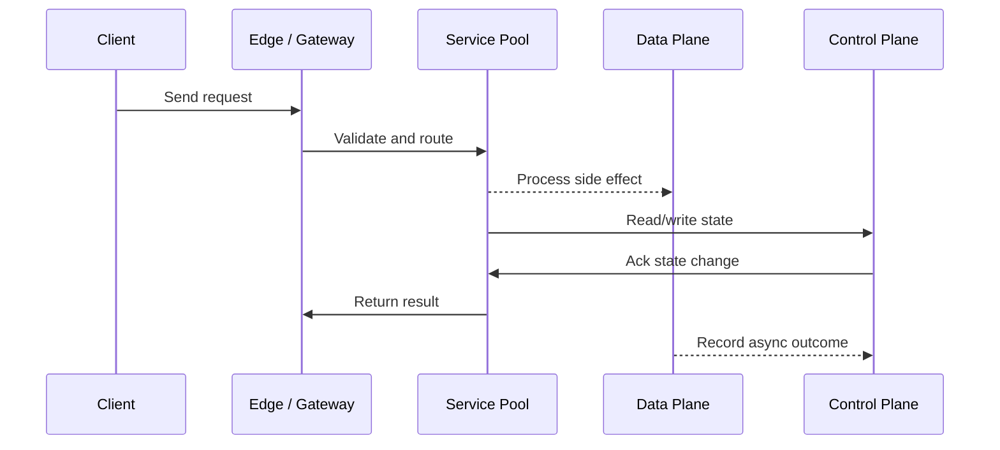

# Compute Spectrum - VMs, Containers & Serverless

## Quick Facts

- Area: System Design
- Tag: Compute
- Source: `src/modules/topics/sysdesign/sd-compute-spectrum.js`
- Tags: `vm`, `container`, `serverless`, `lambda`, `docker`, `kubernetes`, `fargate`, `cold start`, `ec2`
- Visual coverage: live visual, flow lab, UML lab, architecture map

## Concept

**Spectrum from most to least control:**

**1. Bare Metal -> EC2 (Virtual Machines)**

- Full OS control. Predictable performance. No noisy-neighbour.
- Best for: databases, high-performance compute, compliance requiring isolation.
- Cost: highest. Startup: minutes. Management: full.

**2. Containers (Docker + Kubernetes / ECS)**

- Share host OS kernel. Lightweight (~10MB vs GB for VM). Start in seconds.
- Portable - same image runs locally, CI, and production.
- Kubernetes: orchestration, auto-healing, rolling deploys, HPA.
- Best for: long-running web services, background workers, scheduled jobs.

**3. Serverless (Lambda, Cloud Functions, Fargate)**

- No servers to manage. Pay per invocation. Auto-scales to zero.
- **Cold start:** container initialisation latency (100ms-3s for Java; <50ms for Go/Node).
- Concurrency model: each invocation is isolated. No shared state in process.
- Best for: event-driven processing, infrequent workloads, ETL, webhooks.

**Comparison:**
| | VM (EC2) | Container (K8s) | Serverless (Lambda) |
|---|---|---|---|
| Startup | Minutes | Seconds | 100ms-3s |
| Cost model | Per hour | Per hour | Per invocation |
| Scale to zero | No | Possible (KEDA) | Yes |
| State | Persistent disk | Ephemeral pod | No persistent state |
| Cold start | N/A | Seconds | Yes (critical issue) |
| Max duration | Unlimited | Unlimited | 15 min (Lambda) |

## Why It Matters

Choosing the wrong compute model costs money or creates operational burden. Lambda for 24/7 high-traffic = 10x more expensive than EC2. EC2 for sporadic events = paying for idle.

## Architecture / Mental Model



## Runtime / Sequence



## Animation Plan

- Flow lab available: step-by-step path highlighting.
- UML sequence simulation available: actor messages animate in order.
- Architecture map available: clickable nodes and sync/async links.
- Live visual exists in app: topic-specific canvas/ReactViz animation.

Flow steps:

1. Enter system - Request crosses trust boundary and gets normalized before core handling.
2. Execute core path - Gateway routes to owning capability with timeout, auth context, and trace id.
3. Offload slow work - Async path absorbs retries, fanout, indexing, notifications, or heavy processing.
4. Persist state - System writes durable state, cache entries, offsets, or audit evidence.
5. Return or recover - Response returns when sync work succeeds; failure path uses retry, fallback, or replay.

## Example

```yaml
# AWS Lambda - event-driven, scales to zero
# serverless.yml (Serverless Framework)
service: order-processor
provider:
  name: aws
  runtime: java17
  memorySize: 512
  timeout: 30
  environment:
    DB_URL: !Sub "jdbc:postgresql://${DbHost}/orders"

functions:
  processOrder:
    handler: com.example.OrderHandler::handleRequest
    events:
      - sqs:
          arn: !GetAtt OrderQueue.Arn
          batchSize: 10 # Process 10 SQS messages per invocation
          maximumBatchingWindow: 5 # Wait up to 5s to fill batch

  # HTTP API (API Gateway -> Lambda)
  getOrder:
    handler: com.example.OrderQueryHandler::handleRequest
    events:
      - httpApi:
          path: /orders/{id}
          method: GET
    # Provisioned concurrency to eliminate cold starts for hot path
    provisionedConcurrency: 5

---
# SnapStart (Java Lambda) - pre-initialise JVM snapshot
# Add to Lambda config:
# SnapStart:
#   ApplyOn: PublishedVersions
# Reduces Java cold start from 3s -> 200ms
```

Notes:
Lambda SnapStart (Java) takes a snapshot of the initialised JVM. Restores from snapshot instead of cold-starting - reduces latency by 10x.

## Complexity And Performance

- Time/space complexity depends on input size, data volume, and implementation choices.
- Track latency, throughput, memory, saturation, error rate, and correctness invariants.

## Interview Drills

1. How do you reduce Lambda cold start latency for a Java service?
   Answer: **Cold start causes:** JVM startup (~500ms) + class loading + Spring context initialization (500ms-2s).

   **Mitigation strategies:**
   1. **Lambda SnapStart** - JVM snapshot taken after init; restored on cold start. Java 17+.
   2. **Provisioned concurrency** - keep N Lambda instances warm. Eliminates cold starts but costs per hour.
   3. **Smaller deployment package** - fewer classes to load. Use tree-shaking, avoid fat jars.
   4. **GraalVM native image** - compile Java to native binary. Start in <50ms. But: longer build, limited reflection.
   5. **Switch runtime** - Node.js/Go/Python have 50-100ms cold starts vs Java's 1-3s.
   6. **Keep warm ping** - EventBridge rule pings Lambda every 5 minutes. Dirty solution, not reliable.
      Follow-ups: What is GraalVM native compilation and what are its limitations?; How does Lambda handle 10,000 concurrent invocations?

## Trade-offs

Pros:

- Serverless: zero ops, auto-scale, pay-per-use
- Containers: portability + K8s orchestration
- VMs: maximum performance predictability

Cons:

- Serverless: cold starts, 15-min max, stateless
- Containers: K8s complexity
- VMs: slow provisioning, manual scaling

When to use:
Serverless for event-driven, infrequent, or unpredictable loads. Containers for steady web services. VMs for databases and performance-critical compute.

## Gotchas

_No gotchas configured._
