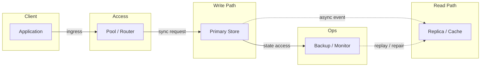
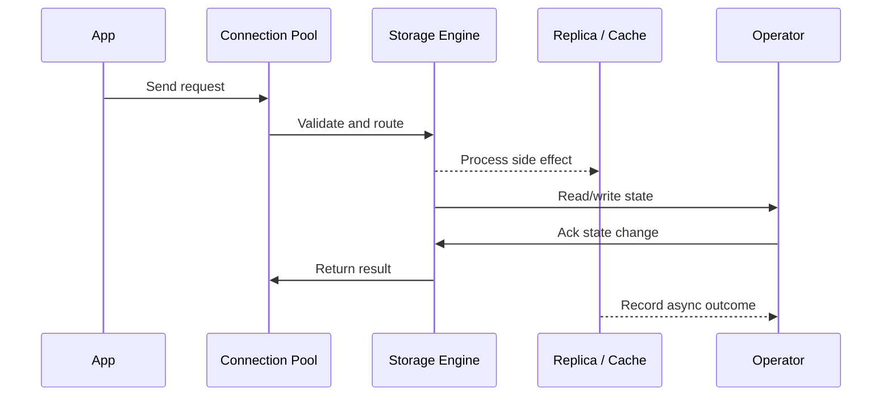

# NoSQL - Document, Key-Value & Wide-Column

## Quick Facts

- Area: System Design
- Tag: Database
- Source: `src/modules/topics/sysdesign/sd-db-nosql.js`
- Tags: `mongodb`, `dynamodb`, `cassandra`, `redis`, `nosql`, `document`, `wide column`, `key value`
- Visual coverage: live visual, flow lab, UML lab, architecture map

## Concept

**NoSQL** databases sacrifice some relational guarantees for horizontal scalability, flexible schemas, and specific access-pattern optimisation.

**Key-Value (Redis, DynamoDB, etcd):**

- Get/Put/Delete by key - O(1)
- No query language; you must know the key
- Perfect for sessions, caches, feature flags, leaderboards
- DynamoDB adds secondary indexes (GSI/LSI) for alternate access patterns

**Document (MongoDB, CouchDB, Firestore):**

- Store JSON-like documents, nested structures allowed
- Rich query language - filter, project, aggregate
- Schema-flexible - each document can have different fields
- Indexes on any field; text search built-in
- Best for catalogs, content management, user profiles

**Wide-Column (Cassandra, HBase, BigTable):**

- Rows indexed by partition key; columns per row can vary
- Partition key determines which node holds the data (consistent hash)
- Optimised for **time-series** and **write-heavy** workloads (append-only)
- No JOINs; denormalize for each query pattern
- Cassandra: masterless, tunable consistency (quorum)

**Graph (Neo4j, Amazon Neptune):**

- Nodes + edges with properties
- Efficient multi-hop traversals (friends-of-friends, fraud rings)
- Poor for non-graph queries

**Time-Series (InfluxDB, TimescaleDB, Prometheus):**

- Optimised for append-only timestamped metrics
- Automatic retention policies, downsampling

## Why It Matters

Choosing the right NoSQL type is a critical design decision. The wrong choice (MongoDB for time-series, Cassandra for random writes without design) leads to catastrophic performance at scale.

## Architecture / Mental Model



## Runtime / Sequence



## Animation Plan

- Flow lab available: step-by-step path highlighting.
- UML sequence simulation available: actor messages animate in order.
- Architecture map available: clickable nodes and sync/async links.
- Live visual exists in app: topic-specific canvas/ReactViz animation.

Flow steps:

1. Enter system - Request crosses trust boundary and gets normalized before core handling.
2. Execute core path - Gateway routes to owning capability with timeout, auth context, and trace id.
3. Offload slow work - Async path absorbs retries, fanout, indexing, notifications, or heavy processing.
4. Persist state - System writes durable state, cache entries, offsets, or audit evidence.
5. Return or recover - Response returns when sync work succeeds; failure path uses retry, fallback, or replay.

## Example

```java
// MongoDB with Spring Data - flexible document model
@Document(collection = "products")
public class Product {
    @Id
    private String id;

    @Indexed
    private String category;

    private String name;
    private Map<String, Object> attributes; // flexible schema
    private List<String> tags;

    @Indexed(expireAfterSeconds = 3600) // TTL index!
    private Date cacheExpiry;
}

// Repository with aggregation pipeline
public interface ProductRepository extends MongoRepository<Product, String> {

    // Uses category index
    List<Product> findByCategoryAndTagsContaining(String category, String tag);

    // Aggregation - group by category, count, avg price
    @Aggregation(pipeline = {
        "{ $match: { status: 'ACTIVE' } }",
        "{ $group: { _id: '$category', count: { $sum: 1 }, avgPrice: { $avg: '$price' } } }",
        "{ $sort: { count: -1 } }"
    })
    List<CategoryStats> getCategoryStats();
}

//  Cassandra - wide-column for time-series events
// Table designed for query: "get events for user X in time range"
// PRIMARY KEY ((user_id), event_time) -- partition by user, cluster by time
@Table("user_events")
public class UserEvent {
    @PrimaryKeyColumn(type = PrimaryKeyType.PARTITIONED)
    private UUID userId;

    @PrimaryKeyColumn(type = PrimaryKeyType.CLUSTERED,
                      ordering = Ordering.DESCENDING)
    private Instant eventTime;

    private String eventType;
    private Map<String, String> metadata;
}
```

Notes:
In Cassandra, design tables around queries not entities. One query pattern = one table. Denormalization is expected.

## Complexity And Performance

- O(1)

## Interview Drills

1. How does DynamoDB achieve single-digit millisecond latency at any scale?
   Answer: DynamoDB is a managed key-value/document store with several architectural decisions for consistent latency:
   1. **Partition key hashing** - data is spread across partitions by consistent hashing. Reads/writes go to a single partition.
   2. **SSD storage** - all data on NVMe SSDs.
   3. **Request routing** - each request routed to the correct partition without scanning.
   4. **Leaderless replication** - 3 replicas per partition using Paxos. A write is acknowledged after 2/3 replicas confirm (quorum write).
   5. **No complex queries** - DynamoDB rejects table scans; you must design with access patterns in mind.

   **Cost of this speed:** no JOINs, no aggregations, no arbitrary filters without GSI.
   Follow-ups: What is a hot partition in DynamoDB and how do you fix it?; When would you use a GSI vs LSI in DynamoDB?

2. Compare MongoDB and Cassandra. When would you choose each?
   Answer: **MongoDB:**
   - Rich query language (aggregation pipeline, $lookup, text search)
   - Document model - nested arrays/objects natural for product catalogs, CMS
   - Mutable documents - updates, upserts
   - Choose for: catalogs, user profiles, CMS, geospatial queries

   **Cassandra:**
   - Write-optimized - append-only log-structured merge (LSM) tree
   - Masterless - any node accepts writes; tunable consistency
   - Designed for time-series and high-write IoT workloads
   - No UPDATE in the traditional sense - new tombstone + new write
   - Choose for: IoT event streams, audit logs, time-series metrics, chat message history

   **Key difference:** MongoDB optimises for flexible read queries. Cassandra optimises for write throughput and predictable high-volume time-series.
   Follow-ups: What is an LSM tree and how does it enable fast writes?

## Trade-offs

Pros:

- Horizontal write scaling (Cassandra/DynamoDB)
- Flexible schema (MongoDB)
- Specialised performance for specific access patterns

Cons:

- Eventual consistency complexity
- No cross-document transactions (until MongoDB 4+)
- Schema design is harder - query-first design required for Cassandra

When to use:
Key-value for caches/sessions. Document for catalogs/profiles. Wide-column for time-series/events. Relational first unless you have a specific scaling or schema-flexibility need.

## Gotchas

_No gotchas configured._
