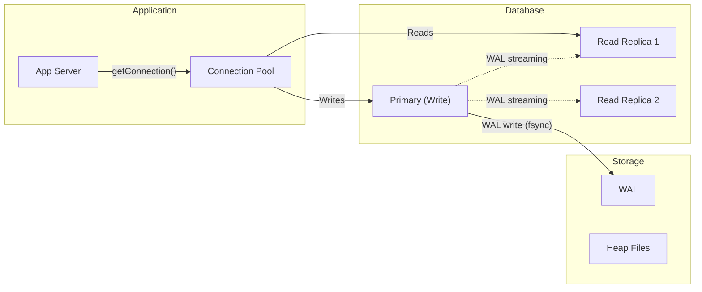
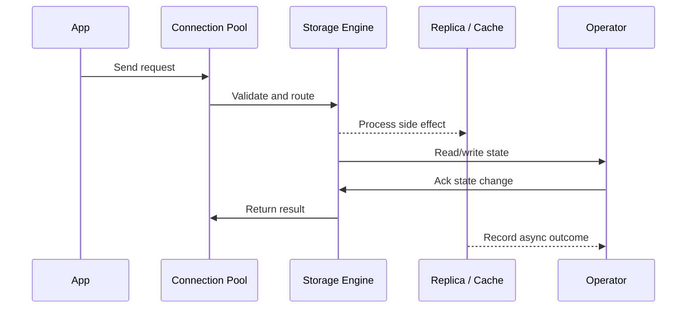

# Relational DBs - ACID, Indexing & Query Planning

## Quick Facts

- Area: System Design
- Tag: Database
- Source: `src/modules/topics/sysdesign/sd-db-relational.js`
- Tags: `sql`, `postgres`, `mysql`, `acid`, `btree`, `index`, `query planner`, `normalization`
- Visual coverage: live visual, flow lab, UML lab, architecture map

## Concept

**ACID properties:**

- **Atomicity** - all statements in a transaction commit or all roll back
- **Consistency** - transaction brings DB from one valid state to another (constraints, foreign keys enforced)
- **Isolation** - concurrent transactions appear sequential. Isolation levels: READ UNCOMMITTED < READ COMMITTED < REPEATABLE READ < SERIALIZABLE
- **Durability** - committed data survives crashes (WAL - Write-Ahead Log flushed to disk before commit ACK)

**Isolation level trade-offs:**
| Level | Dirty Read | Non-repeatable Read | Phantom Read | Performance |
|---|---|---|---|---|
| Read Uncommitted | check | check | check | Fastest |
| Read Committed | | check | check | Good (PG default) |
| Repeatable Read | | | check | Moderate (MySQL default) |
| Serializable | | | | Slowest |

**B-Tree index:** default index type. O(log N) lookup, range scans efficient, good for equality + ORDER BY.
**Hash index:** O(1) point lookup, no range scans (PostgreSQL heap AM only).
**GIN index:** inverted index for JSONB, arrays, full-text search.
**BRIN index:** block range index, tiny footprint, good for append-only time-series tables.
**Partial index:** `CREATE INDEX ON orders(user_id) WHERE status='PENDING'` - tiny, fast for filtered queries.

**Query planner:** EXPLAIN ANALYZE shows plan (seq scan, index scan, bitmap heap scan, nested loop, hash join, merge join). The planner uses table statistics (ANALYZE) to estimate row counts.

## Why It Matters

70% of backend performance issues trace to missing or wrong indexes. Understanding the planner is essential for debugging slow queries in production.

## Architecture / Mental Model



## Runtime / Sequence



## Animation Plan

- Flow lab available: step-by-step path highlighting.
- UML sequence simulation available: actor messages animate in order.
- Architecture map available: clickable nodes and sync/async links.
- Live visual exists in app: topic-specific canvas/ReactViz animation.

Flow steps:

1. Enter system - Request crosses trust boundary and gets normalized before core handling.
2. Execute core path - Gateway routes to owning capability with timeout, auth context, and trace id.
3. Offload slow work - Async path absorbs retries, fanout, indexing, notifications, or heavy processing.
4. Persist state - System writes durable state, cache entries, offsets, or audit evidence.
5. Return or recover - Response returns when sync work succeeds; failure path uses retry, fallback, or replay.

## Example

```java
// Spring Data JPA - indexing and query optimization
@Entity
@Table(name = "orders",
    indexes = {
        @Index(name = "idx_orders_user_status",
               columnList = "user_id, status"),   // composite index
        @Index(name = "idx_orders_created_at",
               columnList = "created_at DESC")     // for ORDER BY created_at DESC
    }
)
public class Order {
    @Id @GeneratedValue(strategy = GenerationType.IDENTITY)
    private Long id;

    @Column(nullable = false)
    private Long userId;

    @Enumerated(EnumType.STRING)
    @Column(nullable = false, length = 20)
    private OrderStatus status;

    @Column(nullable = false)
    private Instant createdAt;

    @Column(precision = 12, scale = 2)
    private BigDecimal total;
}

// Repository - use projections to avoid SELECT *
public interface OrderRepository extends JpaRepository<Order, Long> {

    // Uses idx_orders_user_status
    List<OrderSummary> findByUserIdAndStatus(Long userId, OrderStatus status);

    // Pagination to avoid full table scan
    @Query("SELECT o FROM Order o WHERE o.userId = :uid ORDER BY o.createdAt DESC")
    Page<Order> findRecentByUser(@Param("uid") Long userId, Pageable pageable);

    // COUNT using index only (covering index)
    long countByUserIdAndStatus(Long userId, OrderStatus status);
}

// Projection interface - SELECT only needed columns
interface OrderSummary {
    Long getId();
    OrderStatus getStatus();
    BigDecimal getTotal();
}
```

Notes:
Always run EXPLAIN ANALYZE in staging before deploying queries that touch large tables. Composite index column order matters: put the most selective column first for range queries.

## Complexity And Performance

- O(log N)
- O(1)

## Interview Drills

1. When would you denormalize a database schema?
   Answer: Normalisation (3NF) eliminates redundancy and ensures consistency. Denormalization intentionally adds redundancy for read performance.

   **Denormalize when:**
   - JOIN cost is too high at scale (millions of rows x multiple tables)
   - Read-to-write ratio is very high (reporting, analytics)
   - Aggregates are pre-computed (daily order counts cached in user table)

   **Techniques:**
   - Duplicate column to avoid JOIN (`user_email` on orders table)
   - Pre-compute aggregates (`order_count` on users table, updated by trigger)
   - Materialized views (auto-maintained in PostgreSQL)

   **Risk:** update anomalies - duplicated data must be kept in sync.
   Follow-ups: What is a covering index?; How does MVCC (Multi-Version Concurrency Control) work in PostgreSQL?

2. What causes a sequential scan when an index exists?
   Answer: The query planner chooses seq scan when it estimates that reading the index + heap fetches costs MORE than a full table scan. This happens when:
   1. **Low selectivity** - query matches >10-20% of rows; seq scan amortises better
   2. **Stale statistics** - ANALYZE not run after large data change; planner underestimates row count
   3. **Function on indexed column** - `WHERE LOWER(email) = ...` can't use index on `email`; use functional index instead
   4. **Type mismatch** - comparing `VARCHAR` column to `INTEGER` literal forces cast, skips index
      Follow-ups: How do you force PostgreSQL to use an index?; What is the difference between index scan and bitmap heap scan?

## Trade-offs

Pros:

- ACID guarantees for financial/transactional data
- Rich query language - complex aggregations, JOINs
- Mature ecosystem - replication, backup, monitoring

Cons:

- Vertical scaling has ceiling
- Schema migrations on large tables require downtime (use pg_repack / online DDL)
- Joins across shards are expensive or impossible

When to use:
Default choice for transactional data (orders, users, payments). Move to NoSQL only when you need horizontal write scaling, flexible schema, or specific access patterns (time-series, document, graph).

## Gotchas

Watch for edge cases, assumptions, and hidden performance costs that can make this topic fail in production if handled incorrectly.
