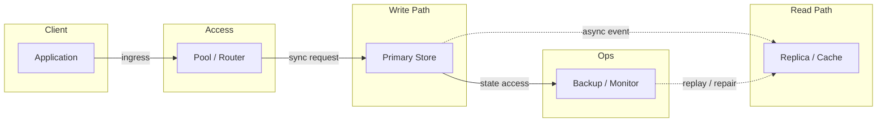
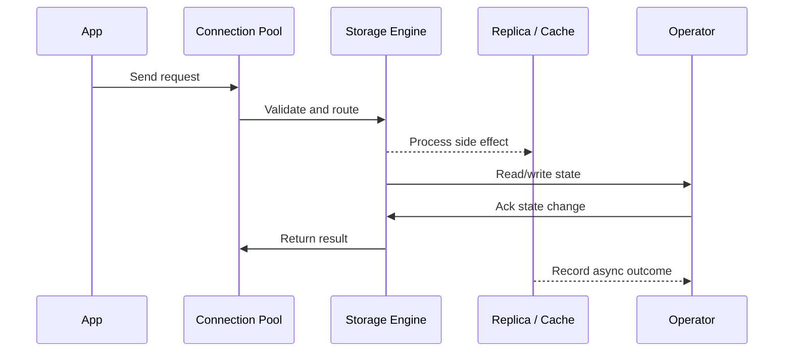

# Database Sharding, Replication & Resharding

## Quick Facts

- Area: System Design
- Tag: Database
- Source: `src/modules/topics/sysdesign/sd-db-sharding.js`
- Tags: `sharding`, `replication`, `horizontal scaling`, `consistent hashing`, `resharding`, `vitess`, `citus`
- Visual coverage: live visual, flow lab, UML lab, architecture map

## Concept

**Replication** - copy data to multiple nodes for availability and read scale. One primary, N replicas.

- **Sync replication** - primary waits for replica ACK before committing. Zero data loss, higher latency.
- **Async replication** - primary commits immediately, replica catches up later. Low latency, potential data loss on failover (~seconds of lag).
- **Semi-sync** - at least one replica must ACK. Balance between above.

**Sharding (horizontal partitioning)** - split data across multiple nodes so each node owns a subset.

**Sharding strategies:**

1. **Range-based** - shard by value range (users 0-1M -> shard 1, 1M-2M -> shard 2). Simple but creates hot spots.
2. **Hash-based** - `shard = hash(key) % N`. Even distribution but resharding is expensive (N changes).
3. **Consistent hashing** - place shards on hash ring; adding a node migrates only K/N keys. Used by Cassandra, DynamoDB, Redis Cluster.
4. **Directory-based** - lookup table maps key -> shard. Flexible but lookup is a bottleneck.
5. **Geo-sharding** - route by geography (EU users -> EU shard). Compliance + latency.

**Cross-shard challenges:**

- **JOINs** - cross-shard JOINs require scatter-gather; avoid by denormalising
- **Distributed transactions** - 2PC or Saga; expensive
- **Auto-increment IDs** - use UUID or Snowflake IDs to avoid collision
- **Resharding** - Vitess (MySQL) and Citus (PostgreSQL) automate online resharding

## Why It Matters

Sharding is the only way to scale writes horizontally beyond a single primary DB. Getting the shard key wrong requires a full data migration to fix.

## Architecture / Mental Model



## Runtime / Sequence



## Animation Plan

- Flow lab available: step-by-step path highlighting.
- UML sequence simulation available: actor messages animate in order.
- Architecture map available: clickable nodes and sync/async links.
- Live visual exists in app: topic-specific canvas/ReactViz animation.

Flow steps:

1. Route by shard key - App computes shard = consistentHash(user_id). Shard router maps to physical node address.
2. Write to Shard 1 - User with hash in 0-33% range lands on Shard 1's primary.
3. Async replication - Primary streams WAL to replica. Replica serves read queries with <100ms lag.
4. Different user -> Shard 2 - Different user_id hash routes to Shard 2 independently.
5. Direct shard access (optimised) - App caches shard mapping locally; skip router for known shard-key queries.

## Example

```java
// Snowflake ID generation - unique across shards without coordination
public class SnowflakeIdGenerator {
    // 41 bits timestamp | 10 bits machineId | 12 bits sequence
    private static final long EPOCH = 1609459200000L; // 2021-01-01
    private static final long MACHINE_BITS = 10L;
    private static final long SEQUENCE_BITS = 12L;
    private static final long MAX_SEQUENCE = (1L << SEQUENCE_BITS) - 1; // 4095

    private final long machineId;
    private long lastTimestamp = -1L;
    private long sequence = 0L;

    public SnowflakeIdGenerator(long machineId) {
        this.machineId = machineId & ((1L << MACHINE_BITS) - 1);
    }

    public synchronized long nextId() {
        long now = System.currentTimeMillis() - EPOCH;
        if (now == lastTimestamp) {
            sequence = (sequence + 1) & MAX_SEQUENCE;
            if (sequence == 0) now = waitNextMs(lastTimestamp); // busy wait 1ms
        } else {
            sequence = 0L;
        }
        lastTimestamp = now;
        return (now << (MACHINE_BITS + SEQUENCE_BITS))
             | (machineId << SEQUENCE_BITS)
             | sequence;
    }

    private long waitNextMs(long lastTs) {
        long ts;
        do { ts = System.currentTimeMillis() - EPOCH; } while (ts <= lastTs);
        return ts;
    }
}
// Usage: 4096 IDs/ms per machine, globally unique, time-sortable
```

Notes:
Twitter's Snowflake: 41-bit timestamp + 10-bit worker + 12-bit sequence = 64-bit ID. Time-sortable, no coordination needed.

## Complexity And Performance

- Time/space complexity depends on input size, data volume, and implementation choices.
- Track latency, throughput, memory, saturation, error rate, and correctness invariants.

## Interview Drills

1. How would you shard a users table for a social network with 500M users?
   Answer: 1. **Shard key choice:** `user_id` (UUID/Snowflake). Avoid sharding by name/email - skewed distributions. Avoid by geography unless you need data residency.
   2. **Strategy:** Consistent hashing with virtual nodes (128 vnodes per shard). Start with 8 physical shards, each shard is a Postgres primary + 2 replicas.
   3. **Co-locate relationships:** Store user's posts, followers, sessions on the same shard as the user (derived shard ID: `followee_shard = hash(user_id) % N`).
   4. **Cross-shard problem:** "Show followers of user A" - follower list stored on user A's shard (precomputed). Cross-shard friend-of-friend queries use async graph processing (Spark/Presto).
   5. **Resharding:** Vitess (MySQL) or pg_partman; online migration with zero downtime.
      Follow-ups: What is a hotspot shard and how do you fix it?; Explain Vitess's VSchema and how it enables transparent sharding.

## Trade-offs

Pros:

- Linear write scale-out
- Data isolation per shard (smaller blast radius)

Cons:

- Application must be shard-aware (or use middleware like Vitess)
- Cross-shard transactions are expensive
- Resharding requires careful planning

When to use:
Shard when a single primary can't handle write throughput (typically >10K TPS sustained) or data size exceeds manageable single-node size (>5TB).

## Gotchas

_No gotchas configured._
