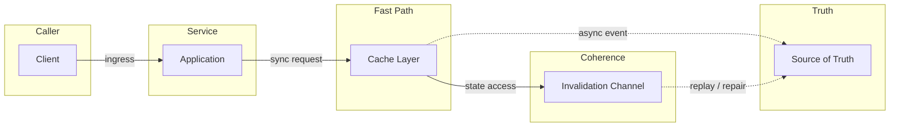
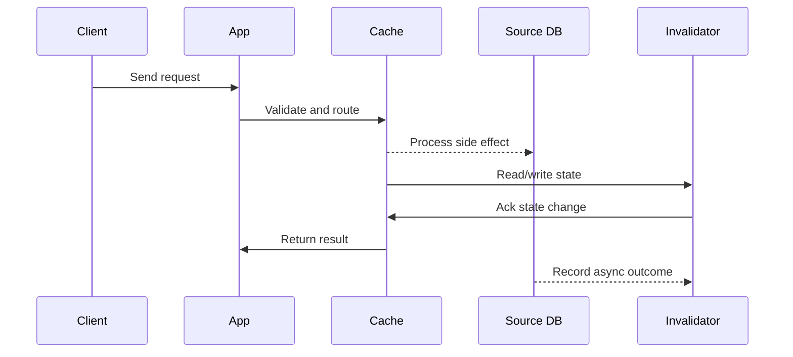

# DNS Resolution & CDN Edge Caching

## Quick Facts

- Area: System Design
- Tag: Networking
- Source: `src/modules/topics/sysdesign/sd-dns-cdn.js`
- Tags: `dns`, `cdn`, `anycast`, `ttl`, `edge`, `cloudflare`, `akamai`
- Visual coverage: live visual, flow lab, UML lab, architecture map

## Concept

**DNS (Domain Name System)** is the internet's phone book. It translates human-readable hostnames into IP addresses through a hierarchical lookup chain.

**Resolution chain:**

```
Browser cache -> OS /etc/hosts -> OS resolver cache
  -> Recursive resolver (ISP or 1.1.1.1)
    -> Root nameserver (13 clusters, anycast)
      -> TLD nameserver (.com, .io, etc.)
        -> Authoritative nameserver (your zone)
```

**Record types:** A (IPv4), AAAA (IPv6), CNAME (alias), MX (mail), TXT (verification/SPF), SRV (service discovery), NS (nameserver delegation).

**TTL trade-off:** Low TTL (60 s) -> fast failover but more queries. High TTL (3600 s) -> cached longer, faster but slow propagation on change.

**CDN Architecture:**

- Global network of **Points of Presence (PoPs)** - 200+ locations for Cloudflare/Akamai
- **Anycast routing** - same IP announced from multiple locations; BGP routes client to nearest PoP
- **Edge caching** - static assets (JS/CSS/images) served from PoP; **cache HIT** skips origin entirely
- **Origin shield** - single PoP acts as origin-facing cache, collapsing cache misses from 200 PoPs to 1
- **Dynamic content** - CDN can accelerate even uncacheable content via TCP connection pooling to origin

## Why It Matters

CDN is typically the highest-leverage single change in web performance. Moving content physically closer to users reduces RTT from 150ms to 5ms. DNS TTL strategy directly affects failover time during incidents.

## Architecture / Mental Model



## Runtime / Sequence



## Animation Plan

- Flow lab available: step-by-step path highlighting.
- UML sequence simulation available: actor messages animate in order.
- Architecture map available: clickable nodes and sync/async links.
- Live visual exists in app: topic-specific canvas/ReactViz animation.

Flow steps:

1. Browser checks OS cache - Browser first checks its own TTL cache, then asks OS resolver. /etc/hosts checked before network.
2. OS asks recursive resolver - OS forwards to configured DNS server (DHCP-assigned or manual: 1.1.1.1, 8.8.8.8).
3. Recursive resolver asks root - Root responds with TLD nameserver addresses - doesn't know the final IP.
4. Root delegates to TLD - TLD nameserver (.com zone) responds with authoritative NS records for the domain.
5. TLD delegates to authoritative - Authoritative nameserver returns A/AAAA record - the actual IP. TTL attached.
6. IP returned and cached - Recursive resolver caches the result for TTL seconds, returns to OS.
7. Browser connects to CDN IP - Anycast routes TCP connection to nearest PoP. CDN serves cached asset or forwards to origin.

## Example

```javascript
// Cloudflare Worker - edge function that adds caching logic
addEventListener("fetch", (event) => {
  event.respondWith(handleRequest(event.request));
});

async function handleRequest(request) {
  const url = new URL(request.url);

  // Bypass cache for API calls
  if (url.pathname.startsWith("/api/")) {
    return fetch(request);
  }

  const cache = caches.default;
  let response = await cache.match(request);

  if (!response) {
    response = await fetch(request);
    // Cache HTML for 60s, static assets for 1 year
    const ttl = url.pathname.match(/\.(js|css|png|woff2)$/) ? 31536000 : 60;
    const headers = new Headers(response.headers);
    headers.set("Cache-Control", `public, max-age=${ttl}`);
    response = new Response(response.body, { ...response, headers });
    event.waitUntil(cache.put(request, response.clone()));
  }
  return response;
}
```

Notes:
Cloudflare Workers run at edge PoPs in V8 isolates - ~0ms cold start vs Lambda's 100ms+

## Complexity And Performance

- Time/space complexity depends on input size, data volume, and implementation choices.
- Track latency, throughput, memory, saturation, error rate, and correctness invariants.

## Interview Drills

1. How does DNS-based load balancing work? What are its limitations?
   Answer: DNS LB returns multiple A records (round-robin) or geo-targeted IPs. Easy to implement - just configure multiple records.

   **Limitations:**
   - Clients cache the IP per TTL - you can't instantly re-route traffic
   - No health-checking at DNS level (requires smart DNS like Route 53 health checks)
   - Doesn't account for server load - a heavy server gets same traffic as light one
   - Low TTL increases DNS query volume and costs
     Follow-ups: How does Route 53 latency-based routing differ from simple round-robin?; What is GeoDNS and when would you use it?

2. What is cache stampede and how do you prevent it?
   Answer: Cache stampede (thundering herd) occurs when a popular key expires and hundreds of concurrent requests all miss cache simultaneously, flooding the DB.

   **Prevention strategies:**
   1. **Mutex/Lock** - first miss acquires lock, sets cache, releases; others wait
   2. **Probabilistic early recomputation** - randomly re-compute before expiry (XFetch algorithm)
   3. **Stale-while-revalidate** - serve stale while background refresh runs
   4. **Cache warming** - pre-populate before expiry using a cron job
      Follow-ups: Explain stale-while-revalidate Cache-Control directive.

## Trade-offs

Pros:

- CDN dramatically reduces latency for global users
- Absorbs DDoS traffic at edge before it hits origin
- Reduces origin server load and bandwidth costs

Cons:

- Cache invalidation is hard - purge APIs exist but propagation takes seconds
- Dynamic/personalised content can't be cached
- Additional cost per GB transferred

When to use:
Always use a CDN for public-facing web apps. DNS health checks + low TTL for zero-downtime deployments.

## Gotchas

_No gotchas configured._
