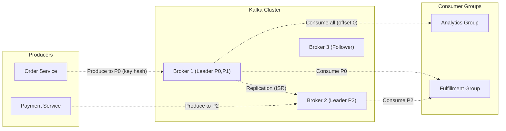
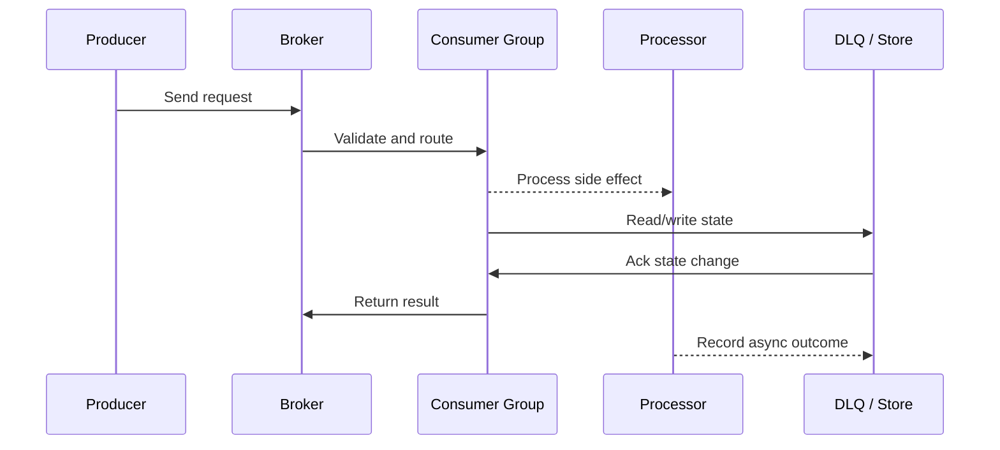

# Apache Kafka - Internals, Partitions & Consumer Groups

## Quick Facts

- Area: System Design
- Tag: Messaging
- Source: `src/modules/topics/sysdesign/sd-kafka-arch.js`
- Tags: `kafka`, `partitions`, `consumer group`, `offset`, `replication`, `ISR`, `compaction`, `streams`, `producer`
- Visual coverage: live visual, flow lab, UML lab, architecture map

## Concept

**Kafka** is a distributed commit log optimised for high-throughput, durable, ordered event streaming.

**Core concepts:**

- **Topic** - logical stream name. Partitioned for parallelism.
- **Partition** - ordered, immutable log. Each message gets an offset. Stored on disk (not memory).
- **Broker** - Kafka server. A cluster has N brokers; each partition has one leader + (replication-factor - 1) followers.
- **Producer** - writes to a partition leader. Partitioning by key ensures ordered delivery for a key.
- **Consumer Group** - logical subscriber. Each partition assigned to exactly one consumer in the group. Multiple groups -> each gets all messages (pub-sub behaviour).
- **Offset** - consumer tracks position per partition. Committed to `__consumer_offsets` topic.

**ISR (In-Sync Replicas):** The set of replicas fully caught up with the leader. `acks=all` waits for all ISR before producer gets ACK - strongest guarantee.

**Exactly-once semantics (EOS):**

1. Producer idempotence (`enable.idempotence=true`) - deduplicates retries via sequence numbers
2. Transactions - atomic write across multiple partitions + commit offset

**Log compaction:** Kafka retains only the latest value per key (useful for change-data-capture CDC).

**Throughput numbers:** Single Kafka cluster handles 10M+ messages/second at LinkedIn, 7M at Twitter.

## Why It Matters

Kafka is the backbone of event-driven architectures. Understanding partitioning and consumer groups is critical for designing scalable async systems.

## Architecture / Mental Model



## Runtime / Sequence



## Animation Plan

- Flow lab available: step-by-step path highlighting.
- UML sequence simulation available: actor messages animate in order.
- Architecture map available: clickable nodes and sync/async links.
- Live visual exists in app: topic-specific canvas/ReactViz animation.

Flow steps:

1. Enter system - Request crosses trust boundary and gets normalized before core handling.
2. Execute core path - Gateway routes to owning capability with timeout, auth context, and trace id.
3. Offload slow work - Async path absorbs retries, fanout, indexing, notifications, or heavy processing.
4. Persist state - System writes durable state, cache entries, offsets, or audit evidence.
5. Return or recover - Response returns when sync work succeeds; failure path uses retry, fallback, or replay.

## Example

```java
// Kafka producer with exactly-once semantics
@Configuration
public class KafkaConfig {

    @Bean
    public ProducerFactory<String, OrderEvent> producerFactory() {
        Map<String, Object> props = new HashMap<>();
        props.put(ProducerConfig.BOOTSTRAP_SERVERS_CONFIG, "kafka:9092");
        props.put(ProducerConfig.KEY_SERIALIZER_CLASS_CONFIG, StringSerializer.class);
        props.put(ProducerConfig.VALUE_SERIALIZER_CLASS_CONFIG, JsonSerializer.class);
        // Exactly-once: idempotent + transactions
        props.put(ProducerConfig.ENABLE_IDEMPOTENCE_CONFIG, true);
        props.put(ProducerConfig.ACKS_CONFIG, "all");
        props.put(ProducerConfig.RETRIES_CONFIG, Integer.MAX_VALUE);
        props.put(ProducerConfig.TRANSACTIONAL_ID_CONFIG, "order-producer-1");
        return new DefaultKafkaProducerFactory<>(props);
    }
}

@Service
public class OrderEventPublisher {

    @Autowired private KafkaTemplate<String, OrderEvent> kafka;
    @Autowired private OrderRepository repo;

    // Transactional outbox pattern
    @Transactional  // DB + Kafka in one transaction scope
    public void placeOrder(Order order) {
        repo.save(order);  // DB write

        kafka.executeInTransaction(ops -> {
            ops.send("orders", order.getId(), new OrderEvent(order));
            return null;
        }); // Kafka commit only if DB commit succeeds
    }
}

// Consumer with manual offset commit
@KafkaListener(topics = "orders", groupId = "fulfillment-service",
               concurrency = "3")  // 3 threads = 3 partitions
public class OrderConsumer {

    @KafkaHandler
    public void handle(OrderEvent event, Acknowledgment ack) {
        try {
            fulfillmentService.process(event);
            ack.acknowledge(); // commit offset only on success
        } catch (RetryableException e) {
            // Don't ack - message will be redelivered
            throw e;
        }
    }
}
```

Notes:
concurrency=3 means 3 consumer threads per instance. With 12 partitions and 4 instances: 12/4=3 threads each - saturates all partitions.

## Complexity And Performance

- Time/space complexity depends on input size, data volume, and implementation choices.
- Track latency, throughput, memory, saturation, error rate, and correctness invariants.

## Interview Drills

1. How do you ensure ordering of messages in Kafka?
   Answer: Kafka guarantees ordering **within a partition**. Cross-partition ordering is not guaranteed.

   **To ensure ordered processing for a logical entity:**
   1. **Partition by entity key** - all events for orderId=42 go to the same partition (hash of key mod partitions). Same partition -> single consumer -> ordered.
   2. **Single partition** - extreme: 1 partition = total order, but 1 consumer max throughput.
   3. **Application-side ordering** - use sequence numbers in events; consumer buffers and reorders.

   **Gotcha:** If a consumer fails and rebalance occurs, a new consumer picks up mid-stream. With at-least-once delivery, ensure idempotent processing.
   Follow-ups: What happens when a Kafka consumer is slow and lags behind?; Explain the differences between at-most-once, at-least-once, and exactly-once delivery.

## Trade-offs

Pros:

- 10M+ msg/s throughput
- Durable - disk-backed, replicated
- Replay - consumers can re-read old events
- Fan-out - multiple consumer groups each see all messages

Cons:

- Operational complexity (ZooKeeper/KRaft, schema registry)
- No built-in message filtering - consumers must filter
- Rebalancing pauses all consumers in a group (improvement: static membership)

When to use:
Use Kafka for: event sourcing, audit logs, cross-service async communication, stream processing (Kafka Streams / Flink). For simple task queues, consider RabbitMQ or SQS.

## Gotchas

_No gotchas configured._
