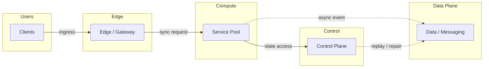
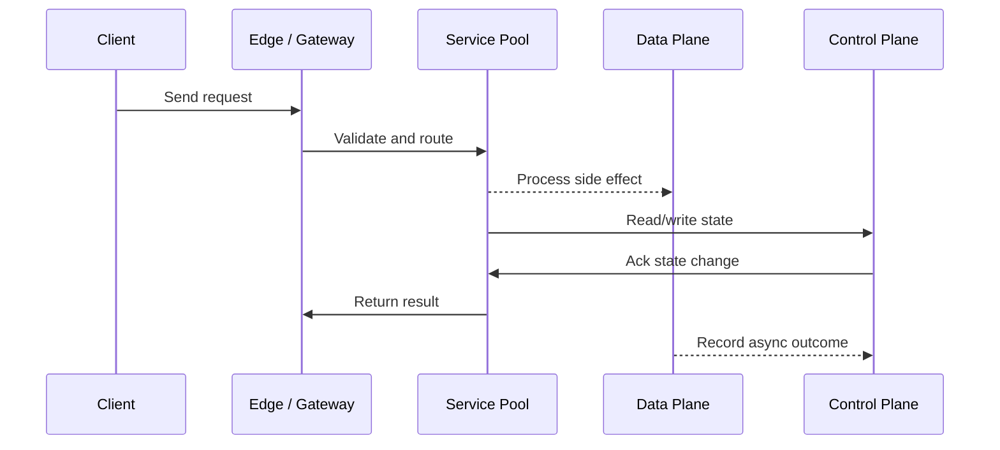

# Microservice Design - DDD, Boundaries & Strangler Fig

## Quick Facts

- Area: System Design
- Tag: Architecture
- Source: `src/modules/topics/sysdesign/sd-microservice-design.js`
- Tags: `microservices`, `ddd`, `bounded context`, `strangler fig`, `service mesh`, `domain driven design`, `aggregate`, `anti-corruption layer`
- Visual coverage: live visual, flow lab, UML lab, architecture map

## Concept

**Domain-Driven Design (DDD)** provides the vocabulary for designing microservice boundaries.

**Key DDD concepts:**

- **Domain** - the problem space your business operates in
- **Bounded Context** - an explicit boundary within which a domain model applies. Different BCs can use the same word with different meanings (Order in Shipping BC vs Order in Billing BC).
- **Aggregate** - cluster of entities treated as a single unit for data changes. All changes go through the aggregate root. Example: Order aggregate (root) + OrderItems + DeliveryAddress.
- **Domain Events** - facts that happened in the domain (OrderPlaced, PaymentFailed). First-class citizens for integration between BCs.
- **Anti-Corruption Layer (ACL)** - translation layer between two BCs to prevent one's model from leaking into the other.

**Service boundary heuristics:**

1. Each service owns one bounded context
2. Services communicate via domain events (async) or well-defined APIs (sync)
3. No shared database - each service has its own DB (polyglot persistence)
4. Services can be deployed independently
5. A service can be rewritten without changing other services

**Strangler Fig pattern** - migrate monolith to microservices incrementally:

1. Route new feature traffic to new microservice (via API gateway)
2. Gradually migrate existing features to microservices
3. Decommission monolith code path once all traffic migrated
4. Monolith "strangled" over months/years without big-bang rewrite

## Why It Matters

Getting service boundaries wrong is the #1 failure mode in microservices migrations. Too fine-grained = distributed monolith (services chatty, tightly coupled). Too coarse = monolith with deployment overhead.

## Architecture / Mental Model



## Runtime / Sequence



## Animation Plan

- Flow lab available: step-by-step path highlighting.
- UML sequence simulation available: actor messages animate in order.
- Architecture map available: clickable nodes and sync/async links.
- Live visual exists in app: topic-specific canvas/ReactViz animation.

Flow steps:

1. Enter system - Request crosses trust boundary and gets normalized before core handling.
2. Execute core path - Gateway routes to owning capability with timeout, auth context, and trace id.
3. Offload slow work - Async path absorbs retries, fanout, indexing, notifications, or heavy processing.
4. Persist state - System writes durable state, cache entries, offsets, or audit evidence.
5. Return or recover - Response returns when sync work succeeds; failure path uses retry, fallback, or replay.

## Example

```java
// DDD Aggregate Root - Order with invariant enforcement
@Entity
public class Order {  // Aggregate Root
    @Id private OrderId id;
    private CustomerId customerId;
    private OrderStatus status;

    @OneToMany(cascade = CascadeType.ALL, orphanRemoval = true)
    private List<OrderItem> items = new ArrayList<>();  // Entities within aggregate

    private Money total;

    // All mutations go through the aggregate root - enforces invariants
    public void addItem(ProductId productId, int quantity, Money price) {
        if (status != OrderStatus.DRAFT) {
            throw new IllegalStateException("Cannot modify a confirmed order");
        }
        items.add(new OrderItem(productId, quantity, price));
        this.total = calculateTotal();
    }

    public void confirm() {
        if (items.isEmpty()) throw new IllegalStateException("Cannot confirm empty order");
        if (status != OrderStatus.DRAFT) throw new IllegalStateException("Order already confirmed");
        this.status = OrderStatus.CONFIRMED;
        // Register domain event - don't publish directly from aggregate
        DomainEvents.raise(new OrderConfirmed(this.id, this.customerId, this.total));
    }

    // Factory method - always creates valid aggregate
    public static Order create(CustomerId customerId) {
        return new Order(OrderId.generate(), customerId, OrderStatus.DRAFT);
    }
}

// Anti-Corruption Layer - translate between Billing BC and Shipping BC
@Service
public class ShippingAdapter {
    // Billing domain uses "Order"; Shipping domain uses "Shipment"
    public Shipment toShipment(com.billing.Order billingOrder) {
        return Shipment.builder()
            .referenceId(billingOrder.getId().toString())
            .destination(mapAddress(billingOrder.getDeliveryAddress()))
            .items(billingOrder.getItems().stream()
                .map(this::toShipmentItem).collect(toList()))
            .build();
    }
}
```

Notes:
Aggregate boundaries = transaction boundaries. Never hold a transaction across aggregate roots - use eventual consistency via domain events instead.

## Complexity And Performance

- Time/space complexity depends on input size, data volume, and implementation choices.
- Track latency, throughput, memory, saturation, error rate, and correctness invariants.

## Interview Drills

1. How do you decide the right size for a microservice?
   Answer: **Too small (nano-services):**
   - Excessive network calls between services (chattiness)
   - Distributed transactions for what should be local operations
   - Operational overhead disproportionate to value

   **Too large:**
   - Independent deployability compromised (change in one area requires full deployment)
   - Teams stepping on each other's code

   **Right size heuristics:**
   1. **Single bounded context** - one team, one service, one deployment
   2. **Two-pizza rule** - if it takes more than 2 pizzas to feed the team, split the service
   3. **Change frequency** - frequently changed together = together in one service
   4. **Data ownership** - each service owns its data; if two services share a table, merge them
   5. **The 3R test:** Can you Rewrite it in 2 weeks, Release independently, and Run it autonomously?
      Follow-ups: What is the Strangler Fig pattern and when would you use it?; How do you handle distributed transactions when each service has its own database?

## Trade-offs

Pros:

- Independent deployability and scaling
- Technology heterogeneity - right tool per service
- Fault isolation - one service down doesn't take all others

Cons:

- Distributed system complexity - network failures, latency, consistency
- Operational overhead - monitoring 50 services vs 1 monolith
- Data consistency across services requires eventual consistency patterns

When to use:
Start with a modular monolith. Extract microservices when: team size > 8, deployment bottlenecks, need to scale one component independently, different technology requirements per component.

## Gotchas

Watch for edge cases, assumptions, and hidden performance costs that can make this topic fail in production if handled incorrectly.
