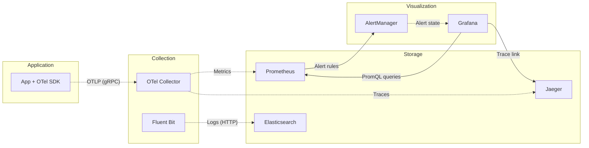
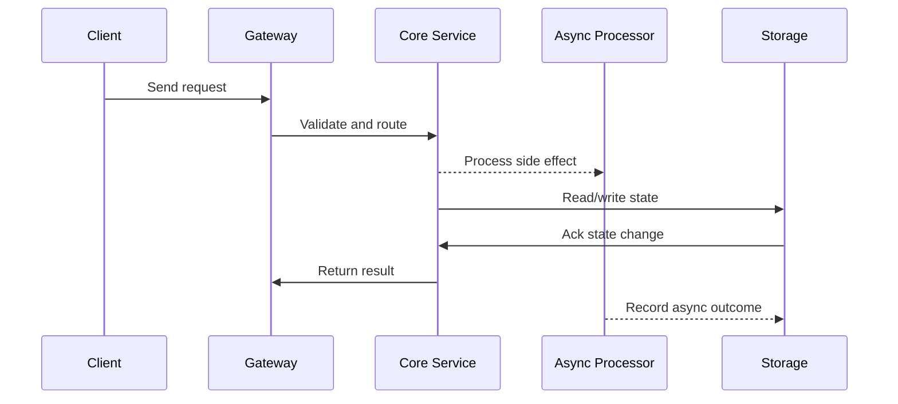

# Observability - Metrics, Logs, Traces & Alerting

## Quick Facts

- Area: System Design
- Tag: Operations
- Source: `src/modules/topics/sysdesign/sd-observability.js`
- Tags: `observability`, `prometheus`, `grafana`, `jaeger`, `opentelemetry`, `structured logging`, `sre`, `slo`, `sla`, `red method`
- Visual coverage: live visual, flow lab, UML lab, architecture map

## Concept

**The three pillars of observability:**

**1. Metrics** - aggregated numerical measurements over time.

- **RED method** (for services): Rate (requests/s), Errors (error rate %), Duration (latency p50/p95/p99)
- **USE method** (for resources): Utilisation, Saturation, Errors
- Stack: **Prometheus** (scrape + store) + **Grafana** (visualise) + **AlertManager** (alert)
- Pull model: Prometheus scrapes `/metrics` endpoint every 15s
- Cardinality warning: labels on metrics multiply storage. Never use userId as a label.

**2. Logs** - timestamped, structured records of events.

- **Structured logging** (JSON) enables filtering and aggregation: `{"level":"ERROR","orderId":"42","service":"payment","latencyMs":234}`
- Stack: **Fluentd/Fluent Bit** (collect) -> **Elasticsearch** (index) -> **Kibana** (search)
- Log levels: TRACE > DEBUG > INFO > WARN > ERROR. Production: INFO minimum.
- Correlation ID: propagate `X-Request-ID` header through all services; log it on every line.

**3. Distributed Traces** - end-to-end request journey across services.

- **OpenTelemetry** (OTel): vendor-neutral instrumentation standard. One SDK for metrics + logs + traces.
- Each request gets a **TraceId**. Each service creates a **Span** (start time, duration, tags).
- Stack: **OTel SDK** -> **Jaeger / Zipkin / Tempo** (collect + visualise)
- Find which service in a 20-hop chain caused 500ms tail latency.

**SLO/SLI/SLA:**

- **SLI** (Service Level Indicator) - actual metric (error rate, p99 latency)
- **SLO** (Service Level Objective) - target (error rate < 0.1%, p99 < 200ms)
- **SLA** (Service Level Agreement) - contractual commitment with penalty
- **Error budget** = 100% - SLO availability. If consumed, freeze risky changes.

## Why It Matters

You can't fix what you can't see. Observability is the difference between resolving incidents in 5 minutes and 5 hours. SLO/error budgets are used at Google, Netflix, Spotify to balance reliability vs velocity.

## Architecture / Mental Model



## Runtime / Sequence



## Animation Plan

- Flow lab available: step-by-step path highlighting.
- UML sequence simulation available: actor messages animate in order.
- Architecture map available: clickable nodes and sync/async links.
- Live visual exists in app: topic-specific canvas/ReactViz animation.

Flow steps:

1. Enter system - Request crosses trust boundary and gets normalized before core handling.
2. Execute core path - Gateway routes to owning capability with timeout, auth context, and trace id.
3. Offload slow work - Async path absorbs retries, fanout, indexing, notifications, or heavy processing.
4. Persist state - System writes durable state, cache entries, offsets, or audit evidence.
5. Return or recover - Response returns when sync work succeeds; failure path uses retry, fallback, or replay.

## Example

```java
// Spring Boot - Micrometer + OpenTelemetry + structured logging
@RestController
public class OrderController {

    private final Counter orderCounter;
    private final Timer orderLatency;
    private final Tracer tracer;

    public OrderController(MeterRegistry registry, Tracer tracer) {
        this.orderCounter = Counter.builder("orders.created")
            .tag("service", "order-service")
            .register(registry);
        this.orderLatency = Timer.builder("orders.latency")
            .publishPercentiles(0.5, 0.95, 0.99)
            .register(registry);
        this.tracer = tracer;
    }

    @PostMapping("/orders")
    public ResponseEntity<Order> createOrder(@RequestBody CreateOrderRequest req) {
        Span span = tracer.spanBuilder("createOrder").startSpan();
        try (var scope = span.makeCurrent()) {
            span.setAttribute("order.customerId", req.getCustomerId());

            Timer.Sample sample = Timer.start();
            Order order = orderService.create(req);
            sample.stop(orderLatency);

            orderCounter.increment();

            // Structured log - JSON with trace correlation
            log.info("Order created orderId={} customerId={} total={} traceId={}",
                order.getId(), req.getCustomerId(), order.getTotal(),
                span.getSpanContext().getTraceId());

            return ResponseEntity.ok(order);
        } catch (Exception e) {
            span.recordException(e);
            span.setStatus(StatusCode.ERROR);
            throw e;
        } finally {
            span.end();
        }
    }
}

// Prometheus alert rule
// groups:
//   - name: order-service
//     rules:
//       - alert: HighErrorRate
//         expr: rate(http_requests_total{status=~"5.."}[5m])
//               / rate(http_requests_total[5m]) > 0.01
//         for: 2m
//         labels: { severity: critical }
//         annotations:
//           summary: "Error rate {{ $value | humanizePercentage }}"
```

Notes:
OpenTelemetry auto-instrumentation (Java agent: -javaagent:opentelemetry-javaagent.jar) adds traces to Spring, JDBC, Kafka without code changes.

## Complexity And Performance

- Time/space complexity depends on input size, data volume, and implementation choices.
- Track latency, throughput, memory, saturation, error rate, and correctness invariants.

## Interview Drills

1. How do you find the root cause of a latency spike in a microservices system?
   Answer: Systematic approach:
   1. **Start with metrics (RED dashboard)** - which service has elevated p99 latency or error rate? Grafana alert fires.
   2. **Check SLO burn rate** - is error budget being consumed? How fast?
   3. **Find the service** - Grafana service map / dependency graph shows which service in the call chain is slow.
   4. **Drill into traces (Jaeger)** - filter traces for the time window. Find traces with p99 latency. Click the slowest trace - spans show exactly where time was spent.
   5. **Cross-reference logs** - use TraceId from Jaeger to find correlated logs in Kibana. Structured logs reveal the exact DB query, cache miss, or timeout.
   6. **Infrastructure metrics** - check CPU, memory, IO, network for the pod (Kubernetes dashboard, AWS CloudWatch).

   Total time: 5-10 minutes with good observability vs hours without.
   Follow-ups: What is an error budget and how do you use it to make decisions?; What is the difference between monitoring and observability?

## Trade-offs

Pros:

- Fast incident resolution - MTTR from hours to minutes
- Data-driven capacity planning
- SLO-based alerting reduces alert fatigue vs threshold alerting

Cons:

- Cardinality explosion in metrics if labels not controlled
- Trace sampling needed at high volume (100% tracing = 10% overhead)
- Storage costs for logs + traces at scale

When to use:
Instrument from day one. Retrofitting observability into production is painful. Use OpenTelemetry standard - avoids vendor lock-in. Set SLOs before you set alerts.

## Gotchas

_No gotchas configured._
